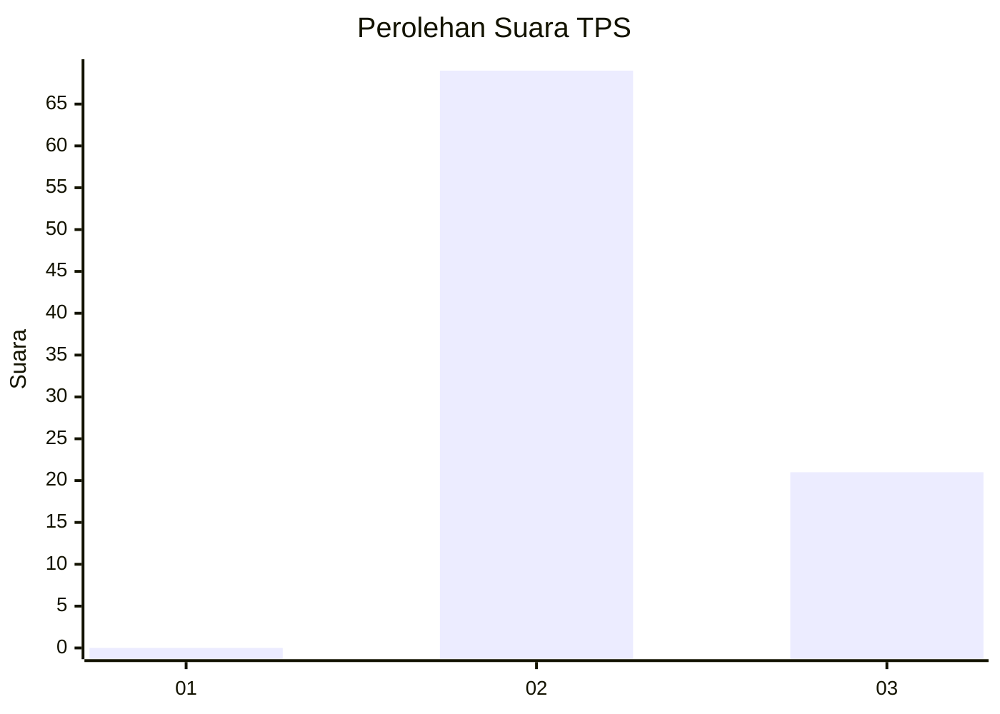
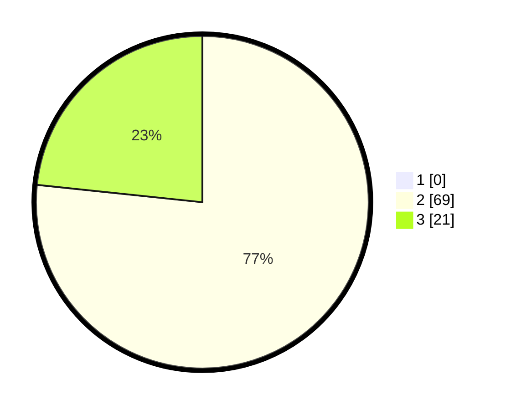

# Hasil

## Grafik

## Tabel

| No. | Nama Paslon    | Suara | Suara (raw) | Persentase |
|:--- |:-------------- | -----:| -----------:| ----------:|
| 1   | ANIES MUHAIMIN | 0     | [0][p-1]    | 0,00       |
| 2   | PRABOWO GIBRAN | 69    | [69][p-2]   | 76,67      |
| 3   | GANJAR MAHFUD  | 21    | [21][p-3]   | 23,33      |

[p-1]: https://github.com/gigit-pemilu/pemilu-2024/blob/main/pilpres/hitung-suara/sub/12-sumatera-utara/sub/16-humbang-hasundutan/sub/03-baktiraja/sub/2007-marbun-tonga-marbun-dolok/sub/003-tps/sub/paslon-1.txt
[p-2]: https://github.com/gigit-pemilu/pemilu-2024/blob/main/pilpres/hitung-suara/sub/12-sumatera-utara/sub/16-humbang-hasundutan/sub/03-baktiraja/sub/2007-marbun-tonga-marbun-dolok/sub/003-tps/sub/paslon-2.txt
[p-3]: https://github.com/gigit-pemilu/pemilu-2024/blob/main/pilpres/hitung-suara/sub/12-sumatera-utara/sub/16-humbang-hasundutan/sub/03-baktiraja/sub/2007-marbun-tonga-marbun-dolok/sub/003-tps/sub/paslon-3.txt

## Foto C Plano

https://sirekap-obj-formc.kpu.go.id/e01d/pemilu/ppwp/12/16/03/20/07/1216032007003-20240214-230018--bee0dbbf-fe2a-4481-b167-b3a0631a8a8f.jpg

https://sirekap-obj-formc.kpu.go.id/e01d/pemilu/ppwp/12/16/03/20/07/1216032007003-20240214-233251--45f41248-8a98-442c-b4f1-a1c27e41424f.jpg

https://sirekap-obj-formc.kpu.go.id/e01d/pemilu/ppwp/12/16/03/20/07/1216032007003-20240214-233529--235dcfee-15e5-4571-93aa-750d3bf07585.jpg

## Metadata

| Key        | Value               |
| ---------- | ------------------- |
| Time Stamp | 2024-02-15 12:00:28 |

