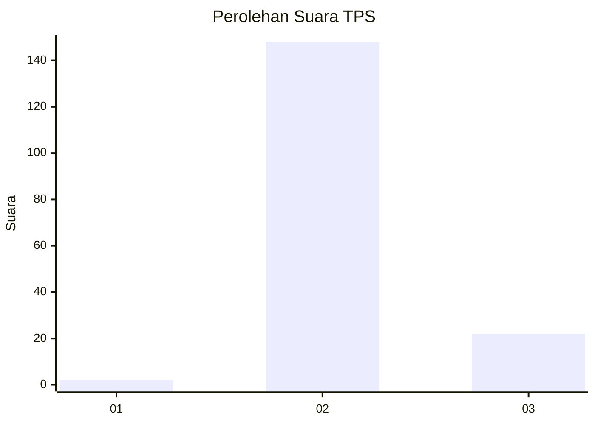
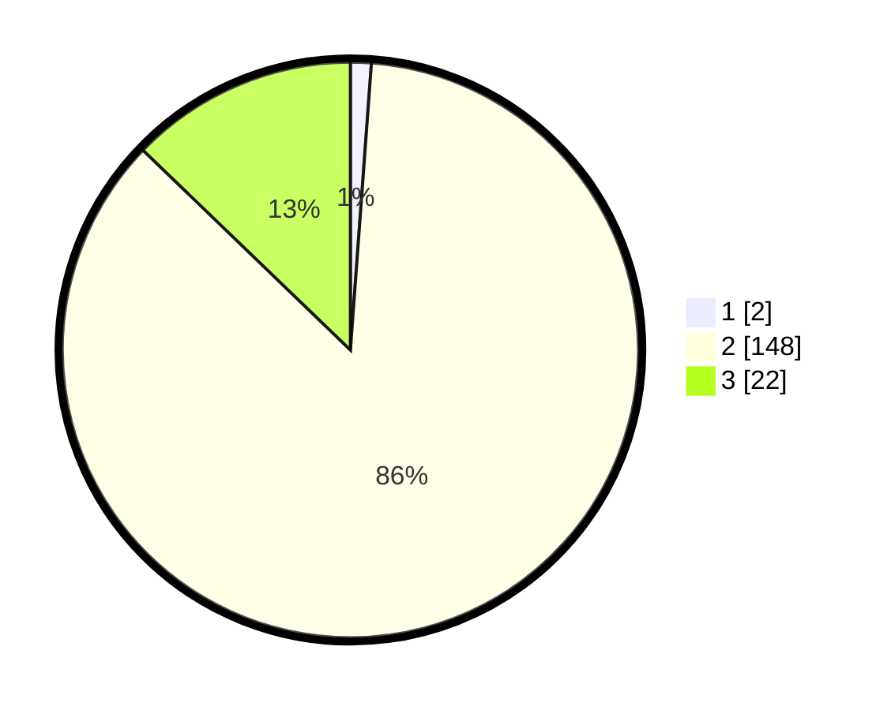

# Hasil

## Grafik

## Tabel

| No. | Nama Paslon    | Suara | Suara (raw) | Persentase |
|:--- |:-------------- | -----:| -----------:| ----------:|
| 1   | ANIES MUHAIMIN | 2     | [2][p-1]    | 1,16       |
| 2   | PRABOWO GIBRAN | 148   | [148][p-2]  | 86,05      |
| 3   | GANJAR MAHFUD  | 22    | [22][p-3]   | 12,79      |

[p-1]: https://github.com/gigit-pemilu/pemilu-2024-12-sumatera-utara/blob/main/pilpres/hitung-suara/sub/12-sumatera-utara/sub/16-humbang-hasundutan/sub/05-lintong-nihuta/sub/2020-nagasaribu-iii/sub/003-tps/sub/paslon-1.txt
[p-2]: https://github.com/gigit-pemilu/pemilu-2024-12-sumatera-utara/blob/main/pilpres/hitung-suara/sub/12-sumatera-utara/sub/16-humbang-hasundutan/sub/05-lintong-nihuta/sub/2020-nagasaribu-iii/sub/003-tps/sub/paslon-2.txt
[p-3]: https://github.com/gigit-pemilu/pemilu-2024-12-sumatera-utara/blob/main/pilpres/hitung-suara/sub/12-sumatera-utara/sub/16-humbang-hasundutan/sub/05-lintong-nihuta/sub/2020-nagasaribu-iii/sub/003-tps/sub/paslon-3.txt

## Foto C Plano

https://sirekap-obj-formc.kpu.go.id/9fd2/pemilu/ppwp/12/16/05/20/20/1216052020003-20240214-141758--e58b48cb-f8a1-4ab3-82f3-6704e629842f.jpg

https://sirekap-obj-formc.kpu.go.id/9fd2/pemilu/ppwp/12/16/05/20/20/1216052020003-20240214-141848--a5cdff47-d7b2-423b-bc43-dcec127892a8.jpg

https://sirekap-obj-formc.kpu.go.id/9fd2/pemilu/ppwp/12/16/05/20/20/1216052020003-20240214-213146--80b20792-1bc5-4529-9acd-66842560361f.jpg

## Metadata

| Key        | Value               |
| ---------- | ------------------- |
| Time Stamp | 2024-02-15 19:30:26 |

