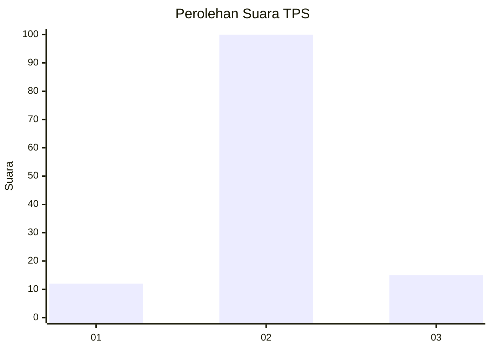
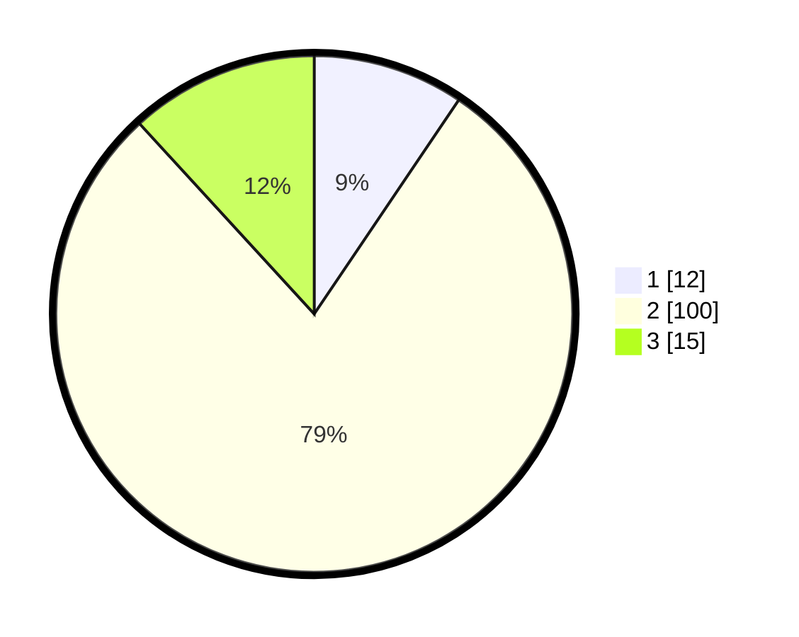

# Hasil

## Grafik

## Tabel

| No. | Nama Paslon    | Suara | Suara (raw) | Persentase |
|:--- |:-------------- | -----:| -----------:| ----------:|
| 1   | ANIES MUHAIMIN | 12    | [12][p-1]   | 9,45       |
| 2   | PRABOWO GIBRAN | 100   | [100][p-2]  | 78,74      |
| 3   | GANJAR MAHFUD  | 15    | [15][p-3]   | 11,81      |

[p-1]: https://github.com/gigit-pemilu/pemilu-2024/blob/main/pilpres/hitung-suara/sub/12-sumatera-utara/sub/16-humbang-hasundutan/sub/06-dolok-sanggul/sub/1001-pasar-dolok-sanggul/sub/010-tps/sub/paslon-1.txt
[p-2]: https://github.com/gigit-pemilu/pemilu-2024/blob/main/pilpres/hitung-suara/sub/12-sumatera-utara/sub/16-humbang-hasundutan/sub/06-dolok-sanggul/sub/1001-pasar-dolok-sanggul/sub/010-tps/sub/paslon-2.txt
[p-3]: https://github.com/gigit-pemilu/pemilu-2024/blob/main/pilpres/hitung-suara/sub/12-sumatera-utara/sub/16-humbang-hasundutan/sub/06-dolok-sanggul/sub/1001-pasar-dolok-sanggul/sub/010-tps/sub/paslon-3.txt

## Foto C Plano

https://sirekap-obj-formc.kpu.go.id/481e/pemilu/ppwp/12/16/06/10/01/1216061001010-20240225-173310--de167352-c331-4696-84a4-add19674374a.jpg

https://sirekap-obj-formc.kpu.go.id/481e/pemilu/ppwp/12/16/06/10/01/1216061001010-20240225-173500--04ac34c5-ef2a-4280-b51e-2a1a30e14d6e.jpg

https://sirekap-obj-formc.kpu.go.id/481e/pemilu/ppwp/12/16/06/10/01/1216061001010-20240225-173711--b22181e3-69d4-4698-904c-4098862e6303.jpg

## Metadata

| Key        | Value               |
| ---------- | ------------------- |
| Time Stamp | 2024-02-25 18:00:00 |

