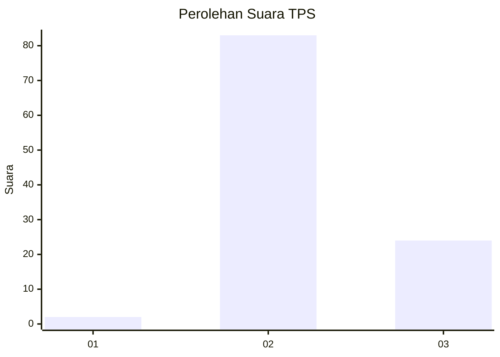
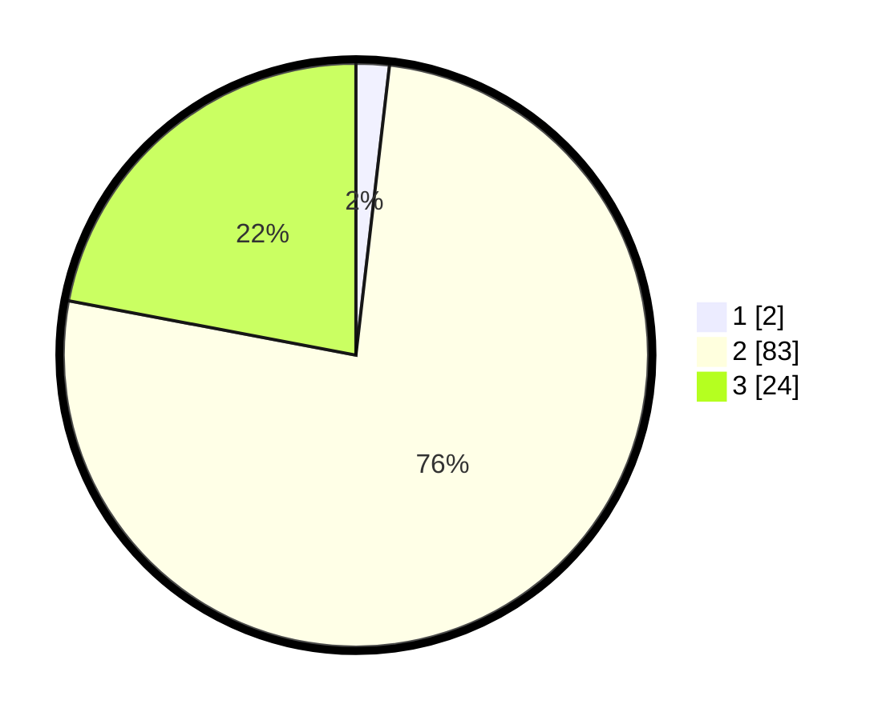

# Hasil

## Grafik

## Tabel

| No. | Nama Paslon    | Suara | Suara (raw) | Persentase |
|:--- |:-------------- | -----:| -----------:| ----------:|
| 1   | ANIES MUHAIMIN | 2     | [2][p-1]    | 1,83       |
| 2   | PRABOWO GIBRAN | 83    | [83][p-2]   | 76,15      |
| 3   | GANJAR MAHFUD  | 24    | [24][p-3]   | 22,02      |

[p-1]: https://github.com/gigit-pemilu/pemilu-2024-12-sumatera-utara/blob/main/pilpres/hitung-suara/sub/12-sumatera-utara/sub/16-humbang-hasundutan/sub/06-dolok-sanggul/sub/1001-pasar-dolok-sanggul/sub/014-tps/sub/paslon-1.txt
[p-2]: https://github.com/gigit-pemilu/pemilu-2024-12-sumatera-utara/blob/main/pilpres/hitung-suara/sub/12-sumatera-utara/sub/16-humbang-hasundutan/sub/06-dolok-sanggul/sub/1001-pasar-dolok-sanggul/sub/014-tps/sub/paslon-2.txt
[p-3]: https://github.com/gigit-pemilu/pemilu-2024-12-sumatera-utara/blob/main/pilpres/hitung-suara/sub/12-sumatera-utara/sub/16-humbang-hasundutan/sub/06-dolok-sanggul/sub/1001-pasar-dolok-sanggul/sub/014-tps/sub/paslon-3.txt

## Foto C Plano

https://sirekap-obj-formc.kpu.go.id/2efc/pemilu/ppwp/12/16/06/10/01/1216061001014-20240225-183554--92e38c0e-fee9-4783-a612-322a6cf17281.jpg

https://sirekap-obj-formc.kpu.go.id/2efc/pemilu/ppwp/12/16/06/10/01/1216061001014-20240225-183723--70c6752d-b9c4-4dfa-932a-e3c0afb4b050.jpg

## Metadata

| Key        | Value               |
| ---------- | ------------------- |
| Time Stamp | 2024-02-28 19:00:00 |

