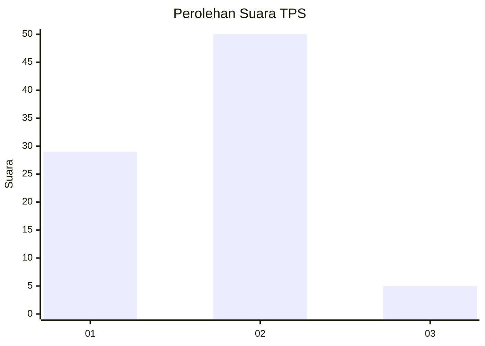
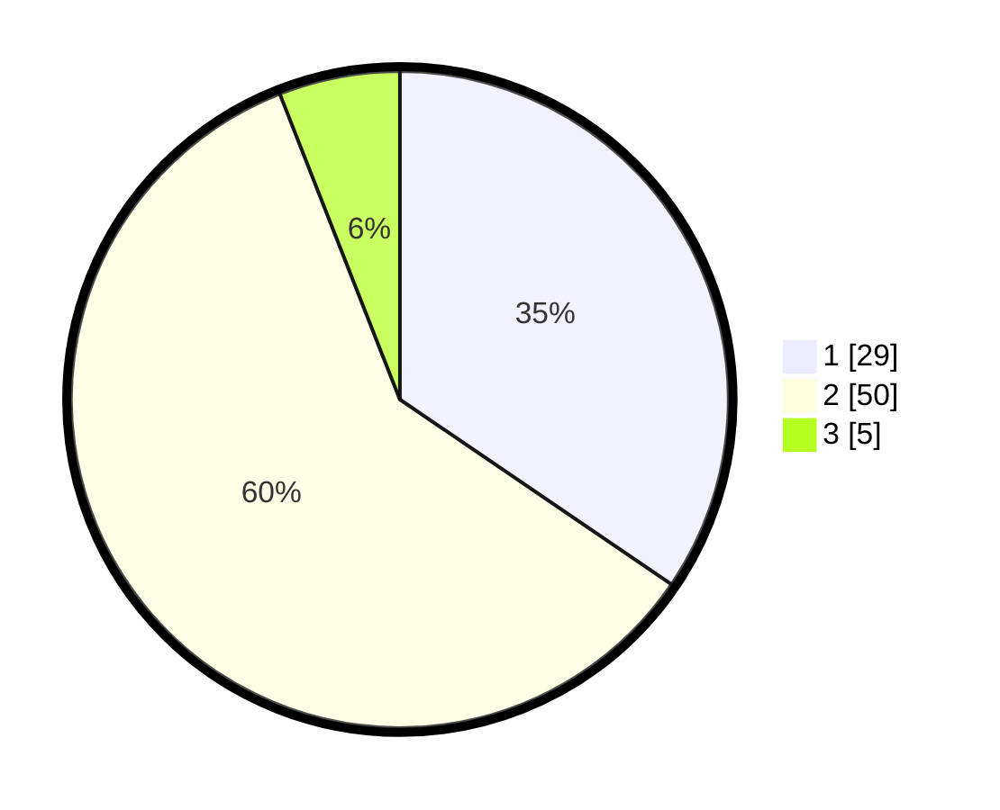

# Hasil

## Grafik

## Tabel

| No. | Nama Paslon    | Suara | Suara (raw) | Persentase |
|:--- |:-------------- | -----:| -----------:| ----------:|
| 1   | ANIES MUHAIMIN | 29    | [29][p-1]   | 34,52      |
| 2   | PRABOWO GIBRAN | 50    | [50][p-2]   | 59,52      |
| 3   | GANJAR MAHFUD  | 5     | [5][p-3]    | 5,95       |

[p-1]: https://github.com/gigit-pemilu/pemilu-2024-12-sumatera-utara/blob/main/pilpres/hitung-suara/sub/12-sumatera-utara/sub/16-humbang-hasundutan/sub/09-pakkat/sub/2008-parmonangan/sub/003-tps/sub/paslon-1.txt
[p-2]: https://github.com/gigit-pemilu/pemilu-2024-12-sumatera-utara/blob/main/pilpres/hitung-suara/sub/12-sumatera-utara/sub/16-humbang-hasundutan/sub/09-pakkat/sub/2008-parmonangan/sub/003-tps/sub/paslon-2.txt
[p-3]: https://github.com/gigit-pemilu/pemilu-2024-12-sumatera-utara/blob/main/pilpres/hitung-suara/sub/12-sumatera-utara/sub/16-humbang-hasundutan/sub/09-pakkat/sub/2008-parmonangan/sub/003-tps/sub/paslon-3.txt

## Foto C Plano

https://sirekap-obj-formc.kpu.go.id/2919/pemilu/ppwp/12/16/09/20/08/1216092008003-20240215-021252--86dd544a-14e8-4421-85c2-a905c9085f4d.jpg

https://sirekap-obj-formc.kpu.go.id/2919/pemilu/ppwp/12/16/09/20/08/1216092008003-20240215-023232--dea1799d-2ce5-4ebf-88f0-f6f1af4f015b.jpg

https://sirekap-obj-formc.kpu.go.id/2919/pemilu/ppwp/12/16/09/20/08/1216092008003-20240215-022257--317c6156-0121-4141-a6c6-6371c7984b74.jpg

## Metadata

| Key        | Value               |
| ---------- | ------------------- |
| Time Stamp | 2024-02-16 12:51:22 |

