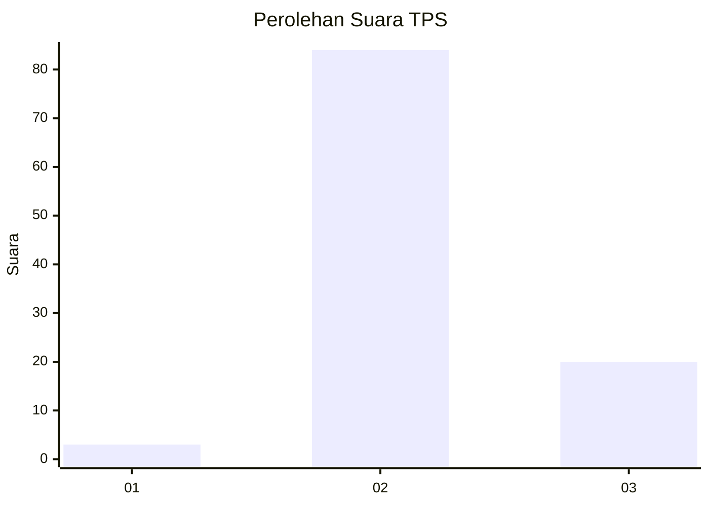
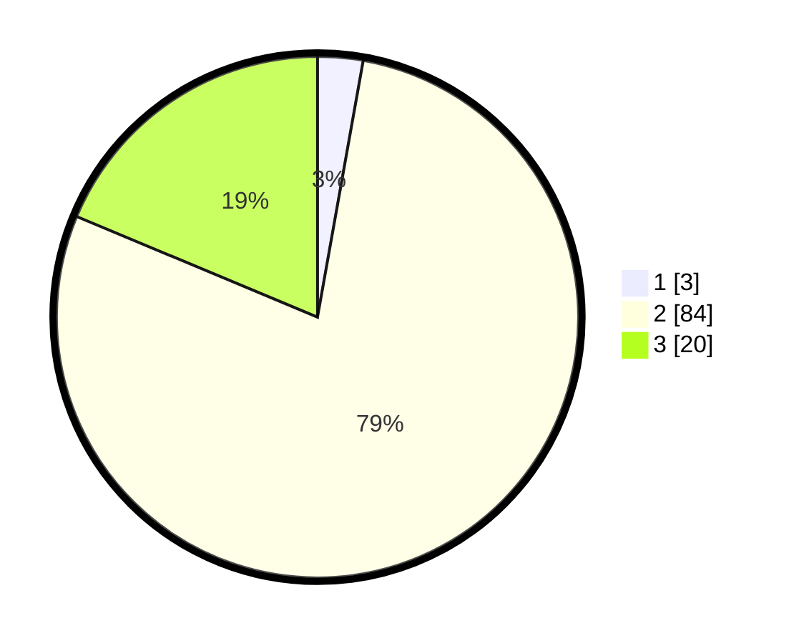

# Hasil

## Grafik

## Tabel

| No. | Nama Paslon    | Suara | Suara (raw) | Persentase |
|:--- |:-------------- | -----:| -----------:| ----------:|
| 1   | ANIES MUHAIMIN | 3     | [3][p-1]    | 2,80       |
| 2   | PRABOWO GIBRAN | 84    | [84][p-2]   | 78,50      |
| 3   | GANJAR MAHFUD  | 20    | [20][p-3]   | 18,69      |

[p-1]: https://github.com/gigit-pemilu/pemilu-2024/blob/main/pilpres/hitung-suara/sub/12-sumatera-utara/sub/16-humbang-hasundutan/sub/09-pakkat/sub/2020-siambaton-pahae/sub/003-tps/sub/paslon-1.txt
[p-2]: https://github.com/gigit-pemilu/pemilu-2024/blob/main/pilpres/hitung-suara/sub/12-sumatera-utara/sub/16-humbang-hasundutan/sub/09-pakkat/sub/2020-siambaton-pahae/sub/003-tps/sub/paslon-2.txt
[p-3]: https://github.com/gigit-pemilu/pemilu-2024/blob/main/pilpres/hitung-suara/sub/12-sumatera-utara/sub/16-humbang-hasundutan/sub/09-pakkat/sub/2020-siambaton-pahae/sub/003-tps/sub/paslon-3.txt

## Foto C Plano

https://sirekap-obj-formc.kpu.go.id/3889/pemilu/ppwp/12/16/09/20/20/1216092020003-20240214-221854--ff35f38b-5e85-43ad-8fc8-260044b11016.jpg

https://sirekap-obj-formc.kpu.go.id/3889/pemilu/ppwp/12/16/09/20/20/1216092020003-20240214-222023--f7baafd2-0b04-4988-8d27-d58fbade115b.jpg

https://sirekap-obj-formc.kpu.go.id/3889/pemilu/ppwp/12/16/09/20/20/1216092020003-20240215-024737--a4aeb4fd-4bac-4715-b6ee-e5e9315117c9.jpg

## Metadata

| Key        | Value               |
| ---------- | ------------------- |
| Time Stamp | 2024-02-15 15:00:29 |

