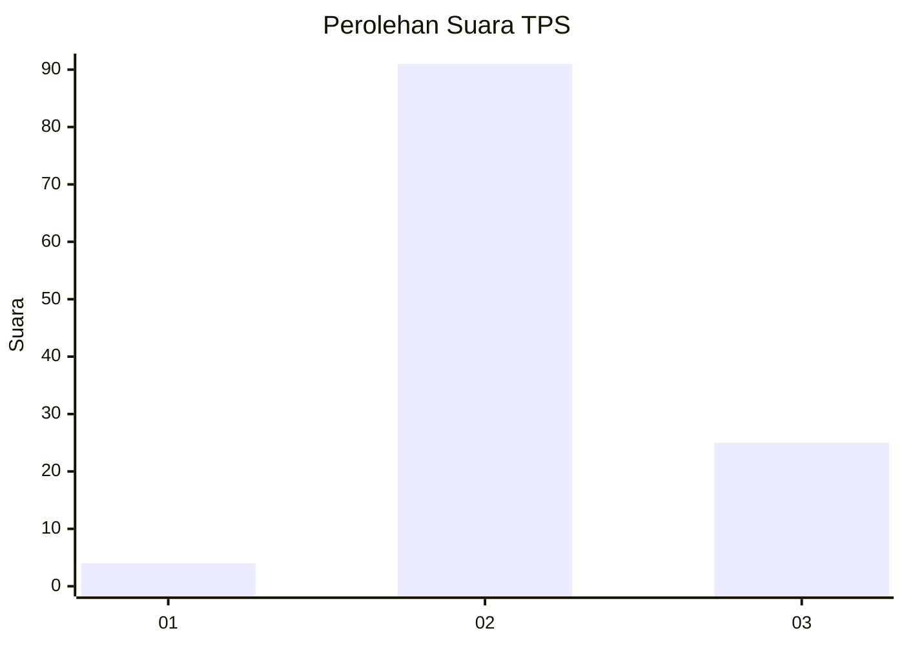

# Hasil

## Grafik

## Tabel

| No. | Nama Paslon    | Suara | Suara (raw) | Persentase |
|:--- |:-------------- | -----:| -----------:| ----------:|
| 1   | ANIES MUHAIMIN | 4     | [4][p-1]    | 3,33       |
| 2   | PRABOWO GIBRAN | 91    | [91][p-2]   | 75,83      |
| 3   | GANJAR MAHFUD  | 25    | [25][p-3]   | 20,83      |

[p-1]: https://github.com/gigit-pemilu/pemilu-2024/blob/main/pilpres/hitung-suara/sub/12-sumatera-utara/sub/17-samosir/sub/01-simanindo/sub/2007-garoga/sub/003-tps/sub/paslon-1.txt
[p-2]: https://github.com/gigit-pemilu/pemilu-2024/blob/main/pilpres/hitung-suara/sub/12-sumatera-utara/sub/17-samosir/sub/01-simanindo/sub/2007-garoga/sub/003-tps/sub/paslon-2.txt
[p-3]: https://github.com/gigit-pemilu/pemilu-2024/blob/main/pilpres/hitung-suara/sub/12-sumatera-utara/sub/17-samosir/sub/01-simanindo/sub/2007-garoga/sub/003-tps/sub/paslon-3.txt

## Foto C Plano

https://sirekap-obj-formc.kpu.go.id/2faa/pemilu/ppwp/12/17/01/20/07/1217012007003-20240214-223710--b2e3862c-b445-4bd3-90c4-6ba33703c092.jpg

https://sirekap-obj-formc.kpu.go.id/2faa/pemilu/ppwp/12/17/01/20/07/1217012007003-20240214-224054--fddd092c-0b75-44ff-8fc3-1a88e3c1f8ac.jpg

https://sirekap-obj-formc.kpu.go.id/2faa/pemilu/ppwp/12/17/01/20/07/1217012007003-20240214-224346--56289cdc-f331-4535-889a-b8f3fc7a81ae.jpg

## Metadata

| Key        | Value               |
| ---------- | ------------------- |
| Time Stamp | 2024-02-19 11:00:00 |

