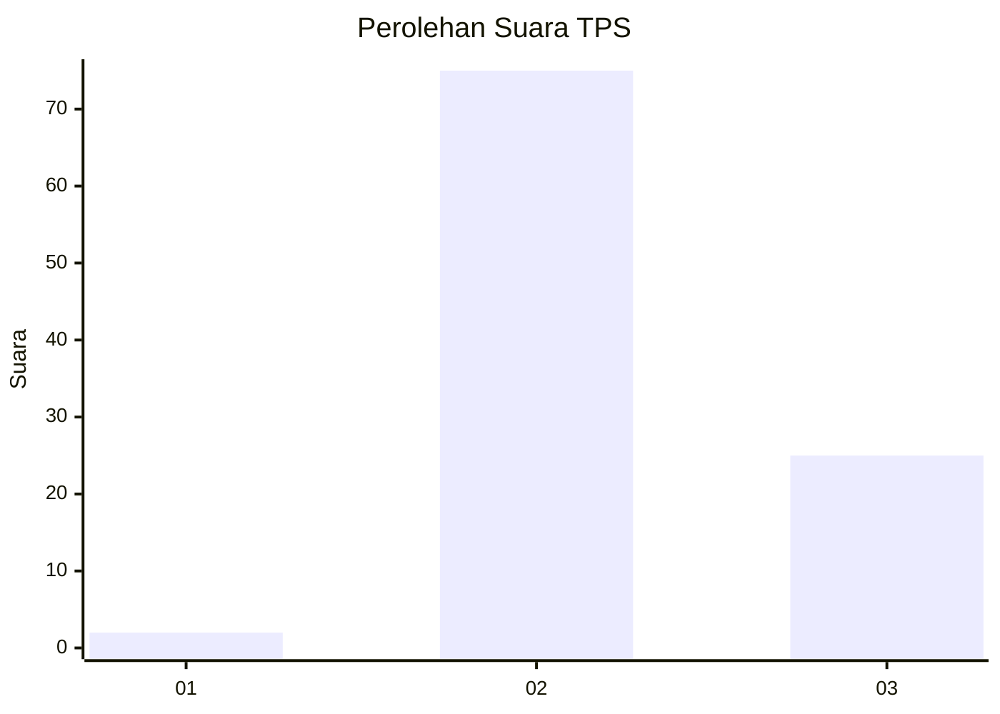
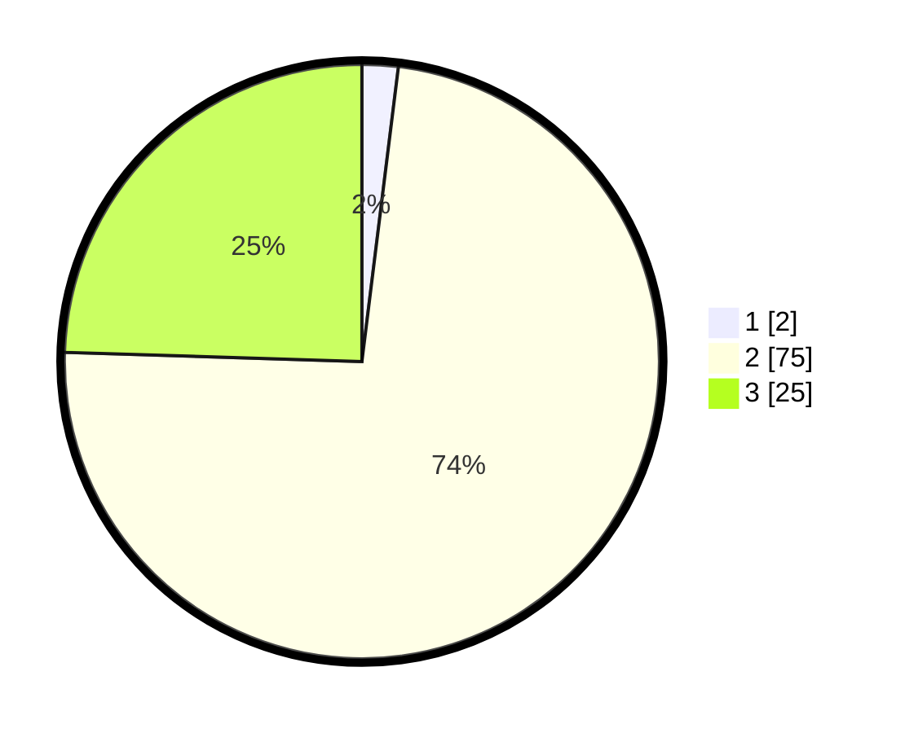

# Hasil

## Grafik

## Tabel

| No. | Nama Paslon    | Suara | Suara (raw) | Persentase |
|:--- |:-------------- | -----:| -----------:| ----------:|
| 1   | ANIES MUHAIMIN | 2     | [2][p-1]    | 1,96       |
| 2   | PRABOWO GIBRAN | 75    | [75][p-2]   | 73,53      |
| 3   | GANJAR MAHFUD  | 25    | [25][p-3]   | 24,51      |

[p-1]: https://github.com/gigit-pemilu/pemilu-2024/blob/main/pilpres/hitung-suara/sub/12-sumatera-utara/sub/17-samosir/sub/06-sianjur-mula-mula/sub/2003-hasinggaan/sub/003-tps/sub/paslon-1.txt
[p-2]: https://github.com/gigit-pemilu/pemilu-2024/blob/main/pilpres/hitung-suara/sub/12-sumatera-utara/sub/17-samosir/sub/06-sianjur-mula-mula/sub/2003-hasinggaan/sub/003-tps/sub/paslon-2.txt
[p-3]: https://github.com/gigit-pemilu/pemilu-2024/blob/main/pilpres/hitung-suara/sub/12-sumatera-utara/sub/17-samosir/sub/06-sianjur-mula-mula/sub/2003-hasinggaan/sub/003-tps/sub/paslon-3.txt

## Foto C Plano

https://sirekap-obj-formc.kpu.go.id/1bfd/pemilu/ppwp/12/17/06/20/03/1217062003003-20240313-114834--0dfc615a-1e2a-47a4-bf77-1d01533664d2.jpg

https://sirekap-obj-formc.kpu.go.id/1bfd/pemilu/ppwp/12/17/06/20/03/1217062003003-20240215-074441--9608b34e-4c5f-4a0c-9b81-d21521507427.jpg

https://sirekap-obj-formc.kpu.go.id/1bfd/pemilu/ppwp/12/17/06/20/03/1217062003003-20240313-114848--5bb848e1-8ca5-434e-8c83-7da3956c654a.jpg

## Metadata

| Key        | Value               |
| ---------- | ------------------- |
| Time Stamp | 2024-03-13 12:00:00 |

