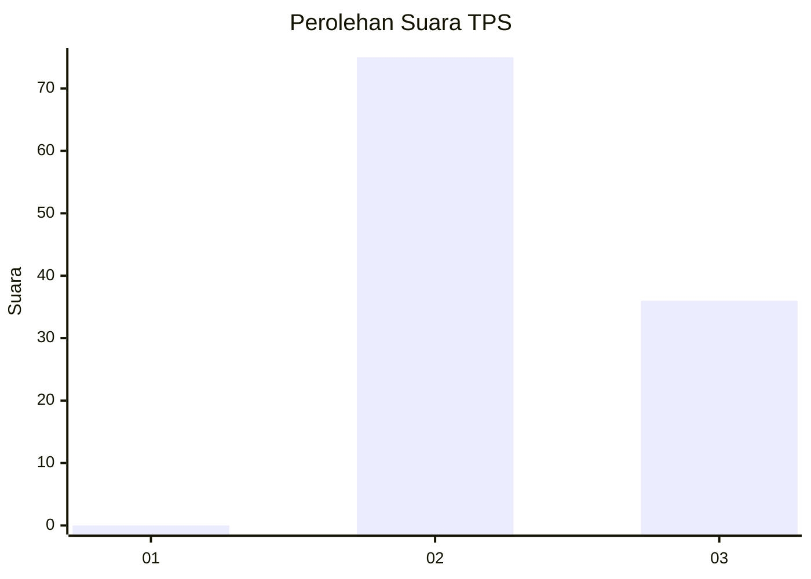
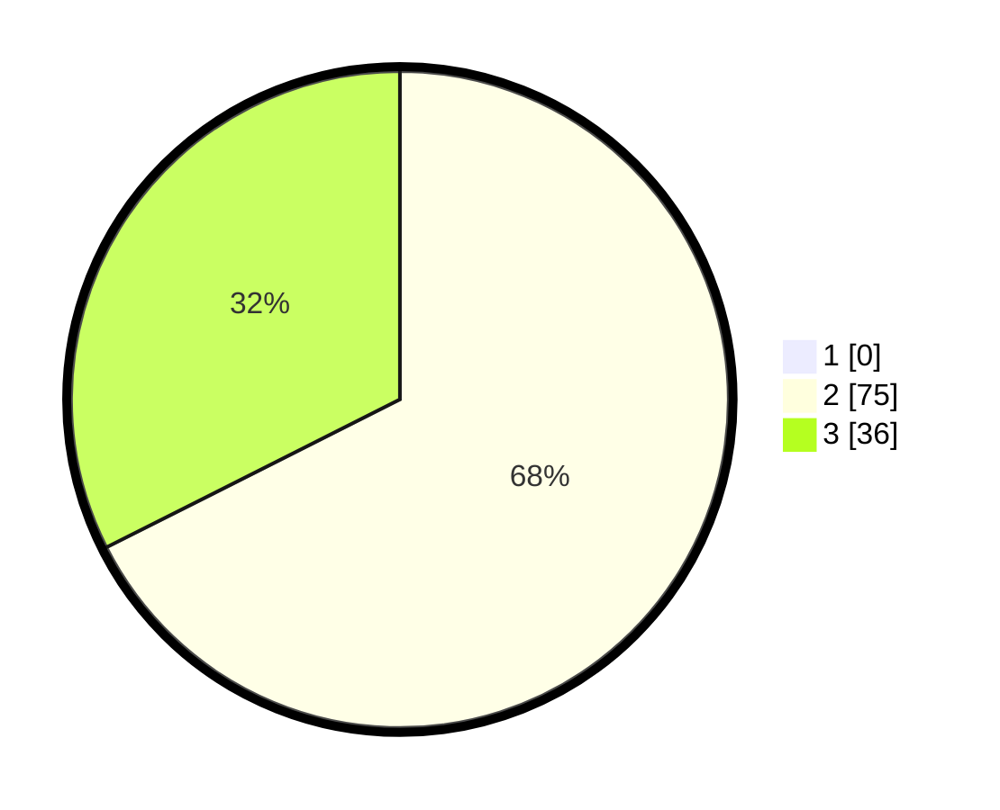

# Hasil

## Grafik

## Tabel

| No. | Nama Paslon    | Suara | Suara (raw) | Persentase |
|:--- |:-------------- | -----:| -----------:| ----------:|
| 1   | ANIES MUHAIMIN | 0     | [0][p-1]    | 0,00       |
| 2   | PRABOWO GIBRAN | 75    | [75][p-2]   | 67,57      |
| 3   | GANJAR MAHFUD  | 36    | [36][p-3]   | 32,43      |

[p-1]: https://github.com/gigit-pemilu/pemilu-2024/blob/main/pilpres/hitung-suara/sub/12-sumatera-utara/sub/17-samosir/sub/08-pangururan/sub/2023-sinabulan/sub/001-tps/sub/paslon-1.txt
[p-2]: https://github.com/gigit-pemilu/pemilu-2024/blob/main/pilpres/hitung-suara/sub/12-sumatera-utara/sub/17-samosir/sub/08-pangururan/sub/2023-sinabulan/sub/001-tps/sub/paslon-2.txt
[p-3]: https://github.com/gigit-pemilu/pemilu-2024/blob/main/pilpres/hitung-suara/sub/12-sumatera-utara/sub/17-samosir/sub/08-pangururan/sub/2023-sinabulan/sub/001-tps/sub/paslon-3.txt

## Foto C Plano

https://sirekap-obj-formc.kpu.go.id/b5c8/pemilu/ppwp/12/17/08/20/23/1217082023001-20240214-194019--58c89715-82b7-4834-ac39-1915eee05e74.jpg

https://sirekap-obj-formc.kpu.go.id/b5c8/pemilu/ppwp/12/17/08/20/23/1217082023001-20240214-205106--9f88d7f1-bc2f-452d-a9e0-4d4706fa9aa1.jpg

https://sirekap-obj-formc.kpu.go.id/b5c8/pemilu/ppwp/12/17/08/20/23/1217082023001-20240214-205312--938f47b6-8208-44bf-ac4b-cbf30a7f45af.jpg

## Metadata

| Key        | Value               |
| ---------- | ------------------- |
| Time Stamp | 2024-02-15 01:47:43 |

