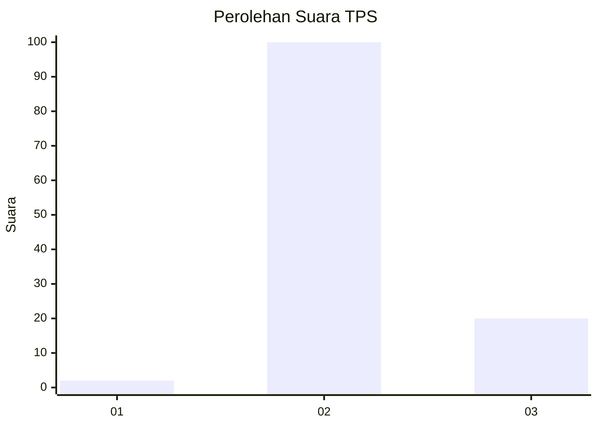
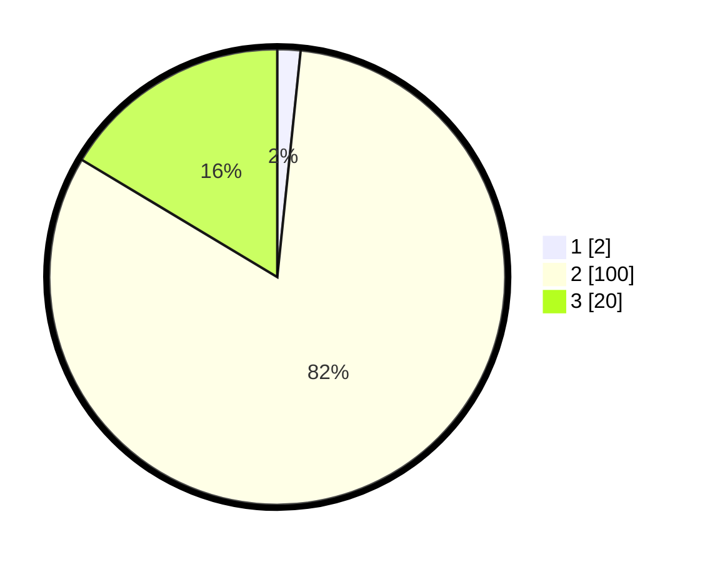

# Hasil

## Grafik

## Tabel

| No. | Nama Paslon    | Suara | Suara (raw) | Persentase |
|:--- |:-------------- | -----:| -----------:| ----------:|
| 1   | ANIES MUHAIMIN | 2     | [2][p-1]    | 1,64       |
| 2   | PRABOWO GIBRAN | 100   | [100][p-2]  | 81,97      |
| 3   | GANJAR MAHFUD  | 20    | [20][p-3]   | 16,39      |

[p-1]: https://github.com/gigit-pemilu/pemilu-2024/blob/main/pilpres/hitung-suara/sub/12-sumatera-utara/sub/17-samosir/sub/09-sitio-tio/sub/2007-parsaoran/sub/004-tps/sub/paslon-1.txt
[p-2]: https://github.com/gigit-pemilu/pemilu-2024/blob/main/pilpres/hitung-suara/sub/12-sumatera-utara/sub/17-samosir/sub/09-sitio-tio/sub/2007-parsaoran/sub/004-tps/sub/paslon-2.txt
[p-3]: https://github.com/gigit-pemilu/pemilu-2024/blob/main/pilpres/hitung-suara/sub/12-sumatera-utara/sub/17-samosir/sub/09-sitio-tio/sub/2007-parsaoran/sub/004-tps/sub/paslon-3.txt

## Foto C Plano

https://sirekap-obj-formc.kpu.go.id/0b3b/pemilu/ppwp/12/17/09/20/07/1217092007004-20240214-215605--a0012b70-e8ea-48cc-84fc-72500127575c.jpg

https://sirekap-obj-formc.kpu.go.id/0b3b/pemilu/ppwp/12/17/09/20/07/1217092007004-20240214-215608--bba3a879-acc4-4c53-87b1-22f57778ddca.jpg

https://sirekap-obj-formc.kpu.go.id/0b3b/pemilu/ppwp/12/17/09/20/07/1217092007004-20240214-215613--6a5fa899-410d-4608-a0cb-46a6b6f358b0.jpg

## Metadata

| Key        | Value               |
| ---------- | ------------------- |
| Time Stamp | 2024-02-15 18:00:26 |

