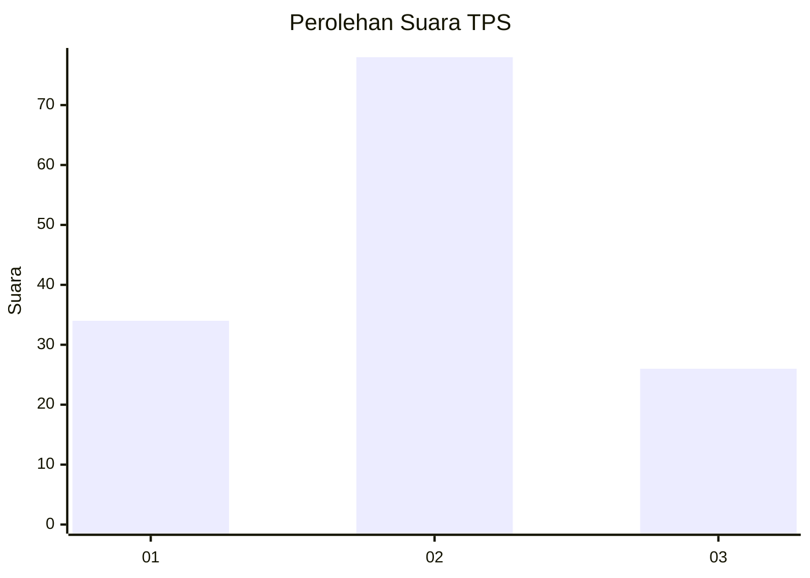
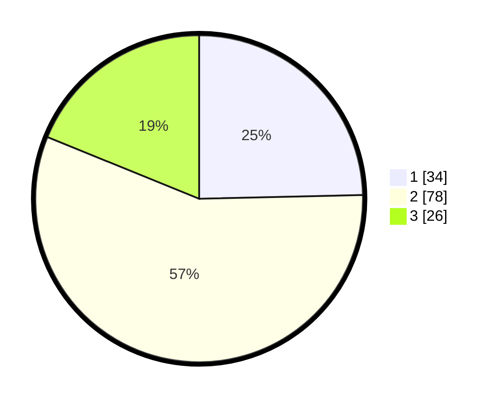

# Hasil

## Grafik

## Tabel

| No. | Nama Paslon    | Suara | Suara (raw) | Persentase |
|:--- |:-------------- | -----:| -----------:| ----------:|
| 1   | ANIES MUHAIMIN | 34    | [34][p-1]   | 24,64      |
| 2   | PRABOWO GIBRAN | 78    | [78][p-2]   | 56,52      |
| 3   | GANJAR MAHFUD  | 26    | [26][p-3]   | 18,84      |

[p-1]: https://github.com/gigit-pemilu/pemilu-2024/blob/main/pilpres/hitung-suara/sub/12-sumatera-utara/sub/18-serdang-bedagai/sub/03-teluk-mengkudu/sub/2004-pematang-setrak/sub/003-tps/sub/paslon-1.txt
[p-2]: https://github.com/gigit-pemilu/pemilu-2024/blob/main/pilpres/hitung-suara/sub/12-sumatera-utara/sub/18-serdang-bedagai/sub/03-teluk-mengkudu/sub/2004-pematang-setrak/sub/003-tps/sub/paslon-2.txt
[p-3]: https://github.com/gigit-pemilu/pemilu-2024/blob/main/pilpres/hitung-suara/sub/12-sumatera-utara/sub/18-serdang-bedagai/sub/03-teluk-mengkudu/sub/2004-pematang-setrak/sub/003-tps/sub/paslon-3.txt

## Foto C Plano

https://sirekap-obj-formc.kpu.go.id/e8e9/pemilu/ppwp/12/18/03/20/04/1218032004003-20240218-074614--65d387bd-cd67-4cb8-a00d-3bd54bc4ac53.jpg

https://sirekap-obj-formc.kpu.go.id/e8e9/pemilu/ppwp/12/18/03/20/04/1218032004003-20240218-075116--b3be43c4-60dd-4bed-9088-f99d7baedc47.jpg

https://sirekap-obj-formc.kpu.go.id/e8e9/pemilu/ppwp/12/18/03/20/04/1218032004003-20240217-113625--ffb4a4de-7ce1-43ae-b38e-00f0b034cd25.jpg

## Metadata

| Key        | Value               |
| ---------- | ------------------- |
| Time Stamp | 2024-02-19 06:16:00 |

