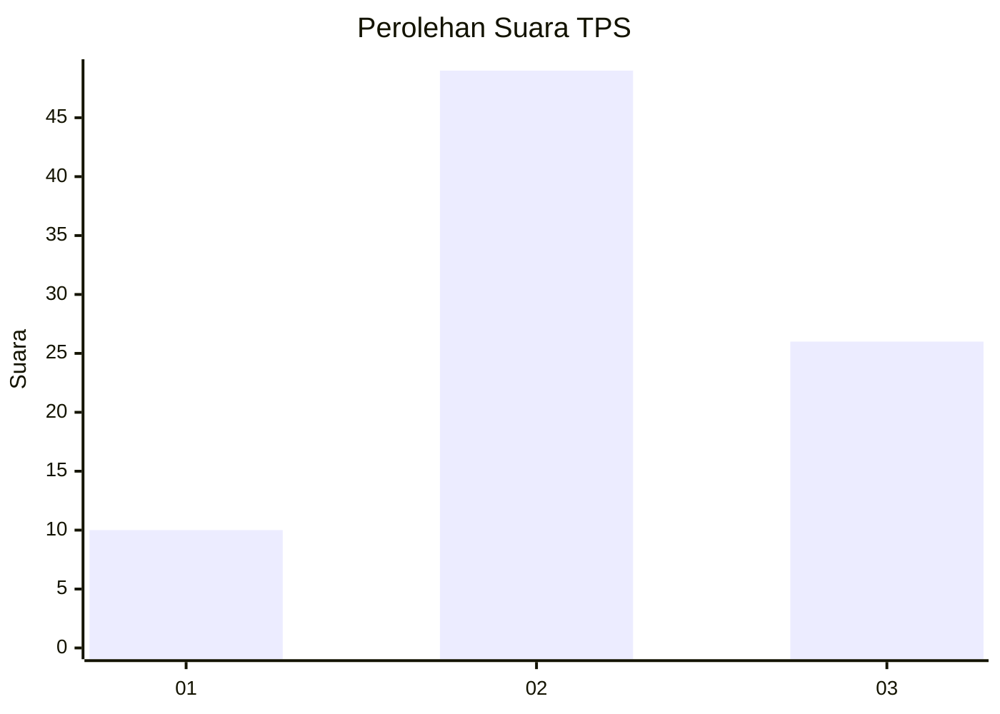
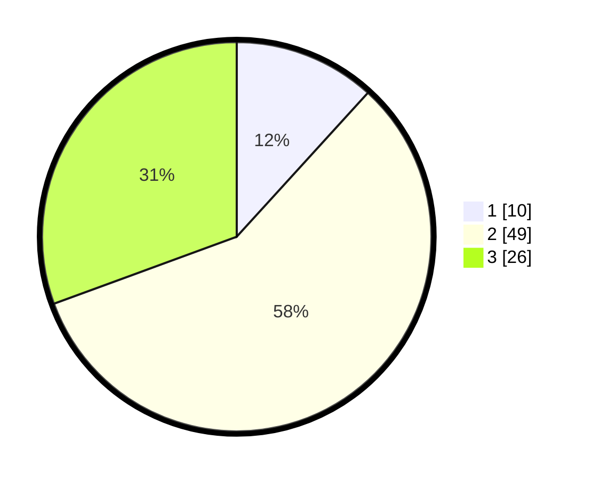

# Hasil

## Grafik

## Tabel

| No. | Nama Paslon    | Suara | Suara (raw) | Persentase |
|:--- |:-------------- | -----:| -----------:| ----------:|
| 1   | ANIES MUHAIMIN | 10    | [10][p-1]   | 11,76      |
| 2   | PRABOWO GIBRAN | 49    | [49][p-2]   | 57,65      |
| 3   | GANJAR MAHFUD  | 26    | [26][p-3]   | 30,59      |

[p-1]: https://github.com/gigit-pemilu/pemilu-2024-12-sumatera-utara/blob/main/pilpres/hitung-suara/sub/12-sumatera-utara/sub/18-serdang-bedagai/sub/03-teluk-mengkudu/sub/2009-sialang-buah/sub/013-tps/sub/paslon-1.txt
[p-2]: https://github.com/gigit-pemilu/pemilu-2024-12-sumatera-utara/blob/main/pilpres/hitung-suara/sub/12-sumatera-utara/sub/18-serdang-bedagai/sub/03-teluk-mengkudu/sub/2009-sialang-buah/sub/013-tps/sub/paslon-2.txt
[p-3]: https://github.com/gigit-pemilu/pemilu-2024-12-sumatera-utara/blob/main/pilpres/hitung-suara/sub/12-sumatera-utara/sub/18-serdang-bedagai/sub/03-teluk-mengkudu/sub/2009-sialang-buah/sub/013-tps/sub/paslon-3.txt

## Foto C Plano

https://sirekap-obj-formc.kpu.go.id/27cc/pemilu/ppwp/12/18/03/20/09/1218032009013-20240215-035214--afb94d75-9f1b-4db5-b118-06d6d7a1d247.jpg

https://sirekap-obj-formc.kpu.go.id/27cc/pemilu/ppwp/12/18/03/20/09/1218032009013-20240215-035327--941d9e16-3bf1-4df4-aefd-28ea6601de14.jpg

https://sirekap-obj-formc.kpu.go.id/27cc/pemilu/ppwp/12/18/03/20/09/1218032009013-20240215-035503--b87b6359-aa20-4021-81cb-86d5f05b3b65.jpg

## Metadata

| Key        | Value               |
| ---------- | ------------------- |
| Time Stamp | 2024-02-24 22:31:28 |

