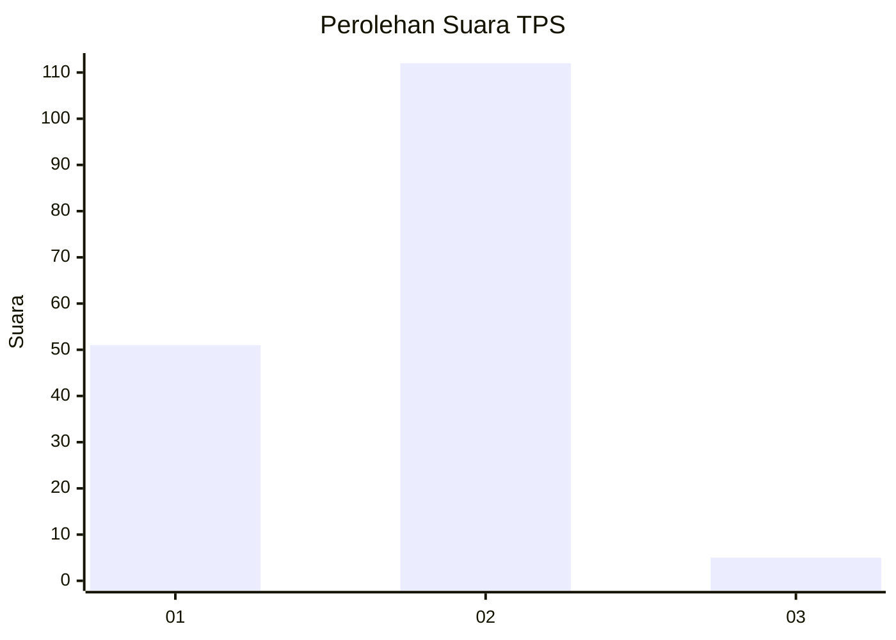
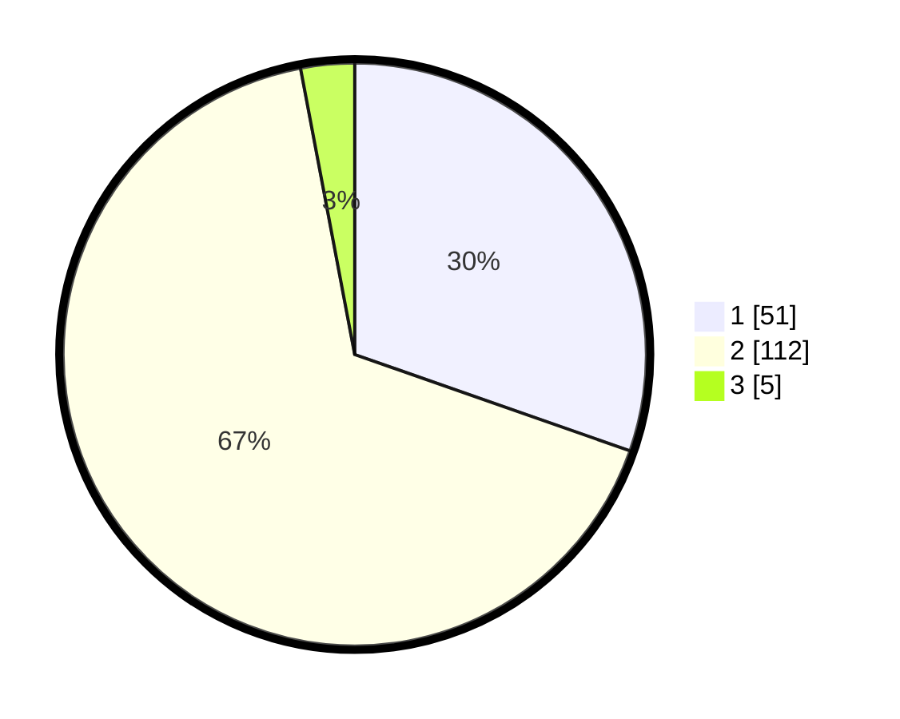

# Hasil

## Grafik

## Tabel

| No. | Nama Paslon    | Suara | Suara (raw) | Persentase |
|:--- |:-------------- | -----:| -----------:| ----------:|
| 1   | ANIES MUHAIMIN | 51    | [51][p-1]   | 30,36      |
| 2   | PRABOWO GIBRAN | 112   | [112][p-2]  | 66,67      |
| 3   | GANJAR MAHFUD  | 5     | [5][p-3]    | 2,98       |

[p-1]: https://github.com/gigit-pemilu/pemilu-2024-12-sumatera-utara/blob/main/pilpres/hitung-suara/sub/12-sumatera-utara/sub/18-serdang-bedagai/sub/04-sei-rampah/sub/2001-cempedak-lobang/sub/003-tps/sub/paslon-1.txt
[p-2]: https://github.com/gigit-pemilu/pemilu-2024-12-sumatera-utara/blob/main/pilpres/hitung-suara/sub/12-sumatera-utara/sub/18-serdang-bedagai/sub/04-sei-rampah/sub/2001-cempedak-lobang/sub/003-tps/sub/paslon-2.txt
[p-3]: https://github.com/gigit-pemilu/pemilu-2024-12-sumatera-utara/blob/main/pilpres/hitung-suara/sub/12-sumatera-utara/sub/18-serdang-bedagai/sub/04-sei-rampah/sub/2001-cempedak-lobang/sub/003-tps/sub/paslon-3.txt

## Foto C Plano

https://sirekap-obj-formc.kpu.go.id/c32b/pemilu/ppwp/12/18/04/20/01/1218042001003-20240217-155829--732fd74f-79ce-47f1-94df-d4a9adee26f4.jpg

https://sirekap-obj-formc.kpu.go.id/c32b/pemilu/ppwp/12/18/04/20/01/1218042001003-20240217-155723--7bea30fa-92a6-4b82-9e32-9ac822b2a298.jpg

https://sirekap-obj-formc.kpu.go.id/c32b/pemilu/ppwp/12/18/04/20/01/1218042001003-20240214-212456--4ec201e6-70a8-412f-b9d6-2544c27e3862.jpg

## Metadata

| Key        | Value               |
| ---------- | ------------------- |
| Time Stamp | 2024-02-17 16:36:25 |

