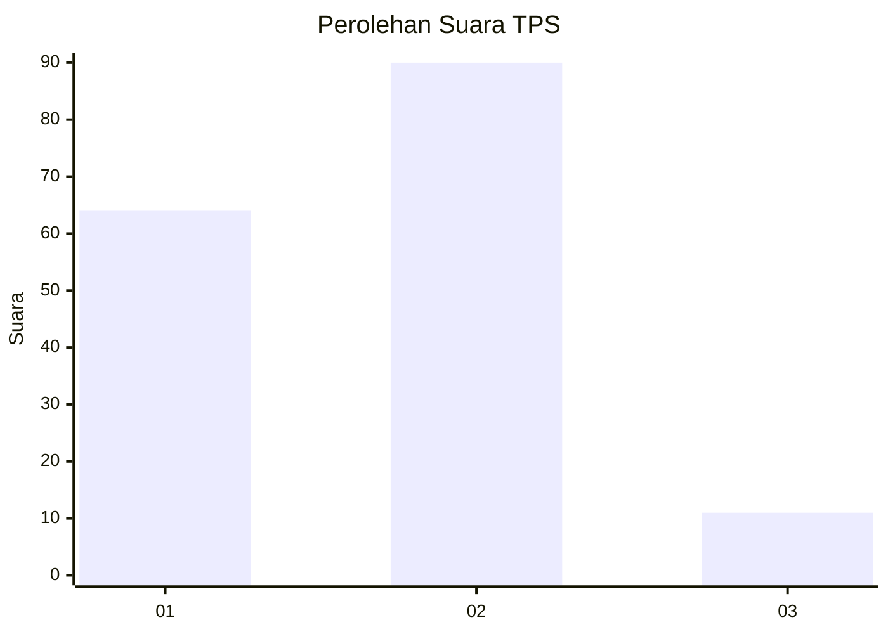
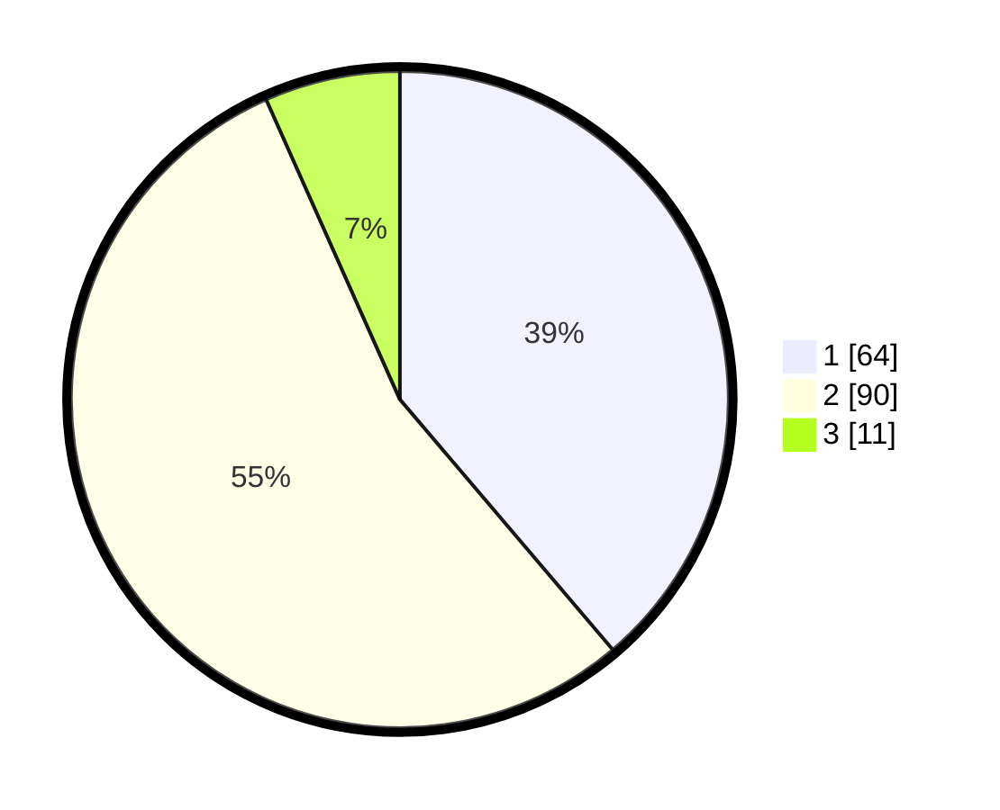

# Hasil

## Grafik

## Tabel

| No. | Nama Paslon    | Suara | Suara (raw) | Persentase |
|:--- |:-------------- | -----:| -----------:| ----------:|
| 1   | ANIES MUHAIMIN | 64    | [64][p-1]   | 38,79      |
| 2   | PRABOWO GIBRAN | 90    | [90][p-2]   | 54,55      |
| 3   | GANJAR MAHFUD  | 11    | [11][p-3]   | 6,67       |

[p-1]: https://github.com/gigit-pemilu/pemilu-2024/blob/main/pilpres/hitung-suara/sub/12-sumatera-utara/sub/18-serdang-bedagai/sub/04-sei-rampah/sub/2015-pematang-pelintahan/sub/008-tps/sub/paslon-1.txt
[p-2]: https://github.com/gigit-pemilu/pemilu-2024/blob/main/pilpres/hitung-suara/sub/12-sumatera-utara/sub/18-serdang-bedagai/sub/04-sei-rampah/sub/2015-pematang-pelintahan/sub/008-tps/sub/paslon-2.txt
[p-3]: https://github.com/gigit-pemilu/pemilu-2024/blob/main/pilpres/hitung-suara/sub/12-sumatera-utara/sub/18-serdang-bedagai/sub/04-sei-rampah/sub/2015-pematang-pelintahan/sub/008-tps/sub/paslon-3.txt

## Foto C Plano

https://sirekap-obj-formc.kpu.go.id/bede/pemilu/ppwp/12/18/04/20/15/1218042015008-20240217-121640--ab05fe72-7cbd-4bed-b60a-a4c4eb6a78cf.jpg

https://sirekap-obj-formc.kpu.go.id/bede/pemilu/ppwp/12/18/04/20/15/1218042015008-20240217-120721--c0263df9-ed60-490d-b594-3b9778ba0114.jpg

https://sirekap-obj-formc.kpu.go.id/bede/pemilu/ppwp/12/18/04/20/15/1218042015008-20240217-121323--98a0d75e-dc48-4731-a6ac-c60254606545.jpg

## Metadata

| Key        | Value               |
| ---------- | ------------------- |
| Time Stamp | 2024-02-19 12:00:00 |

## DATA PEMILIH TETAP

Jumlah pemilih dalam DPT: **225**.
 * L: **730**.
 * P: **285**.

## DATA PENGGUNA HAK PILIH

Jumlah pengguna hak pilih dalam DPT: **366**.
 * L: **1**.
 * P: **485**.

Jumlah pengguna hak pilih dalam DPTb: **202**.
 * L: **0**.
 * P: **342**.

Jumlah pengguna hak pilih dalam DPK: **0**.
 * L: **2**.
 * P: **440**.

Jumlah pengguna hak pilih: **720**.
 * L: **3**.
 * P: **85**.

## JUMLAH SUARA SAH DAN TIDAK SAH

JUMLAH SELURUH SUARA SAH: **165**.

JUMLAH SUARA TIDAK SAH: **3**.

JUMLAH SELURUH SUARA SAH DAN SUARA TIDAK SAH: **168**.

