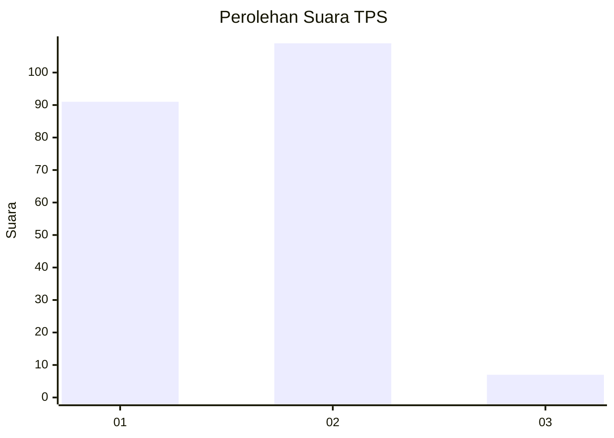
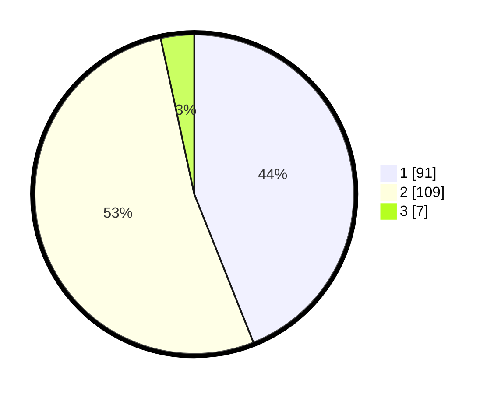

# Hasil

## Grafik

## Tabel

| No. | Nama Paslon    | Suara | Suara (raw) | Persentase |
|:--- |:-------------- | -----:| -----------:| ----------:|
| 1   | ANIES MUHAIMIN | 91    | [91][p-1]   | 43,96      |
| 2   | PRABOWO GIBRAN | 109   | [109][p-2]  | 52,66      |
| 3   | GANJAR MAHFUD  | 7     | [7][p-3]    | 3,38       |

[p-1]: https://github.com/gigit-pemilu/pemilu-2024-12-sumatera-utara/blob/main/pilpres/hitung-suara/sub/12-sumatera-utara/sub/18-serdang-bedagai/sub/05-tanjung-beringin/sub/2001-pekan-tanjung-beringin/sub/002-tps/sub/paslon-1.txt
[p-2]: https://github.com/gigit-pemilu/pemilu-2024-12-sumatera-utara/blob/main/pilpres/hitung-suara/sub/12-sumatera-utara/sub/18-serdang-bedagai/sub/05-tanjung-beringin/sub/2001-pekan-tanjung-beringin/sub/002-tps/sub/paslon-2.txt
[p-3]: https://github.com/gigit-pemilu/pemilu-2024-12-sumatera-utara/blob/main/pilpres/hitung-suara/sub/12-sumatera-utara/sub/18-serdang-bedagai/sub/05-tanjung-beringin/sub/2001-pekan-tanjung-beringin/sub/002-tps/sub/paslon-3.txt

## Foto C Plano

https://sirekap-obj-formc.kpu.go.id/3c29/pemilu/ppwp/12/18/05/20/01/1218052001002-20240218-120233--0bd8c62d-0dc1-4d40-8e84-342579065b6d.jpg

https://sirekap-obj-formc.kpu.go.id/3c29/pemilu/ppwp/12/18/05/20/01/1218052001002-20240218-120352--865e14c9-bb76-4516-a70e-11e9d20bf351.jpg

https://sirekap-obj-formc.kpu.go.id/3c29/pemilu/ppwp/12/18/05/20/01/1218052001002-20240218-121039--376a8648-8454-4ec6-a782-60b8eb28760b.jpg

## Metadata

| Key        | Value               |
| ---------- | ------------------- |
| Time Stamp | 2024-02-25 19:00:00 |

