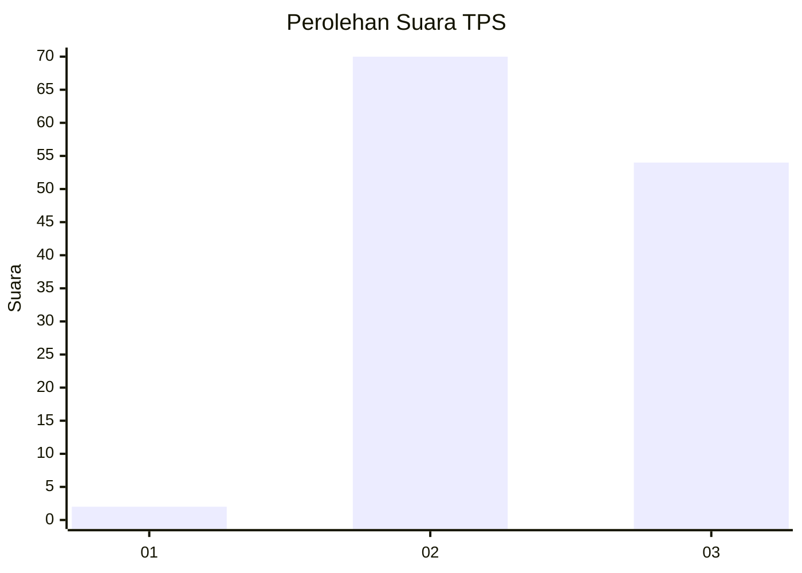
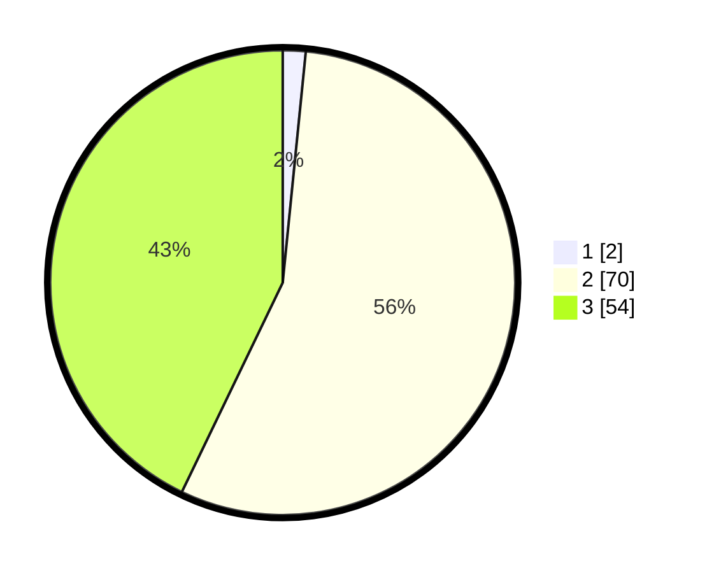

# Hasil

## Grafik

## Tabel

| No. | Nama Paslon    | Suara | Suara (raw) | Persentase |
|:--- |:-------------- | -----:| -----------:| ----------:|
| 1   | ANIES MUHAIMIN | 2     | [2][p-1]    | 1,59       |
| 2   | PRABOWO GIBRAN | 70    | [70][p-2]   | 55,56      |
| 3   | GANJAR MAHFUD  | 54    | [54][p-3]   | 42,86      |

[p-1]: https://github.com/gigit-pemilu/pemilu-2024/blob/main/pilpres/hitung-suara/sub/12-sumatera-utara/sub/18-serdang-bedagai/sub/05-tanjung-beringin/sub/2007-pematang-terang/sub/007-tps/sub/paslon-1.txt
[p-2]: https://github.com/gigit-pemilu/pemilu-2024/blob/main/pilpres/hitung-suara/sub/12-sumatera-utara/sub/18-serdang-bedagai/sub/05-tanjung-beringin/sub/2007-pematang-terang/sub/007-tps/sub/paslon-2.txt
[p-3]: https://github.com/gigit-pemilu/pemilu-2024/blob/main/pilpres/hitung-suara/sub/12-sumatera-utara/sub/18-serdang-bedagai/sub/05-tanjung-beringin/sub/2007-pematang-terang/sub/007-tps/sub/paslon-3.txt

## Foto C Plano

https://sirekap-obj-formc.kpu.go.id/b43f/pemilu/ppwp/12/18/05/20/07/1218052007007-20240214-141503--a50153ae-2b6b-486a-a6d8-63903ba4807b.jpg

https://sirekap-obj-formc.kpu.go.id/b43f/pemilu/ppwp/12/18/05/20/07/1218052007007-20240214-141609--68b5298c-205a-4d69-a91c-48b460e21b97.jpg

https://sirekap-obj-formc.kpu.go.id/b43f/pemilu/ppwp/12/18/05/20/07/1218052007007-20240214-141746--1ffec209-d35b-4b99-85f3-ceefd7452d7f.jpg

## Metadata

| Key        | Value               |
| ---------- | ------------------- |
| Time Stamp | 2024-02-25 15:00:00 |

