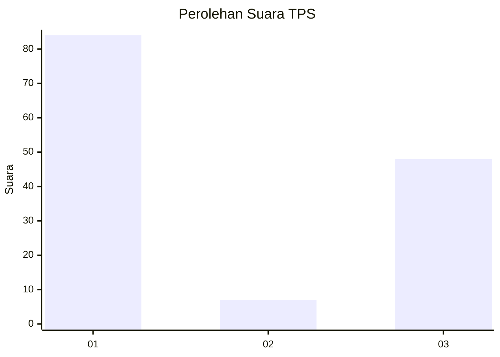
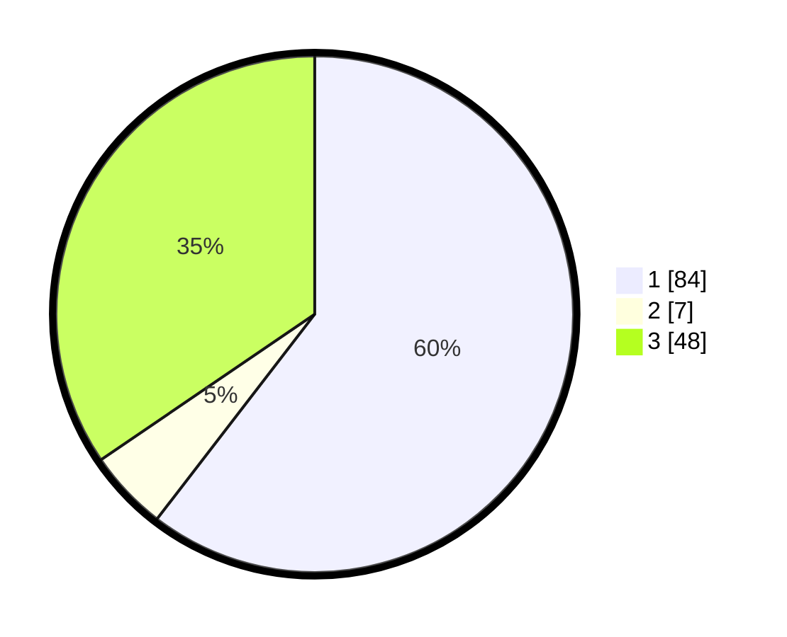

# Hasil

## Grafik

## Tabel

| No. | Nama Paslon    | Suara | Suara (raw) | Persentase |
|:--- |:-------------- | -----:| -----------:| ----------:|
| 1   | ANIES MUHAIMIN | 84    | [84][p-1]   | 60,43      |
| 2   | PRABOWO GIBRAN | 7     | [7][p-2]    | 5,04       |
| 3   | GANJAR MAHFUD  | 48    | [48][p-3]   | 34,53      |

[p-1]: https://github.com/gigit-pemilu/pemilu-2024/blob/main/pilpres/hitung-suara/sub/12-sumatera-utara/sub/18-serdang-bedagai/sub/06-bandar-khalipah/sub/2002-juhar/sub/002-tps/sub/paslon-1.txt
[p-2]: https://github.com/gigit-pemilu/pemilu-2024/blob/main/pilpres/hitung-suara/sub/12-sumatera-utara/sub/18-serdang-bedagai/sub/06-bandar-khalipah/sub/2002-juhar/sub/002-tps/sub/paslon-2.txt
[p-3]: https://github.com/gigit-pemilu/pemilu-2024/blob/main/pilpres/hitung-suara/sub/12-sumatera-utara/sub/18-serdang-bedagai/sub/06-bandar-khalipah/sub/2002-juhar/sub/002-tps/sub/paslon-3.txt

## Foto C Plano

https://sirekap-obj-formc.kpu.go.id/7e4f/pemilu/ppwp/12/18/06/20/02/1218062002002-20240221-141949--d619d4a8-3eb2-4633-94c8-8301bfc70236.jpg

https://sirekap-obj-formc.kpu.go.id/7e4f/pemilu/ppwp/12/18/06/20/02/1218062002002-20240221-141757--b5baca42-5aa9-4a7b-aefa-f8dcafc44905.jpg

https://sirekap-obj-formc.kpu.go.id/7e4f/pemilu/ppwp/12/18/06/20/02/1218062002002-20240221-142039--2bce9606-f953-447f-85f4-23aa20f3e454.jpg

## Metadata

| Key        | Value               |
| ---------- | ------------------- |
| Time Stamp | 2024-02-21 15:00:00 |

## DATA PEMILIH TETAP

Jumlah pemilih dalam DPT: **201**.
 * L: **92**.
 * P: **609**.

## DATA PENGGUNA HAK PILIH

Jumlah pengguna hak pilih dalam DPT: **648**.
 * L: **61**.
 * P: **87**.

Jumlah pengguna hak pilih dalam DPTb: **2**.
 * L: **3**.
 * P: **4**.

Jumlah pengguna hak pilih dalam DPK: **0**.
 * L: **300**.
 * P: **300**.

Jumlah pengguna hak pilih: **321**.
 * L: **548**.
 * P: **628**.

## JUMLAH SUARA SAH DAN TIDAK SAH

JUMLAH SELURUH SUARA SAH: **253**.

JUMLAH SUARA TIDAK SAH: **6**.

JUMLAH SELURUH SUARA SAH DAN SUARA TIDAK SAH: **554**.

