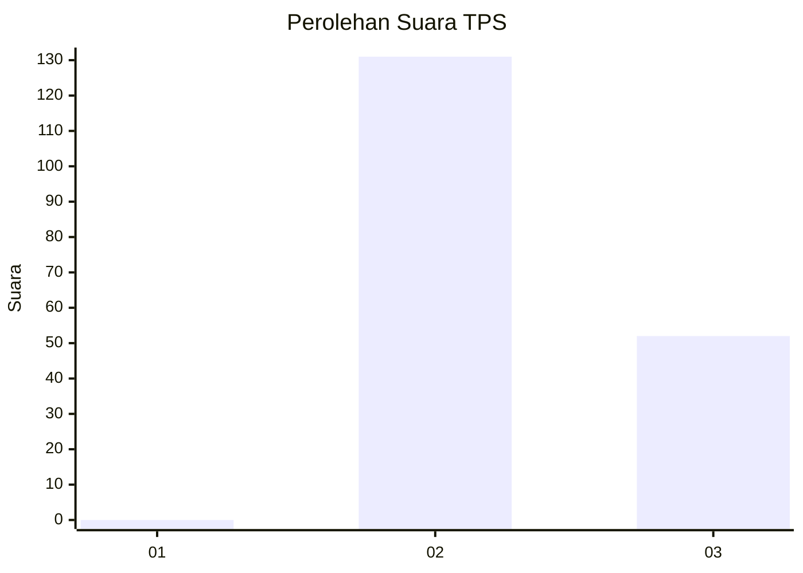
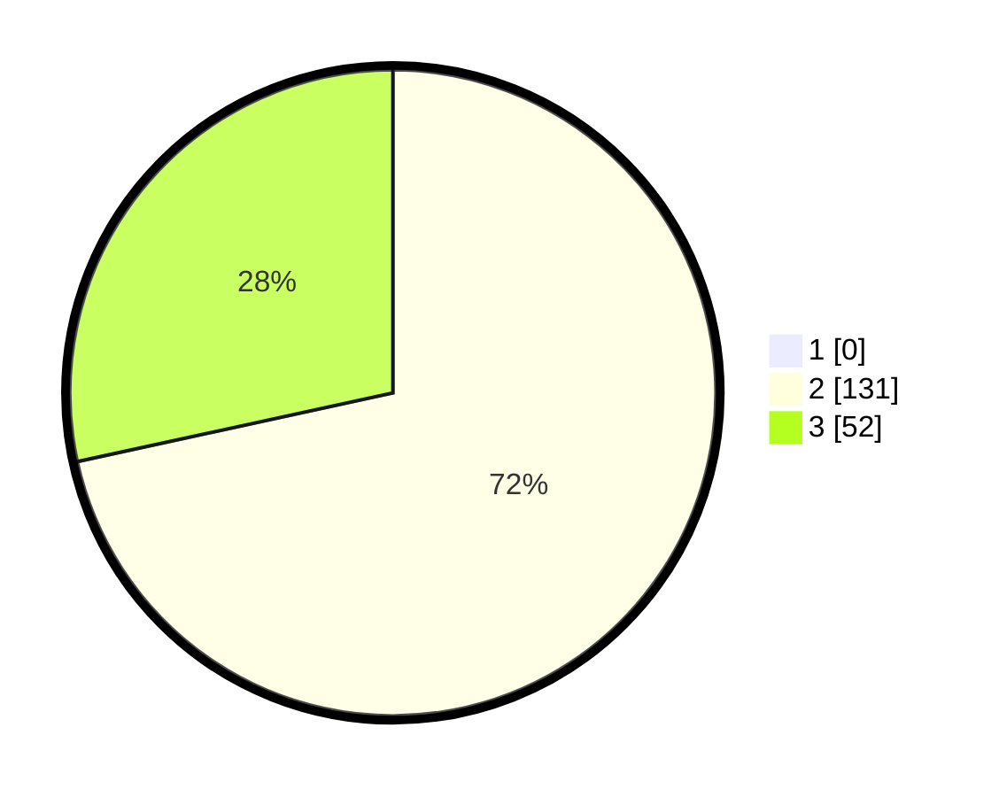

# Hasil

## Grafik

## Tabel

| No. | Nama Paslon    | Suara | Suara (raw) | Persentase |
|:--- |:-------------- | -----:| -----------:| ----------:|
| 1   | ANIES MUHAIMIN | 0     | [0][p-1]    | 0,00       |
| 2   | PRABOWO GIBRAN | 131   | [131][p-2]  | 71,58      |
| 3   | GANJAR MAHFUD  | 52    | [52][p-3]   | 28,42      |

[p-1]: https://github.com/gigit-pemilu/pemilu-2024-12-sumatera-utara/blob/main/pilpres/hitung-suara/sub/12-sumatera-utara/sub/18-serdang-bedagai/sub/06-bandar-khalipah/sub/2002-juhar/sub/012-tps/sub/paslon-1.txt
[p-2]: https://github.com/gigit-pemilu/pemilu-2024-12-sumatera-utara/blob/main/pilpres/hitung-suara/sub/12-sumatera-utara/sub/18-serdang-bedagai/sub/06-bandar-khalipah/sub/2002-juhar/sub/012-tps/sub/paslon-2.txt
[p-3]: https://github.com/gigit-pemilu/pemilu-2024-12-sumatera-utara/blob/main/pilpres/hitung-suara/sub/12-sumatera-utara/sub/18-serdang-bedagai/sub/06-bandar-khalipah/sub/2002-juhar/sub/012-tps/sub/paslon-3.txt

## Foto C Plano

https://sirekap-obj-formc.kpu.go.id/56b2/pemilu/ppwp/12/18/06/20/02/1218062002012-20240221-145630--e4a2b503-3ce6-482d-8280-330991925570.jpg

https://sirekap-obj-formc.kpu.go.id/56b2/pemilu/ppwp/12/18/06/20/02/1218062002012-20240221-150326--d842e615-706f-4424-83d5-676a1706b6f7.jpg

https://sirekap-obj-formc.kpu.go.id/56b2/pemilu/ppwp/12/18/06/20/02/1218062002012-20240221-145948--a2137719-7b89-4566-8b5a-3c7124745ab6.jpg

## Metadata

| Key        | Value               |
| ---------- | ------------------- |
| Time Stamp | 2024-02-21 16:00:00 |

## DATA PEMILIH TETAP

Jumlah pemilih dalam DPT: **0**.
 * L: **120**.
 * P: **0**.

## DATA PENGGUNA HAK PILIH

Jumlah pengguna hak pilih dalam DPT: **501**.
 * L: **80**.
 * P: **0**.

Jumlah pengguna hak pilih dalam DPTb: **5**.
 * L: **62**.
 * P: **500**.

Jumlah pengguna hak pilih dalam DPK: **194**.
 * L: **50**.
 * P: **500**.

Jumlah pengguna hak pilih: **0**.
 * L: **0**.
 * P: **0**.

## JUMLAH SUARA SAH DAN TIDAK SAH

JUMLAH SELURUH SUARA SAH: **155**.

JUMLAH SUARA TIDAK SAH: **500**.

JUMLAH SELURUH SUARA SAH DAN SUARA TIDAK SAH: **0**.

