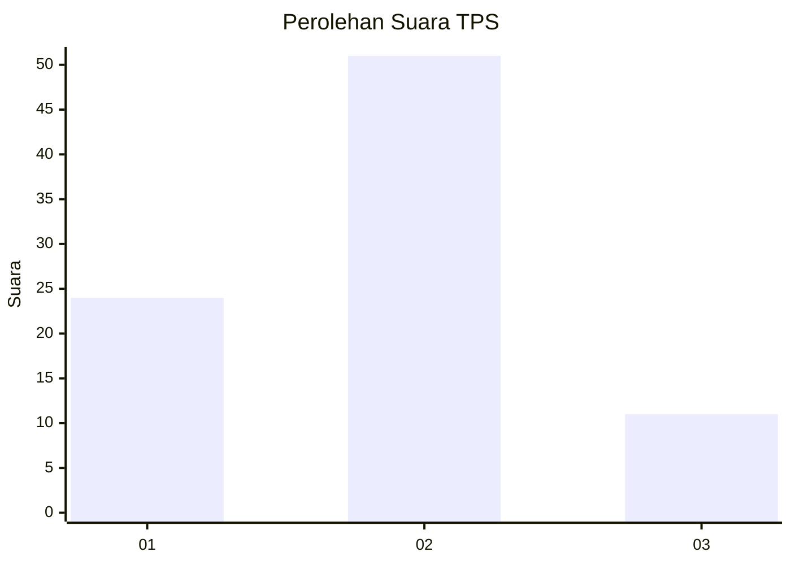
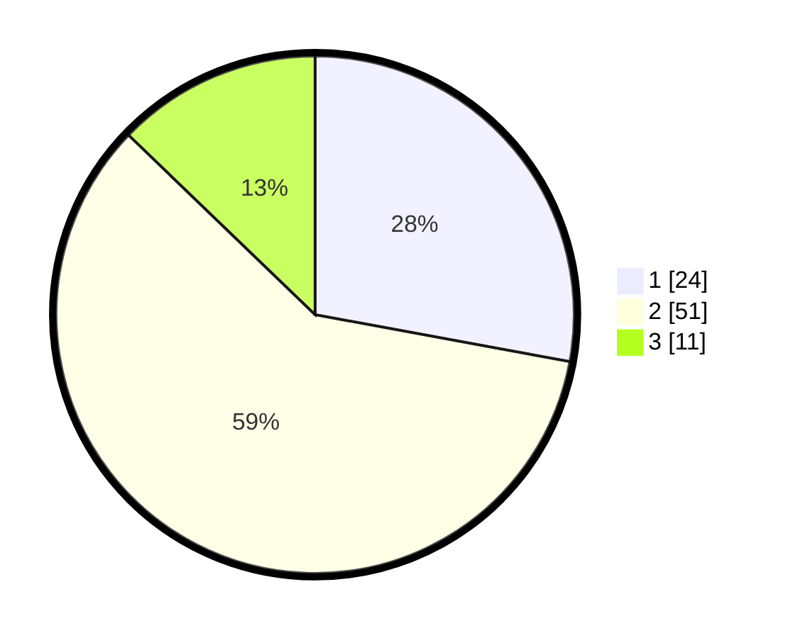

# Hasil

## Grafik

## Tabel

| No. | Nama Paslon    | Suara | Suara (raw) | Persentase |
|:--- |:-------------- | -----:| -----------:| ----------:|
| 1   | ANIES MUHAIMIN | 24    | [24][p-1]   | 27,91      |
| 2   | PRABOWO GIBRAN | 51    | [51][p-2]   | 59,30      |
| 3   | GANJAR MAHFUD  | 11    | [11][p-3]   | 12,79      |

[p-1]: https://github.com/gigit-pemilu/pemilu-2024-12-sumatera-utara/blob/main/pilpres/hitung-suara/sub/12-sumatera-utara/sub/18-serdang-bedagai/sub/06-bandar-khalipah/sub/2004-pekan-bandar-khalipah/sub/003-tps/sub/paslon-1.txt
[p-2]: https://github.com/gigit-pemilu/pemilu-2024-12-sumatera-utara/blob/main/pilpres/hitung-suara/sub/12-sumatera-utara/sub/18-serdang-bedagai/sub/06-bandar-khalipah/sub/2004-pekan-bandar-khalipah/sub/003-tps/sub/paslon-2.txt
[p-3]: https://github.com/gigit-pemilu/pemilu-2024-12-sumatera-utara/blob/main/pilpres/hitung-suara/sub/12-sumatera-utara/sub/18-serdang-bedagai/sub/06-bandar-khalipah/sub/2004-pekan-bandar-khalipah/sub/003-tps/sub/paslon-3.txt

## Foto C Plano

https://sirekap-obj-formc.kpu.go.id/811f/pemilu/ppwp/12/18/06/20/04/1218062004003-20240214-155149--5ef9b428-935e-4714-b7de-621e2edfa94b.jpg

https://sirekap-obj-formc.kpu.go.id/811f/pemilu/ppwp/12/18/06/20/04/1218062004003-20240214-141753--438fe389-7688-410c-9c63-6fc9a8af07c4.jpg

https://sirekap-obj-formc.kpu.go.id/811f/pemilu/ppwp/12/18/06/20/04/1218062004003-20240214-141930--6b69a1cc-0aa0-455b-bf17-b02029b530fc.jpg

## Metadata

| Key        | Value               |
| ---------- | ------------------- |
| Time Stamp | 2024-02-25 12:00:00 |

