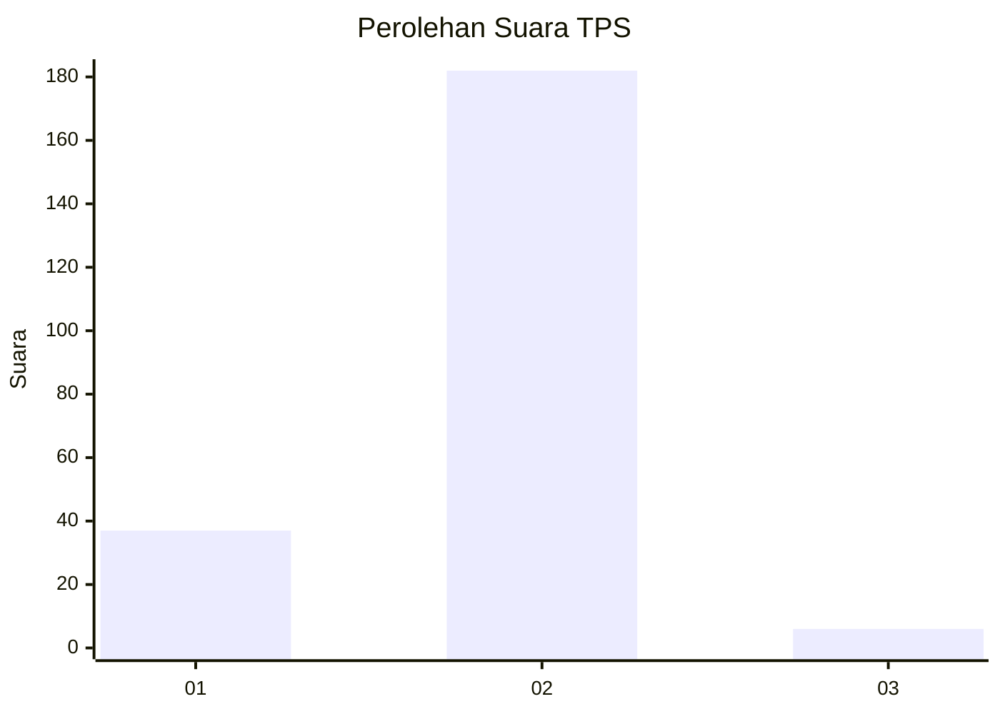
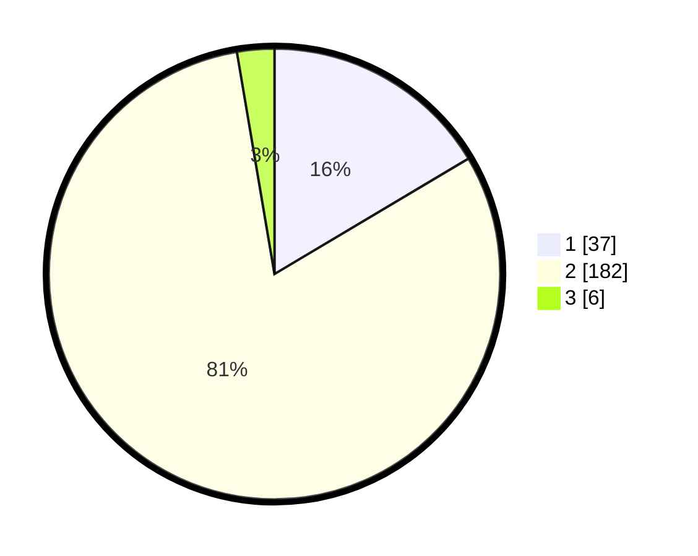

# Hasil

## Grafik

## Tabel

| No. | Nama Paslon    | Suara | Suara (raw) | Persentase |
|:--- |:-------------- | -----:| -----------:| ----------:|
| 1   | ANIES MUHAIMIN | 37    | [37][p-1]   | 16,44      |
| 2   | PRABOWO GIBRAN | 182   | [182][p-2]  | 80,89      |
| 3   | GANJAR MAHFUD  | 6     | [6][p-3]    | 2,67       |

[p-1]: https://github.com/gigit-pemilu/pemilu-2024/blob/main/pilpres/hitung-suara/sub/12-sumatera-utara/sub/18-serdang-bedagai/sub/07-dolok-merawan/sub/2003-bandarawan/sub/001-tps/sub/paslon-1.txt
[p-2]: https://github.com/gigit-pemilu/pemilu-2024/blob/main/pilpres/hitung-suara/sub/12-sumatera-utara/sub/18-serdang-bedagai/sub/07-dolok-merawan/sub/2003-bandarawan/sub/001-tps/sub/paslon-2.txt
[p-3]: https://github.com/gigit-pemilu/pemilu-2024/blob/main/pilpres/hitung-suara/sub/12-sumatera-utara/sub/18-serdang-bedagai/sub/07-dolok-merawan/sub/2003-bandarawan/sub/001-tps/sub/paslon-3.txt

## Foto C Plano

https://sirekap-obj-formc.kpu.go.id/7977/pemilu/ppwp/12/18/07/20/03/1218072003001-20240215-101050--483a2407-7f08-4fe6-9104-f86ebfaa544c.jpg

https://sirekap-obj-formc.kpu.go.id/7977/pemilu/ppwp/12/18/07/20/03/1218072003001-20240215-101055--0fc69a37-bea7-499b-98b1-62d667fca3b2.jpg

https://sirekap-obj-formc.kpu.go.id/7977/pemilu/ppwp/12/18/07/20/03/1218072003001-20240215-101109--3c9b77dd-7266-44f2-893c-2068d20d9203.jpg

## Metadata

| Key        | Value               |
| ---------- | ------------------- |
| Time Stamp | 2024-02-24 22:31:28 |

