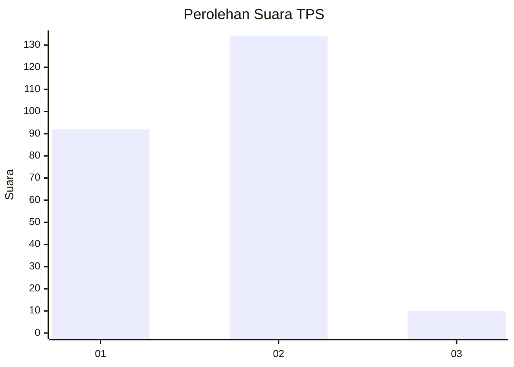
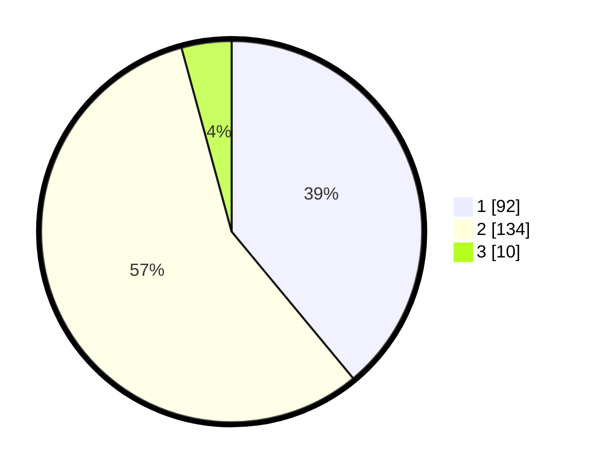

# Hasil

## Grafik

## Tabel

| No. | Nama Paslon    | Suara | Suara (raw) | Persentase |
|:--- |:-------------- | -----:| -----------:| ----------:|
| 1   | ANIES MUHAIMIN | 92    | [92][p-1]   | 38,98      |
| 2   | PRABOWO GIBRAN | 134   | [134][p-2]  | 56,78      |
| 3   | GANJAR MAHFUD  | 10    | [10][p-3]   | 4,24       |

[p-1]: https://github.com/gigit-pemilu/pemilu-2024-12-sumatera-utara/blob/main/pilpres/hitung-suara/sub/12-sumatera-utara/sub/18-serdang-bedagai/sub/07-dolok-merawan/sub/2004-gunung-para-ii/sub/002-tps/sub/paslon-1.txt
[p-2]: https://github.com/gigit-pemilu/pemilu-2024-12-sumatera-utara/blob/main/pilpres/hitung-suara/sub/12-sumatera-utara/sub/18-serdang-bedagai/sub/07-dolok-merawan/sub/2004-gunung-para-ii/sub/002-tps/sub/paslon-2.txt
[p-3]: https://github.com/gigit-pemilu/pemilu-2024-12-sumatera-utara/blob/main/pilpres/hitung-suara/sub/12-sumatera-utara/sub/18-serdang-bedagai/sub/07-dolok-merawan/sub/2004-gunung-para-ii/sub/002-tps/sub/paslon-3.txt

## Foto C Plano

https://sirekap-obj-formc.kpu.go.id/b72a/pemilu/ppwp/12/18/07/20/04/1218072004002-20240216-221353--7264ee82-8b1e-4585-9e1a-10135d69b22f.jpg

https://sirekap-obj-formc.kpu.go.id/b72a/pemilu/ppwp/12/18/07/20/04/1218072004002-20240216-221415--47811fcd-8144-426b-8ad7-abbec6c5b906.jpg

https://sirekap-obj-formc.kpu.go.id/b72a/pemilu/ppwp/12/18/07/20/04/1218072004002-20240216-221757--1245b161-d8c8-4d45-930f-1a22d42e6c4a.jpg

## Metadata

| Key        | Value               |
| ---------- | ------------------- |
| Time Stamp | 2024-02-25 10:00:00 |

