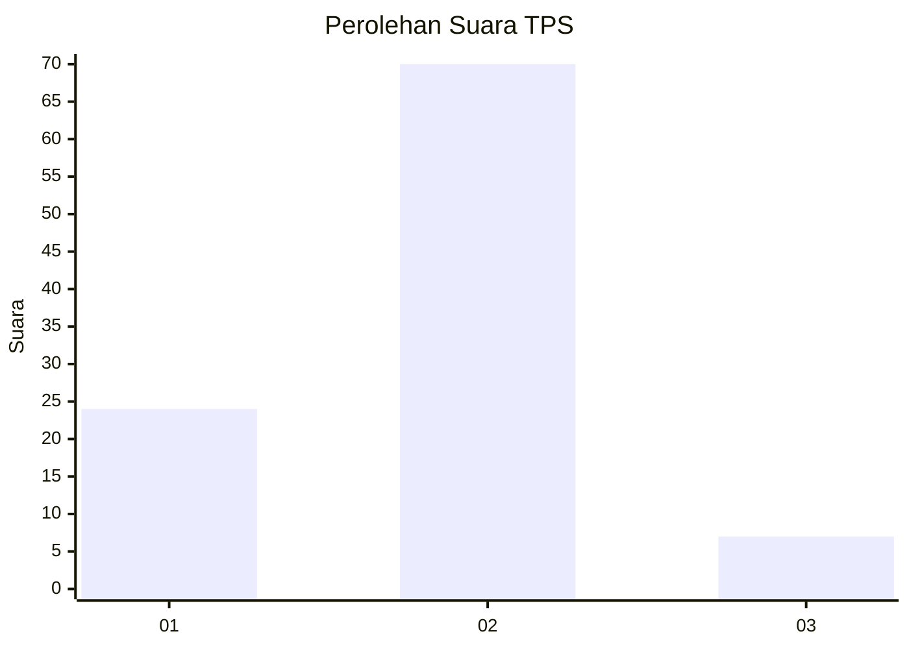
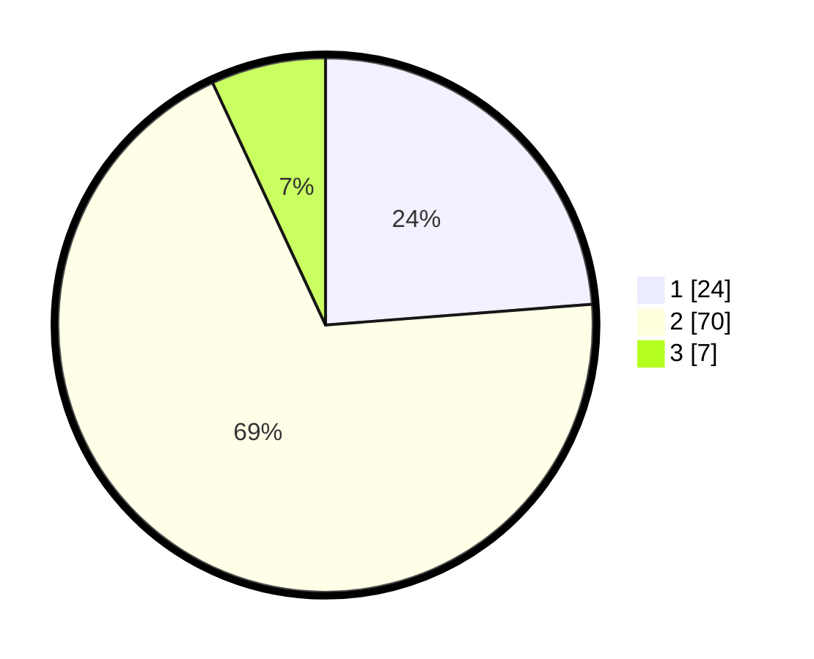

# Hasil

## Grafik

## Tabel

| No. | Nama Paslon    | Suara | Suara (raw) | Persentase |
|:--- |:-------------- | -----:| -----------:| ----------:|
| 1   | ANIES MUHAIMIN | 24    | [24][p-1]   | 23,76      |
| 2   | PRABOWO GIBRAN | 70    | [70][p-2]   | 69,31      |
| 3   | GANJAR MAHFUD  | 7     | [7][p-3]    | 6,93       |

[p-1]: https://github.com/gigit-pemilu/pemilu-2024/blob/main/pilpres/hitung-suara/sub/12-sumatera-utara/sub/18-serdang-bedagai/sub/08-sipispis/sub/2005-pispis/sub/002-tps/sub/paslon-1.txt
[p-2]: https://github.com/gigit-pemilu/pemilu-2024/blob/main/pilpres/hitung-suara/sub/12-sumatera-utara/sub/18-serdang-bedagai/sub/08-sipispis/sub/2005-pispis/sub/002-tps/sub/paslon-2.txt
[p-3]: https://github.com/gigit-pemilu/pemilu-2024/blob/main/pilpres/hitung-suara/sub/12-sumatera-utara/sub/18-serdang-bedagai/sub/08-sipispis/sub/2005-pispis/sub/002-tps/sub/paslon-3.txt

## Foto C Plano

https://sirekap-obj-formc.kpu.go.id/5992/pemilu/ppwp/12/18/08/20/05/1218082005002-20240214-140957--cb179f32-c978-4934-8f7d-75c52db401b3.jpg

https://sirekap-obj-formc.kpu.go.id/5992/pemilu/ppwp/12/18/08/20/05/1218082005002-20240214-141602--734b277e-e026-49fd-baa7-499a5ccbe056.jpg

https://sirekap-obj-formc.kpu.go.id/5992/pemilu/ppwp/12/18/08/20/05/1218082005002-20240219-155126--b42cb323-1e5a-4e09-8911-9d995e17312e.jpg

## Metadata

| Key        | Value               |
| ---------- | ------------------- |
| Time Stamp | 2024-02-19 16:00:00 |

