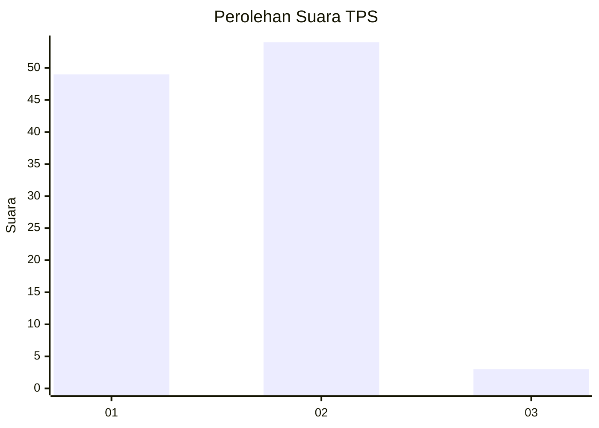
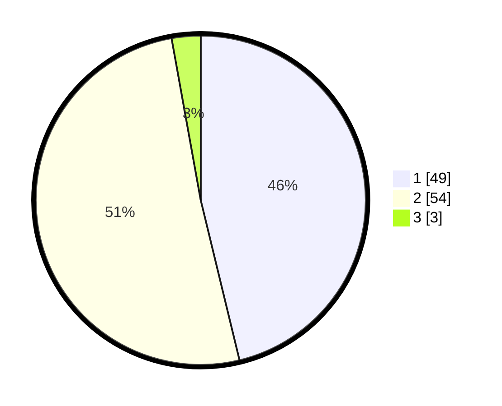

# Hasil

## Grafik

## Tabel

| No. | Nama Paslon    | Suara | Suara (raw) | Persentase |
|:--- |:-------------- | -----:| -----------:| ----------:|
| 1   | ANIES MUHAIMIN | 49    | [49][p-1]   | 46,23      |
| 2   | PRABOWO GIBRAN | 54    | [54][p-2]   | 50,94      |
| 3   | GANJAR MAHFUD  | 3     | [3][p-3]    | 2,83       |

[p-1]: https://github.com/gigit-pemilu/pemilu-2024-12-sumatera-utara/blob/main/pilpres/hitung-suara/sub/12-sumatera-utara/sub/18-serdang-bedagai/sub/08-sipispis/sub/2005-pispis/sub/003-tps/sub/paslon-1.txt
[p-2]: https://github.com/gigit-pemilu/pemilu-2024-12-sumatera-utara/blob/main/pilpres/hitung-suara/sub/12-sumatera-utara/sub/18-serdang-bedagai/sub/08-sipispis/sub/2005-pispis/sub/003-tps/sub/paslon-2.txt
[p-3]: https://github.com/gigit-pemilu/pemilu-2024-12-sumatera-utara/blob/main/pilpres/hitung-suara/sub/12-sumatera-utara/sub/18-serdang-bedagai/sub/08-sipispis/sub/2005-pispis/sub/003-tps/sub/paslon-3.txt

## Foto C Plano

https://sirekap-obj-formc.kpu.go.id/8dc4/pemilu/ppwp/12/18/08/20/05/1218082005003-20240219-144042--0991aedd-1df8-4135-867b-023fb45fbc3b.jpg

https://sirekap-obj-formc.kpu.go.id/8dc4/pemilu/ppwp/12/18/08/20/05/1218082005003-20240214-141851--cb2dba85-9c68-4645-a9bb-b398eef36b76.jpg

https://sirekap-obj-formc.kpu.go.id/8dc4/pemilu/ppwp/12/18/08/20/05/1218082005003-20240217-185547--d7bd3027-7f0f-4fee-998c-7942d1426088.jpg

## Metadata

| Key        | Value               |
| ---------- | ------------------- |
| Time Stamp | 2024-02-19 15:00:00 |

