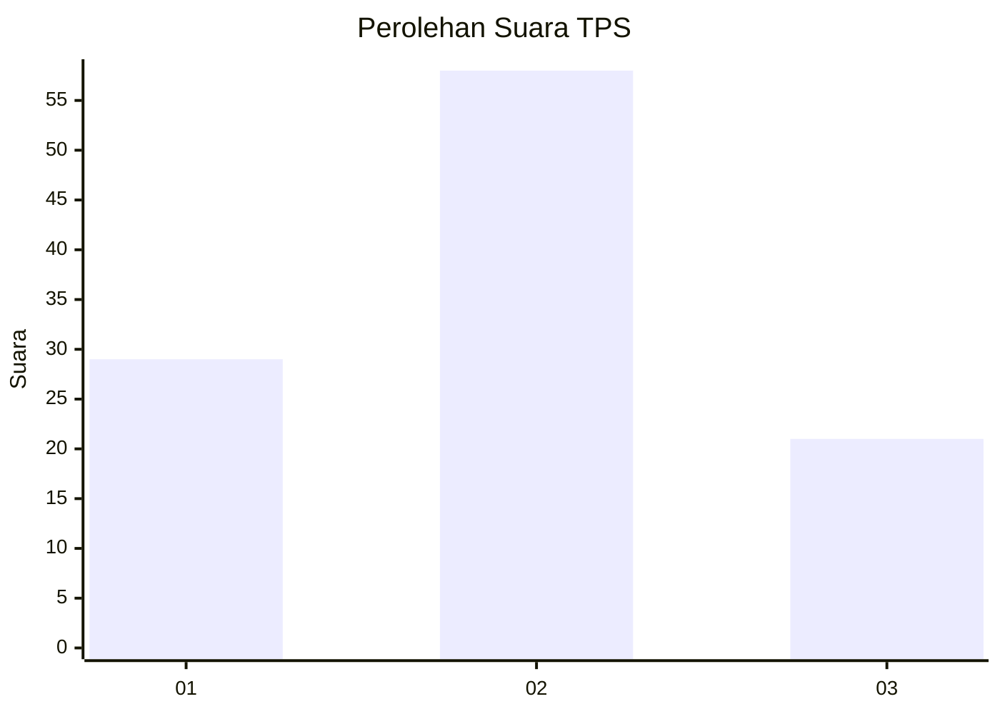
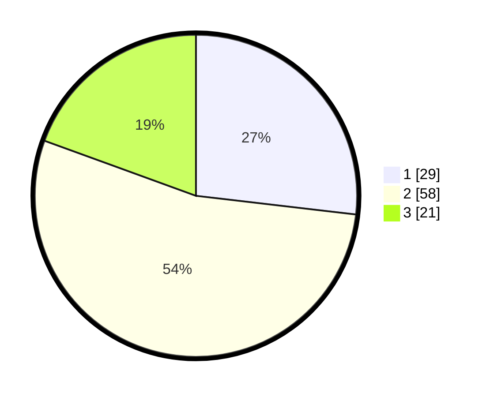

# Hasil

## Grafik

## Tabel

| No. | Nama Paslon    | Suara | Suara (raw) | Persentase |
|:--- |:-------------- | -----:| -----------:| ----------:|
| 1   | ANIES MUHAIMIN | 29    | [29][p-1]   | 26,85      |
| 2   | PRABOWO GIBRAN | 58    | [58][p-2]   | 53,70      |
| 3   | GANJAR MAHFUD  | 21    | [21][p-3]   | 19,44      |

[p-1]: https://github.com/gigit-pemilu/pemilu-2024/blob/main/pilpres/hitung-suara/sub/12-sumatera-utara/sub/18-serdang-bedagai/sub/08-sipispis/sub/2006-baja-dolok/sub/003-tps/sub/paslon-1.txt
[p-2]: https://github.com/gigit-pemilu/pemilu-2024/blob/main/pilpres/hitung-suara/sub/12-sumatera-utara/sub/18-serdang-bedagai/sub/08-sipispis/sub/2006-baja-dolok/sub/003-tps/sub/paslon-2.txt
[p-3]: https://github.com/gigit-pemilu/pemilu-2024/blob/main/pilpres/hitung-suara/sub/12-sumatera-utara/sub/18-serdang-bedagai/sub/08-sipispis/sub/2006-baja-dolok/sub/003-tps/sub/paslon-3.txt

## Foto C Plano

https://sirekap-obj-formc.kpu.go.id/0b8c/pemilu/ppwp/12/18/08/20/06/1218082006003-20240214-141615--6dfa01d5-1d19-4ff7-a6ca-4bfd39d43e4b.jpg

https://sirekap-obj-formc.kpu.go.id/0b8c/pemilu/ppwp/12/18/08/20/06/1218082006003-20240214-141549--64799556-c8ca-453c-8223-451bdcb6e19f.jpg

https://sirekap-obj-formc.kpu.go.id/0b8c/pemilu/ppwp/12/18/08/20/06/1218082006003-20240214-193808--356a5564-5464-46b3-9baf-21a3a4220dcf.jpg

## Metadata

| Key        | Value               |
| ---------- | ------------------- |
| Time Stamp | 2024-02-16 16:25:10 |

