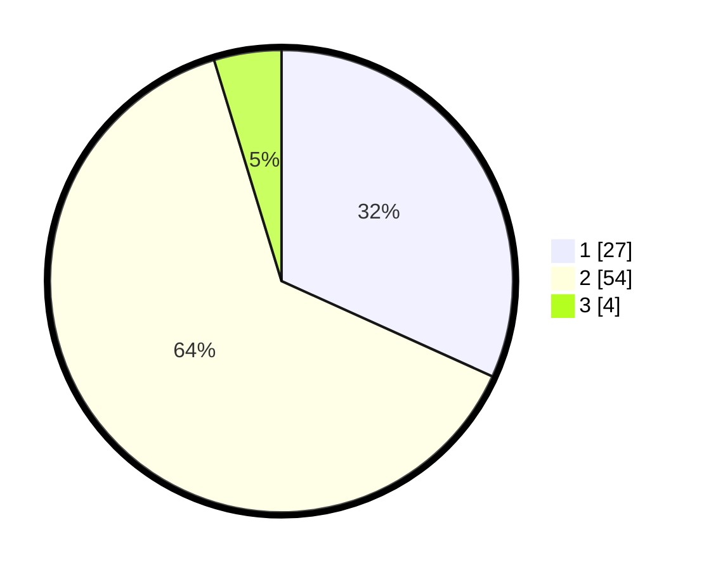

# Hasil

## Grafik

## Tabel

| No. | Nama Paslon    | Suara | Suara (raw) | Persentase |
|:--- |:-------------- | -----:| -----------:| ----------:|
| 1   | ANIES MUHAIMIN | 27    | [27][p-1]   | 31,76      |
| 2   | PRABOWO GIBRAN | 54    | [54][p-2]   | 63,53      |
| 3   | GANJAR MAHFUD  | 4     | [4][p-3]    | 4,71       |

[p-1]: https://github.com/gigit-pemilu/pemilu-2024/blob/main/pilpres/hitung-suara/sub/12-sumatera-utara/sub/18-serdang-bedagai/sub/08-sipispis/sub/2016-gunung-monako/sub/001-tps/sub/paslon-1.txt
[p-2]: https://github.com/gigit-pemilu/pemilu-2024/blob/main/pilpres/hitung-suara/sub/12-sumatera-utara/sub/18-serdang-bedagai/sub/08-sipispis/sub/2016-gunung-monako/sub/001-tps/sub/paslon-2.txt
[p-3]: https://github.com/gigit-pemilu/pemilu-2024/blob/main/pilpres/hitung-suara/sub/12-sumatera-utara/sub/18-serdang-bedagai/sub/08-sipispis/sub/2016-gunung-monako/sub/001-tps/sub/paslon-3.txt

## Foto C Plano

https://sirekap-obj-formc.kpu.go.id/25d3/pemilu/ppwp/12/18/08/20/16/1218082016001-20240216-101938--76307e42-fa15-49c1-9f48-7867d3baff60.jpg

https://sirekap-obj-formc.kpu.go.id/25d3/pemilu/ppwp/12/18/08/20/16/1218082016001-20240225-162115--d81c2088-cc19-4231-8e10-5102891a69bd.jpg

https://sirekap-obj-formc.kpu.go.id/25d3/pemilu/ppwp/12/18/08/20/16/1218082016001-20240225-162137--3f5ea7aa-1e81-4d34-8e72-e869b479b10f.jpg

## Metadata

| Key        | Value               |
| ---------- | ------------------- |
| Time Stamp | 2024-02-25 17:00:00 |

