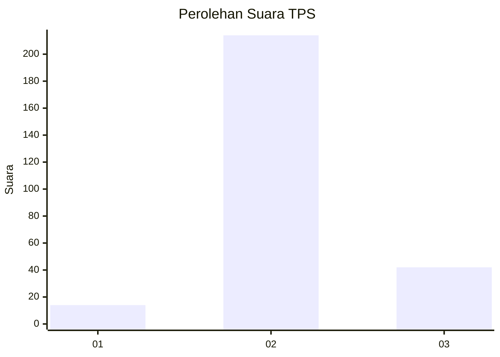
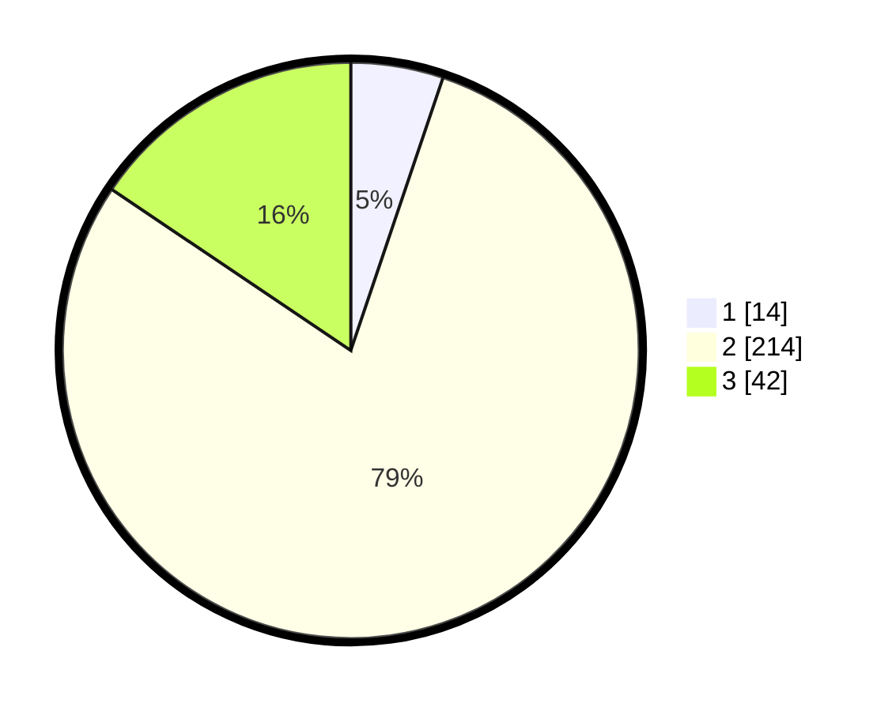

# Hasil

## Grafik

## Tabel

| No. | Nama Paslon    | Suara | Suara (raw) | Persentase |
|:--- |:-------------- | -----:| -----------:| ----------:|
| 1   | ANIES MUHAIMIN | 14    | [14][p-1]   | 5,19       |
| 2   | PRABOWO GIBRAN | 214   | [214][p-2]  | 79,26      |
| 3   | GANJAR MAHFUD  | 42    | [42][p-3]   | 15,56      |

[p-1]: https://github.com/gigit-pemilu/pemilu-2024/blob/main/pilpres/hitung-suara/sub/12-sumatera-utara/sub/18-serdang-bedagai/sub/11-silinda/sub/2013-damak-gelugur/sub/001-tps/sub/paslon-1.txt
[p-2]: https://github.com/gigit-pemilu/pemilu-2024/blob/main/pilpres/hitung-suara/sub/12-sumatera-utara/sub/18-serdang-bedagai/sub/11-silinda/sub/2013-damak-gelugur/sub/001-tps/sub/paslon-2.txt
[p-3]: https://github.com/gigit-pemilu/pemilu-2024/blob/main/pilpres/hitung-suara/sub/12-sumatera-utara/sub/18-serdang-bedagai/sub/11-silinda/sub/2013-damak-gelugur/sub/001-tps/sub/paslon-3.txt

## Foto C Plano

https://sirekap-obj-formc.kpu.go.id/7695/pemilu/ppwp/12/18/11/20/13/1218112013001-20240218-171059--5a07fbdf-4588-4e0c-8725-6704db0e9119.jpg

https://sirekap-obj-formc.kpu.go.id/7695/pemilu/ppwp/12/18/11/20/13/1218112013001-20240218-171228--fcdc6f89-9e84-45e5-be05-0175d85d9e63.jpg

https://sirekap-obj-formc.kpu.go.id/7695/pemilu/ppwp/12/18/11/20/13/1218112013001-20240218-171255--205ca769-266e-4be1-83dd-a50c0652a831.jpg

## Metadata

| Key        | Value               |
| ---------- | ------------------- |
| Time Stamp | 2024-02-21 22:00:00 |

