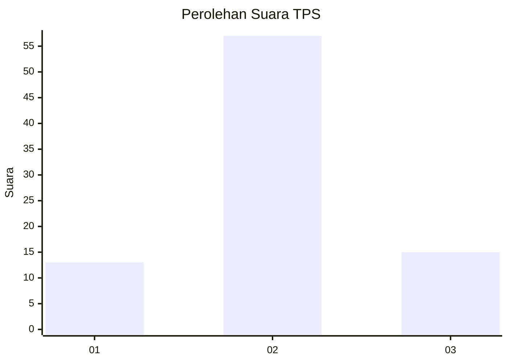
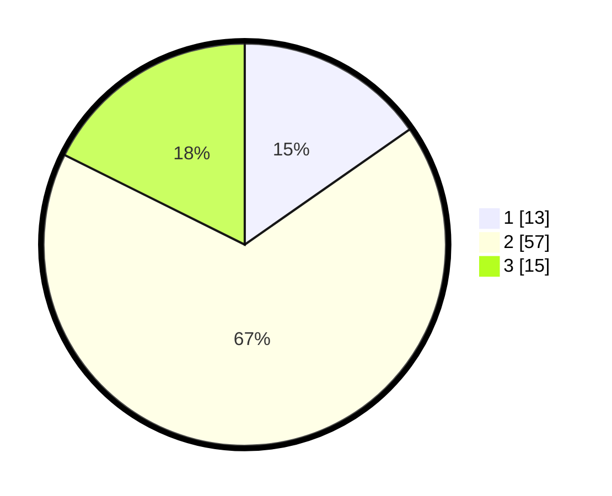

# Hasil

## Grafik

## Tabel

| No. | Nama Paslon    | Suara | Suara (raw) | Persentase |
|:--- |:-------------- | -----:| -----------:| ----------:|
| 1   | ANIES MUHAIMIN | 13    | [13][p-1]   | 15,29      |
| 2   | PRABOWO GIBRAN | 57    | [57][p-2]   | 67,06      |
| 3   | GANJAR MAHFUD  | 15    | [15][p-3]   | 17,65      |

[p-1]: https://github.com/gigit-pemilu/pemilu-2024/blob/main/pilpres/hitung-suara/sub/12-sumatera-utara/sub/18-serdang-bedagai/sub/11-silinda/sub/2016-kulasar/sub/001-tps/sub/paslon-1.txt
[p-2]: https://github.com/gigit-pemilu/pemilu-2024/blob/main/pilpres/hitung-suara/sub/12-sumatera-utara/sub/18-serdang-bedagai/sub/11-silinda/sub/2016-kulasar/sub/001-tps/sub/paslon-2.txt
[p-3]: https://github.com/gigit-pemilu/pemilu-2024/blob/main/pilpres/hitung-suara/sub/12-sumatera-utara/sub/18-serdang-bedagai/sub/11-silinda/sub/2016-kulasar/sub/001-tps/sub/paslon-3.txt

## Foto C Plano

https://sirekap-obj-formc.kpu.go.id/0dff/pemilu/ppwp/12/18/11/20/16/1218112016001-20240218-164504--e7a53eee-fb3e-4b8b-8a69-c980f8bfa9db.jpg

https://sirekap-obj-formc.kpu.go.id/0dff/pemilu/ppwp/12/18/11/20/16/1218112016001-20240218-164521--ba886c36-04b8-4f91-a9b8-64bf634879a9.jpg

https://sirekap-obj-formc.kpu.go.id/0dff/pemilu/ppwp/12/18/11/20/16/1218112016001-20240218-164556--35973f5f-023c-488e-9394-db31bfe31645.jpg

## Metadata

| Key        | Value               |
| ---------- | ------------------- |
| Time Stamp | 2024-02-22 11:00:00 |

