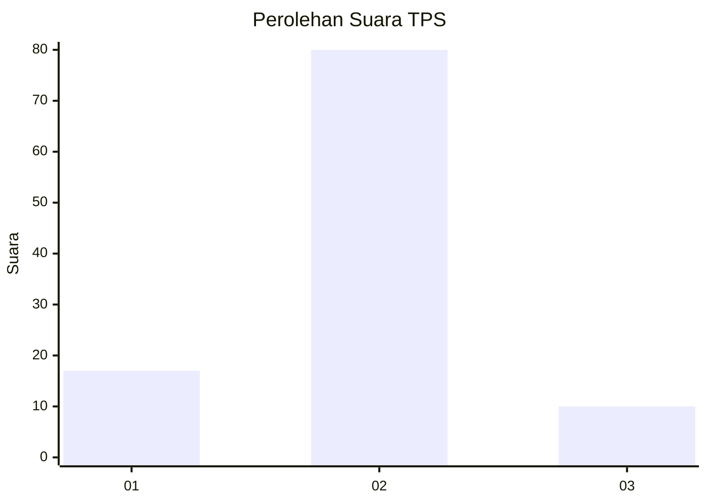
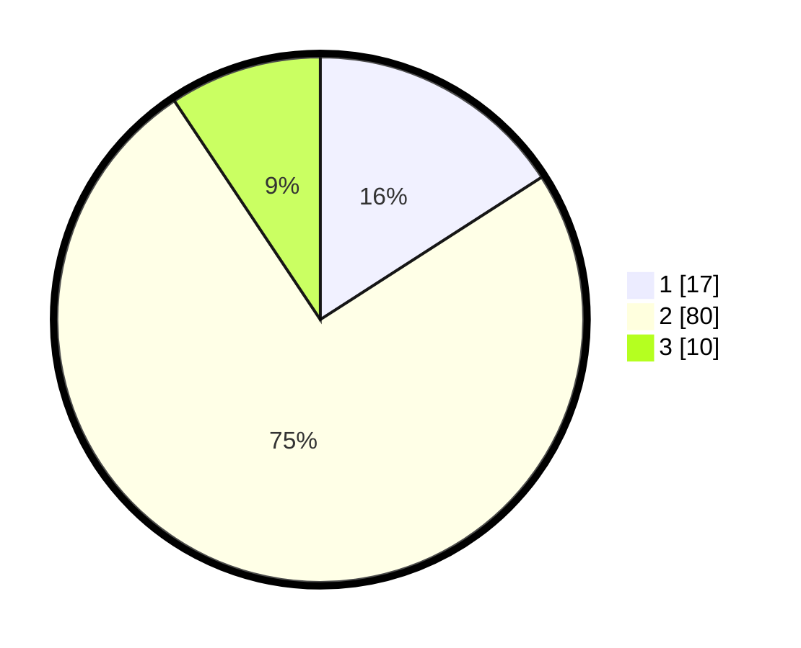

# Hasil

## Grafik

## Tabel

| No. | Nama Paslon    | Suara | Suara (raw) | Persentase |
|:--- |:-------------- | -----:| -----------:| ----------:|
| 1   | ANIES MUHAIMIN | 17    | [17][p-1]   | 15,89      |
| 2   | PRABOWO GIBRAN | 80    | [80][p-2]   | 74,77      |
| 3   | GANJAR MAHFUD  | 10    | [10][p-3]   | 9,35       |

[p-1]: https://github.com/gigit-pemilu/pemilu-2024-12-sumatera-utara/blob/main/pilpres/hitung-suara/sub/12-sumatera-utara/sub/18-serdang-bedagai/sub/11-silinda/sub/2016-kulasar/sub/002-tps/sub/paslon-1.txt
[p-2]: https://github.com/gigit-pemilu/pemilu-2024-12-sumatera-utara/blob/main/pilpres/hitung-suara/sub/12-sumatera-utara/sub/18-serdang-bedagai/sub/11-silinda/sub/2016-kulasar/sub/002-tps/sub/paslon-2.txt
[p-3]: https://github.com/gigit-pemilu/pemilu-2024-12-sumatera-utara/blob/main/pilpres/hitung-suara/sub/12-sumatera-utara/sub/18-serdang-bedagai/sub/11-silinda/sub/2016-kulasar/sub/002-tps/sub/paslon-3.txt

## Foto C Plano

https://sirekap-obj-formc.kpu.go.id/01e0/pemilu/ppwp/12/18/11/20/16/1218112016002-20240218-175223--309de9fc-dd7a-49a1-a88b-5d88212b5608.jpg

https://sirekap-obj-formc.kpu.go.id/01e0/pemilu/ppwp/12/18/11/20/16/1218112016002-20240218-175235--0064c812-7c5b-4721-945a-7d2accfeb197.jpg

https://sirekap-obj-formc.kpu.go.id/01e0/pemilu/ppwp/12/18/11/20/16/1218112016002-20240218-175252--c594f43d-e876-4e1d-92bb-4aa7302abda3.jpg

## Metadata

| Key        | Value               |
| ---------- | ------------------- |
| Time Stamp | 2024-02-21 21:00:04 |

