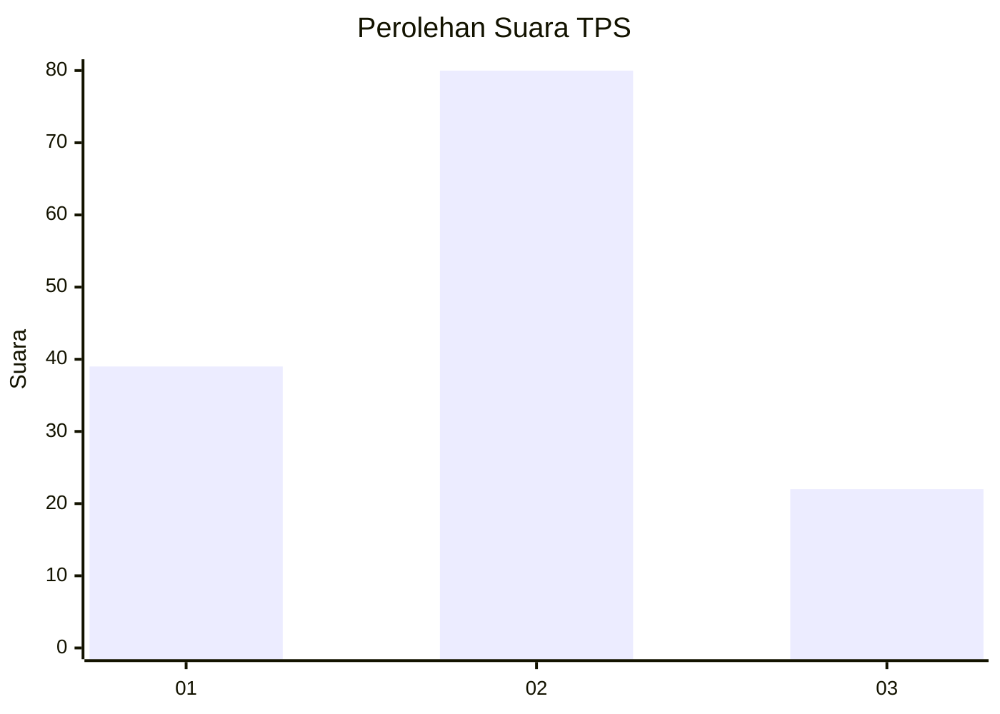
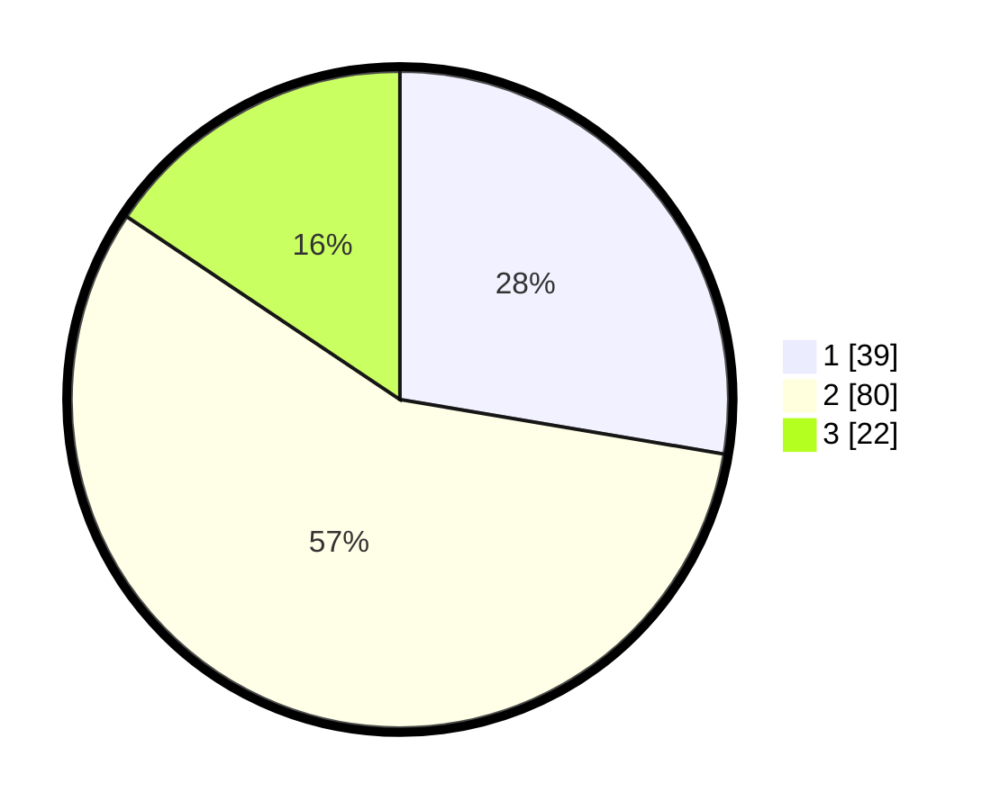

# Hasil

## Grafik

## Tabel

| No. | Nama Paslon    | Suara | Suara (raw) | Persentase |
|:--- |:-------------- | -----:| -----------:| ----------:|
| 1   | ANIES MUHAIMIN | 39    | [39][p-1]   | 27,66      |
| 2   | PRABOWO GIBRAN | 80    | [80][p-2]   | 56,74      |
| 3   | GANJAR MAHFUD  | 22    | [22][p-3]   | 15,60      |

[p-1]: https://github.com/gigit-pemilu/pemilu-2024-12-sumatera-utara/blob/main/pilpres/hitung-suara/sub/12-sumatera-utara/sub/18-serdang-bedagai/sub/12-serba-jadi/sub/2010-tanjung-harap/sub/003-tps/sub/paslon-1.txt
[p-2]: https://github.com/gigit-pemilu/pemilu-2024-12-sumatera-utara/blob/main/pilpres/hitung-suara/sub/12-sumatera-utara/sub/18-serdang-bedagai/sub/12-serba-jadi/sub/2010-tanjung-harap/sub/003-tps/sub/paslon-2.txt
[p-3]: https://github.com/gigit-pemilu/pemilu-2024-12-sumatera-utara/blob/main/pilpres/hitung-suara/sub/12-sumatera-utara/sub/18-serdang-bedagai/sub/12-serba-jadi/sub/2010-tanjung-harap/sub/003-tps/sub/paslon-3.txt

## Foto C Plano

https://sirekap-obj-formc.kpu.go.id/ec3d/pemilu/ppwp/12/18/12/20/10/1218122010003-20240214-201752--0a9041ca-591d-4ec3-b4d5-69999d753b56.jpg

https://sirekap-obj-formc.kpu.go.id/ec3d/pemilu/ppwp/12/18/12/20/10/1218122010003-20240214-201927--530e7435-dbf2-4d94-a90f-6f17e9a45078.jpg

https://sirekap-obj-formc.kpu.go.id/ec3d/pemilu/ppwp/12/18/12/20/10/1218122010003-20240214-202210--a1976fc3-690a-47f9-b9cd-ae772349a7bb.jpg

## Metadata

| Key        | Value               |
| ---------- | ------------------- |
| Time Stamp | 2024-02-25 18:00:00 |

