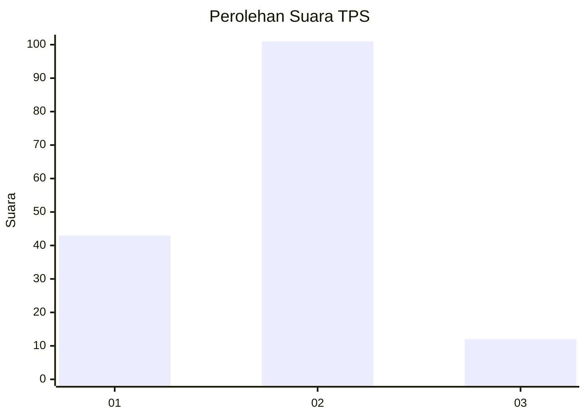
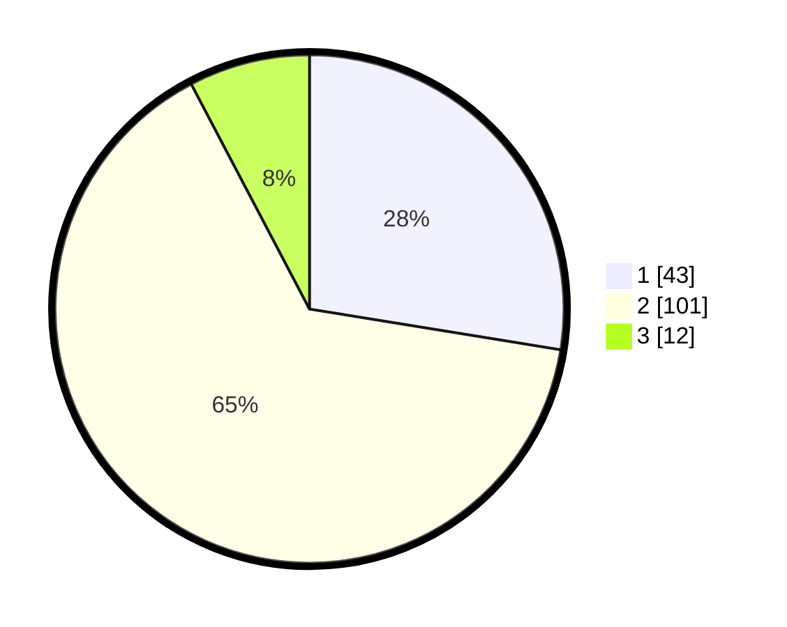

# Hasil

## Grafik

## Tabel

| No. | Nama Paslon    | Suara | Suara (raw) | Persentase |
|:--- |:-------------- | -----:| -----------:| ----------:|
| 1   | ANIES MUHAIMIN | 43    | [43][p-1]   | 27,56      |
| 2   | PRABOWO GIBRAN | 101   | [101][p-2]  | 64,74      |
| 3   | GANJAR MAHFUD  | 12    | [12][p-3]   | 7,69       |

[p-1]: https://github.com/gigit-pemilu/pemilu-2024-12-sumatera-utara/blob/main/pilpres/hitung-suara/sub/12-sumatera-utara/sub/18-serdang-bedagai/sub/12-serba-jadi/sub/2010-tanjung-harap/sub/004-tps/sub/paslon-1.txt
[p-2]: https://github.com/gigit-pemilu/pemilu-2024-12-sumatera-utara/blob/main/pilpres/hitung-suara/sub/12-sumatera-utara/sub/18-serdang-bedagai/sub/12-serba-jadi/sub/2010-tanjung-harap/sub/004-tps/sub/paslon-2.txt
[p-3]: https://github.com/gigit-pemilu/pemilu-2024-12-sumatera-utara/blob/main/pilpres/hitung-suara/sub/12-sumatera-utara/sub/18-serdang-bedagai/sub/12-serba-jadi/sub/2010-tanjung-harap/sub/004-tps/sub/paslon-3.txt

## Foto C Plano

https://sirekap-obj-formc.kpu.go.id/b6bf/pemilu/ppwp/12/18/12/20/10/1218122010004-20240214-194428--49345672-190d-4e74-98d1-61c14d33e1b1.jpg

https://sirekap-obj-formc.kpu.go.id/b6bf/pemilu/ppwp/12/18/12/20/10/1218122010004-20240214-194410--421b4de3-b085-4498-91eb-bcd4678aa3df.jpg

https://sirekap-obj-formc.kpu.go.id/b6bf/pemilu/ppwp/12/18/12/20/10/1218122010004-20240214-194343--f08f5a3a-5aad-43a9-81c9-75af23953bc0.jpg

## Metadata

| Key        | Value               |
| ---------- | ------------------- |
| Time Stamp | 2024-02-15 23:29:50 |

