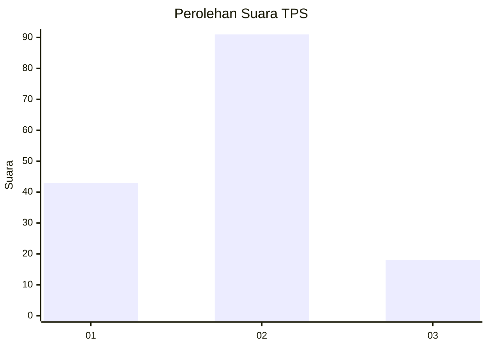
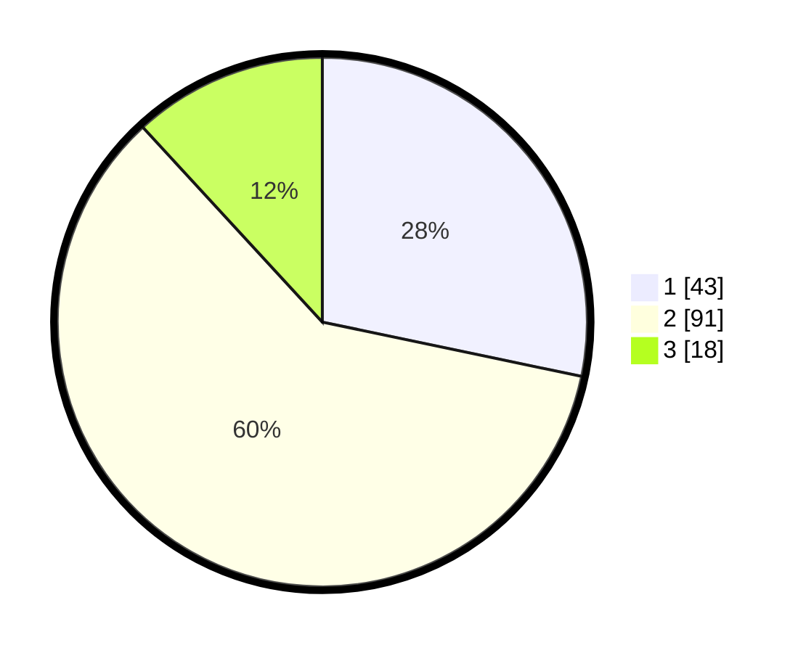

# Hasil

## Grafik

## Tabel

| No. | Nama Paslon    | Suara | Suara (raw) | Persentase |
|:--- |:-------------- | -----:| -----------:| ----------:|
| 1   | ANIES MUHAIMIN | 43    | [43][p-1]   | 28,29      |
| 2   | PRABOWO GIBRAN | 91    | [91][p-2]   | 59,87      |
| 3   | GANJAR MAHFUD  | 18    | [18][p-3]   | 11,84      |

[p-1]: https://github.com/gigit-pemilu/pemilu-2024/blob/main/pilpres/hitung-suara/sub/12-sumatera-utara/sub/18-serdang-bedagai/sub/12-serba-jadi/sub/2010-tanjung-harap/sub/006-tps/sub/paslon-1.txt
[p-2]: https://github.com/gigit-pemilu/pemilu-2024/blob/main/pilpres/hitung-suara/sub/12-sumatera-utara/sub/18-serdang-bedagai/sub/12-serba-jadi/sub/2010-tanjung-harap/sub/006-tps/sub/paslon-2.txt
[p-3]: https://github.com/gigit-pemilu/pemilu-2024/blob/main/pilpres/hitung-suara/sub/12-sumatera-utara/sub/18-serdang-bedagai/sub/12-serba-jadi/sub/2010-tanjung-harap/sub/006-tps/sub/paslon-3.txt

## Foto C Plano

https://sirekap-obj-formc.kpu.go.id/96e6/pemilu/ppwp/12/18/12/20/10/1218122010006-20240224-002751--fda91566-7cc3-44e0-891e-08c834d9f76c.jpg

https://sirekap-obj-formc.kpu.go.id/96e6/pemilu/ppwp/12/18/12/20/10/1218122010006-20240224-002806--9be9866f-427e-479e-8e6a-108922ee6be4.jpg

https://sirekap-obj-formc.kpu.go.id/96e6/pemilu/ppwp/12/18/12/20/10/1218122010006-20240224-002817--582dbbfb-3e15-4e8f-b624-0acce1b09987.jpg

## Metadata

| Key        | Value               |
| ---------- | ------------------- |
| Time Stamp | 2024-02-24 22:31:28 |

