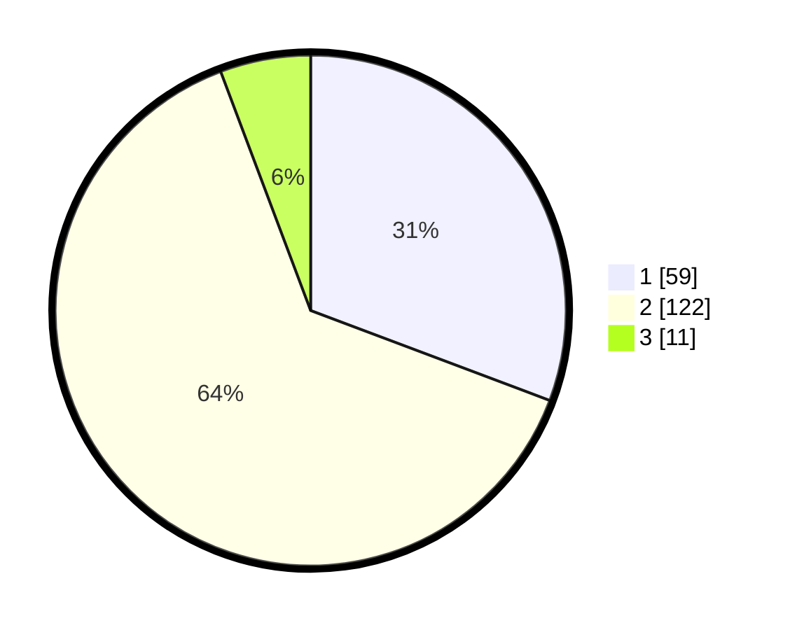

# Hasil

## Grafik

## Tabel

| No. | Nama Paslon    | Suara | Suara (raw) | Persentase |
|:--- |:-------------- | -----:| -----------:| ----------:|
| 1   | ANIES MUHAIMIN | 59    | [59][p-1]   | 30,73      |
| 2   | PRABOWO GIBRAN | 122   | [122][p-2]  | 63,54      |
| 3   | GANJAR MAHFUD  | 11    | [11][p-3]   | 5,73       |

[p-1]: https://github.com/gigit-pemilu/pemilu-2024/blob/main/pilpres/hitung-suara/sub/12-sumatera-utara/sub/18-serdang-bedagai/sub/12-serba-jadi/sub/2020-pulau-gambar/sub/024-tps/sub/paslon-1.txt
[p-2]: https://github.com/gigit-pemilu/pemilu-2024/blob/main/pilpres/hitung-suara/sub/12-sumatera-utara/sub/18-serdang-bedagai/sub/12-serba-jadi/sub/2020-pulau-gambar/sub/024-tps/sub/paslon-2.txt
[p-3]: https://github.com/gigit-pemilu/pemilu-2024/blob/main/pilpres/hitung-suara/sub/12-sumatera-utara/sub/18-serdang-bedagai/sub/12-serba-jadi/sub/2020-pulau-gambar/sub/024-tps/sub/paslon-3.txt

## Foto C Plano

https://sirekap-obj-formc.kpu.go.id/e82b/pemilu/ppwp/12/18/12/20/20/1218122020024-20240216-181855--92fb6de5-77f7-40f7-8ac7-5bcf84ee4741.jpg

https://sirekap-obj-formc.kpu.go.id/e82b/pemilu/ppwp/12/18/12/20/20/1218122020024-20240216-181336--6b9e8f3b-47d3-4333-9581-cd68bf80fd0c.jpg

https://sirekap-obj-formc.kpu.go.id/e82b/pemilu/ppwp/12/18/12/20/20/1218122020024-20240216-181514--67cc0e85-94bb-498c-b421-c2190f385d01.jpg

## Metadata

| Key        | Value               |
| ---------- | ------------------- |
| Time Stamp | 2024-02-25 15:00:00 |

