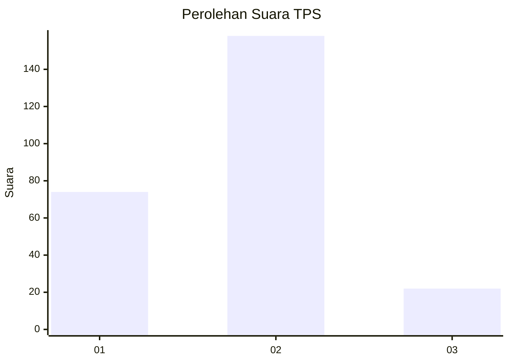
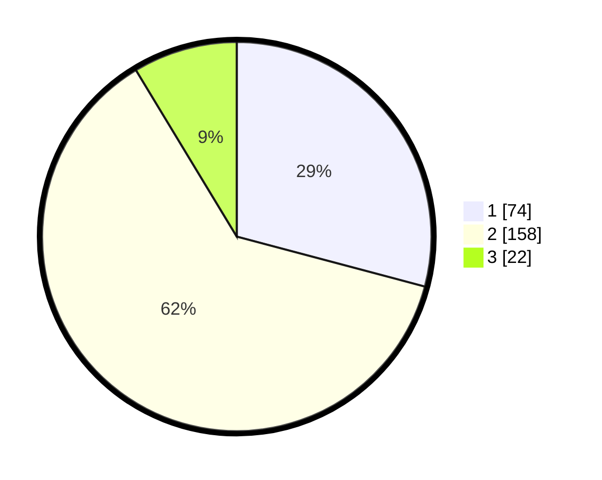

# Hasil

## Grafik

## Tabel

| No. | Nama Paslon    | Suara | Suara (raw) | Persentase |
|:--- |:-------------- | -----:| -----------:| ----------:|
| 1   | ANIES MUHAIMIN | 74    | [74][p-1]   | 29,13      |
| 2   | PRABOWO GIBRAN | 158   | [158][p-2]  | 62,20      |
| 3   | GANJAR MAHFUD  | 22    | [22][p-3]   | 8,66       |

[p-1]: https://github.com/gigit-pemilu/pemilu-2024/blob/main/pilpres/hitung-suara/sub/12-sumatera-utara/sub/18-serdang-bedagai/sub/12-serba-jadi/sub/2033-tambak-cekur/sub/001-tps/sub/paslon-1.txt
[p-2]: https://github.com/gigit-pemilu/pemilu-2024/blob/main/pilpres/hitung-suara/sub/12-sumatera-utara/sub/18-serdang-bedagai/sub/12-serba-jadi/sub/2033-tambak-cekur/sub/001-tps/sub/paslon-2.txt
[p-3]: https://github.com/gigit-pemilu/pemilu-2024/blob/main/pilpres/hitung-suara/sub/12-sumatera-utara/sub/18-serdang-bedagai/sub/12-serba-jadi/sub/2033-tambak-cekur/sub/001-tps/sub/paslon-3.txt

## Foto C Plano

https://sirekap-obj-formc.kpu.go.id/14df/pemilu/ppwp/12/18/12/20/33/1218122033001-20240214-192246--96dccfd8-dc03-4429-b665-f73e4a038286.jpg

https://sirekap-obj-formc.kpu.go.id/14df/pemilu/ppwp/12/18/12/20/33/1218122033001-20240214-193030--8a92f31c-80f4-4368-b0be-d2485155be10.jpg

https://sirekap-obj-formc.kpu.go.id/14df/pemilu/ppwp/12/18/12/20/33/1218122033001-20240214-205218--e19ddd33-e754-49eb-9255-3422efa30bb2.jpg

## Metadata

| Key        | Value               |
| ---------- | ------------------- |
| Time Stamp | 2024-02-16 00:00:26 |

