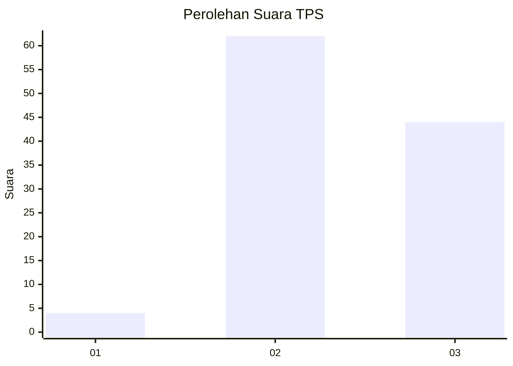
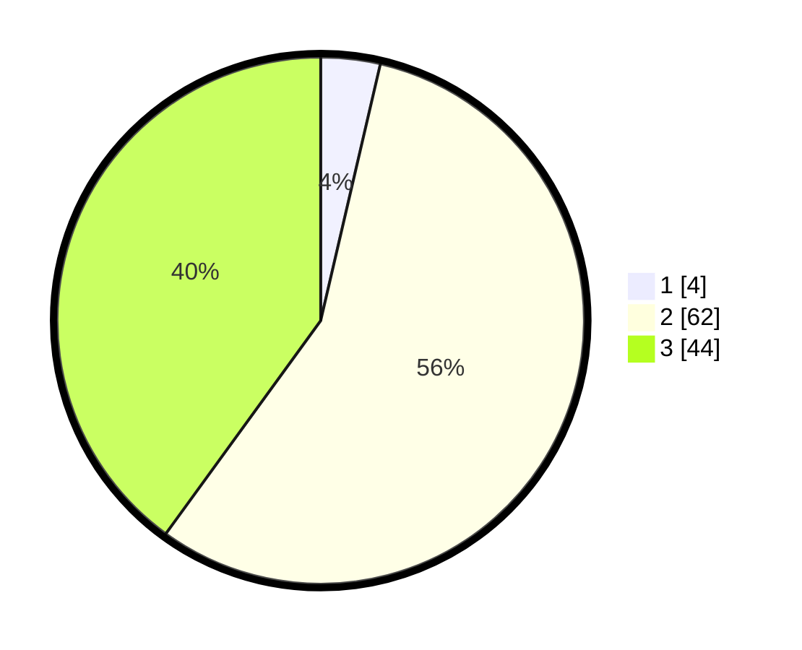

# Hasil

## Grafik

## Tabel

| No. | Nama Paslon    | Suara | Suara (raw) | Persentase |
|:--- |:-------------- | -----:| -----------:| ----------:|
| 1   | ANIES MUHAIMIN | 4     | [4][p-1]    | 3,64       |
| 2   | PRABOWO GIBRAN | 62    | [62][p-2]   | 56,36      |
| 3   | GANJAR MAHFUD  | 44    | [44][p-3]   | 40,00      |

[p-1]: https://github.com/gigit-pemilu/pemilu-2024-12-sumatera-utara/blob/main/pilpres/hitung-suara/sub/12-sumatera-utara/sub/18-serdang-bedagai/sub/12-serba-jadi/sub/2038-bah-sidua-dua/sub/004-tps/sub/paslon-1.txt
[p-2]: https://github.com/gigit-pemilu/pemilu-2024-12-sumatera-utara/blob/main/pilpres/hitung-suara/sub/12-sumatera-utara/sub/18-serdang-bedagai/sub/12-serba-jadi/sub/2038-bah-sidua-dua/sub/004-tps/sub/paslon-2.txt
[p-3]: https://github.com/gigit-pemilu/pemilu-2024-12-sumatera-utara/blob/main/pilpres/hitung-suara/sub/12-sumatera-utara/sub/18-serdang-bedagai/sub/12-serba-jadi/sub/2038-bah-sidua-dua/sub/004-tps/sub/paslon-3.txt

## Foto C Plano

https://sirekap-obj-formc.kpu.go.id/e95e/pemilu/ppwp/12/18/12/20/38/1218122038004-20240221-222348--5d606385-e925-4a16-a50f-a7e37aea34b1.jpg

https://sirekap-obj-formc.kpu.go.id/e95e/pemilu/ppwp/12/18/12/20/38/1218122038004-20240221-222410--10bd878b-545e-47f4-9635-82842d65b036.jpg

https://sirekap-obj-formc.kpu.go.id/e95e/pemilu/ppwp/12/18/12/20/38/1218122038004-20240221-222431--0da510ec-f9ea-4527-bcb9-654bdc6a7ef8.jpg

## Metadata

| Key        | Value               |
| ---------- | ------------------- |
| Time Stamp | 2024-02-24 22:31:28 |

