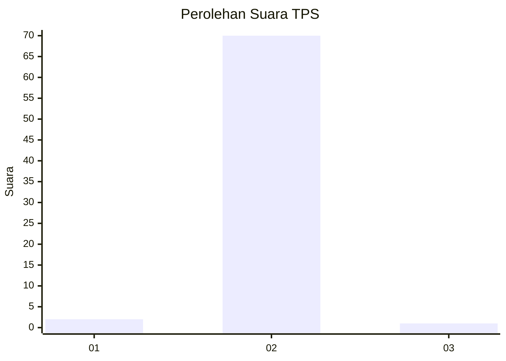
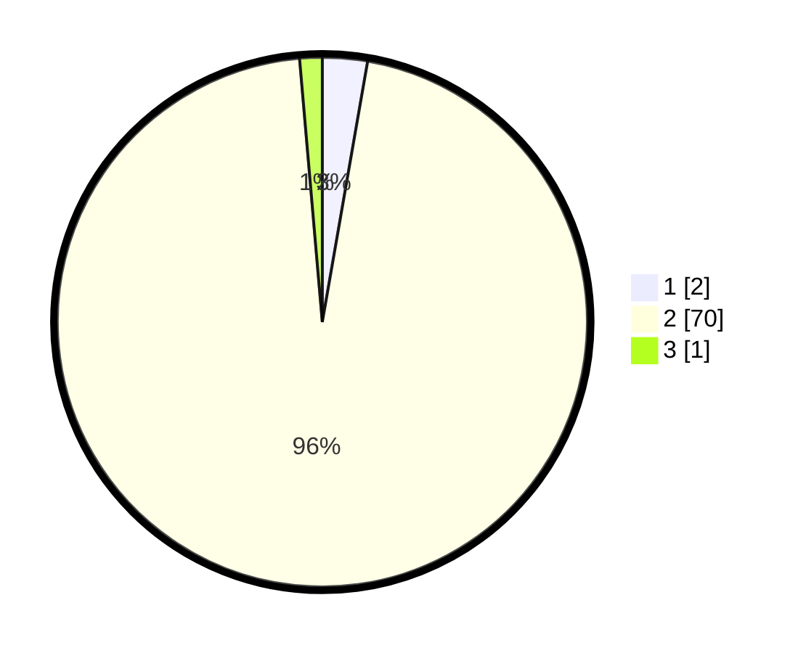

# Hasil

## Grafik

## Tabel

| No. | Nama Paslon    | Suara | Suara (raw) | Persentase |
|:--- |:-------------- | -----:| -----------:| ----------:|
| 1   | ANIES MUHAIMIN | 2     | [2][p-1]    | 2,74       |
| 2   | PRABOWO GIBRAN | 70    | [70][p-2]   | 95,89      |
| 3   | GANJAR MAHFUD  | 1     | [1][p-3]    | 1,37       |

[p-1]: https://github.com/gigit-pemilu/pemilu-2024-12-sumatera-utara/blob/main/pilpres/hitung-suara/sub/12-sumatera-utara/sub/18-serdang-bedagai/sub/13-tebing-tinggi/sub/2006-paya-lombang/sub/020-tps/sub/paslon-1.txt
[p-2]: https://github.com/gigit-pemilu/pemilu-2024-12-sumatera-utara/blob/main/pilpres/hitung-suara/sub/12-sumatera-utara/sub/18-serdang-bedagai/sub/13-tebing-tinggi/sub/2006-paya-lombang/sub/020-tps/sub/paslon-2.txt
[p-3]: https://github.com/gigit-pemilu/pemilu-2024-12-sumatera-utara/blob/main/pilpres/hitung-suara/sub/12-sumatera-utara/sub/18-serdang-bedagai/sub/13-tebing-tinggi/sub/2006-paya-lombang/sub/020-tps/sub/paslon-3.txt

## Foto C Plano

https://sirekap-obj-formc.kpu.go.id/f78b/pemilu/ppwp/12/18/13/20/06/1218132006020-20240219-083050--31facccd-9304-4b20-97d8-dc941db47524.jpg

https://sirekap-obj-formc.kpu.go.id/f78b/pemilu/ppwp/12/18/13/20/06/1218132006020-20240219-084055--a0208914-3bc7-4b88-829c-1fe7e9060b22.jpg

https://sirekap-obj-formc.kpu.go.id/f78b/pemilu/ppwp/12/18/13/20/06/1218132006020-20240219-084246--32b8fcb8-ad9d-4133-b7fd-c97bdd7a6325.jpg

## Metadata

| Key        | Value               |
| ---------- | ------------------- |
| Time Stamp | 2024-02-19 09:00:00 |

