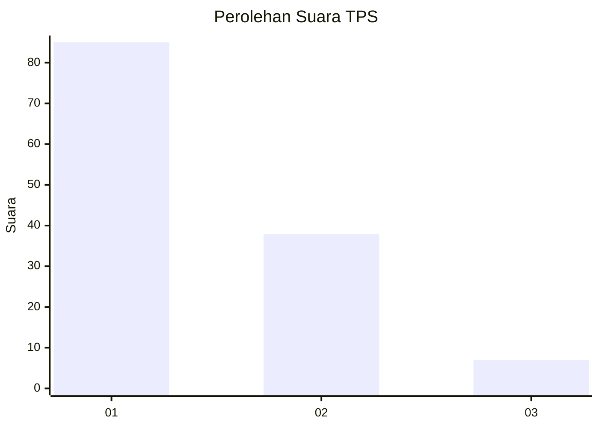
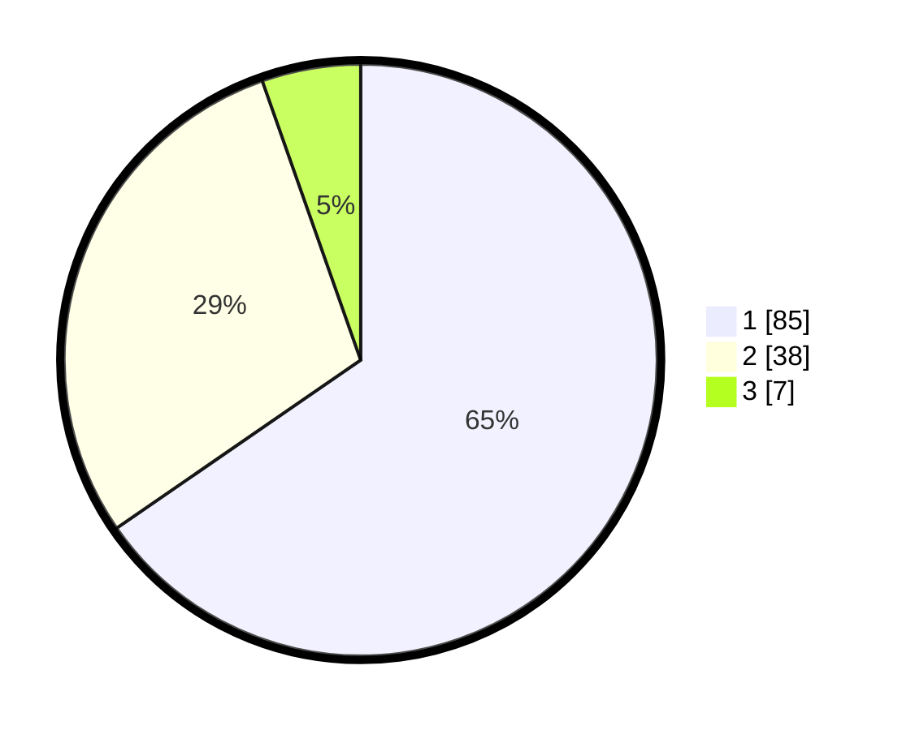

# Hasil

## Grafik

## Tabel

| No. | Nama Paslon    | Suara | Suara (raw) | Persentase |
|:--- |:-------------- | -----:| -----------:| ----------:|
| 1   | ANIES MUHAIMIN | 85    | [85][p-1]   | 65,38      |
| 2   | PRABOWO GIBRAN | 38    | [38][p-2]   | 29,23      |
| 3   | GANJAR MAHFUD  | 7     | [7][p-3]    | 5,38       |

[p-1]: https://github.com/gigit-pemilu/pemilu-2024/blob/main/pilpres/hitung-suara/sub/12-sumatera-utara/sub/18-serdang-bedagai/sub/13-tebing-tinggi/sub/2018-kedai-damar/sub/003-tps/sub/paslon-1.txt
[p-2]: https://github.com/gigit-pemilu/pemilu-2024/blob/main/pilpres/hitung-suara/sub/12-sumatera-utara/sub/18-serdang-bedagai/sub/13-tebing-tinggi/sub/2018-kedai-damar/sub/003-tps/sub/paslon-2.txt
[p-3]: https://github.com/gigit-pemilu/pemilu-2024/blob/main/pilpres/hitung-suara/sub/12-sumatera-utara/sub/18-serdang-bedagai/sub/13-tebing-tinggi/sub/2018-kedai-damar/sub/003-tps/sub/paslon-3.txt

## Foto C Plano

https://sirekap-obj-formc.kpu.go.id/a21c/pemilu/ppwp/12/18/13/20/18/1218132018003-20240218-112739--f87d35d4-afbf-40f8-8939-ba5c2fbde32f.jpg

https://sirekap-obj-formc.kpu.go.id/a21c/pemilu/ppwp/12/18/13/20/18/1218132018003-20240218-112826--1812d567-6d10-4d34-b112-2baad230ded4.jpg

https://sirekap-obj-formc.kpu.go.id/a21c/pemilu/ppwp/12/18/13/20/18/1218132018003-20240218-112842--ca13d826-b252-4ef9-87ef-b5373ba9ef20.jpg

## Metadata

| Key        | Value               |
| ---------- | ------------------- |
| Time Stamp | 2024-02-24 22:31:28 |

