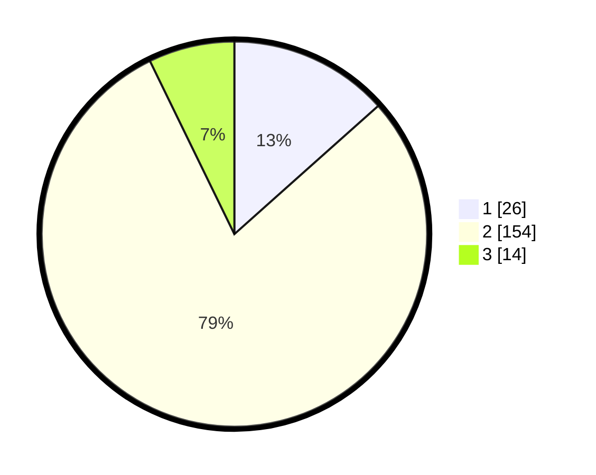

# Hasil

## Grafik

## Tabel

| No. | Nama Paslon    | Suara | Suara (raw) | Persentase |
|:--- |:-------------- | -----:| -----------:| ----------:|
| 1   | ANIES MUHAIMIN | 26    | [26][p-1]   | 13,40      |
| 2   | PRABOWO GIBRAN | 154   | [154][p-2]  | 79,38      |
| 3   | GANJAR MAHFUD  | 14    | [14][p-3]   | 7,22       |

[p-1]: https://github.com/gigit-pemilu/pemilu-2024-12-sumatera-utara/blob/main/pilpres/hitung-suara/sub/12-sumatera-utara/sub/18-serdang-bedagai/sub/14-pegajahan/sub/1012-melati-kebun/sub/001-tps/sub/paslon-1.txt
[p-2]: https://github.com/gigit-pemilu/pemilu-2024-12-sumatera-utara/blob/main/pilpres/hitung-suara/sub/12-sumatera-utara/sub/18-serdang-bedagai/sub/14-pegajahan/sub/1012-melati-kebun/sub/001-tps/sub/paslon-2.txt
[p-3]: https://github.com/gigit-pemilu/pemilu-2024-12-sumatera-utara/blob/main/pilpres/hitung-suara/sub/12-sumatera-utara/sub/18-serdang-bedagai/sub/14-pegajahan/sub/1012-melati-kebun/sub/001-tps/sub/paslon-3.txt

## Foto C Plano

https://sirekap-obj-formc.kpu.go.id/b06f/pemilu/ppwp/12/18/14/10/12/1218141012001-20240215-043223--c69fe2f6-e358-4a13-b3e2-245daaa64f05.jpg

https://sirekap-obj-formc.kpu.go.id/b06f/pemilu/ppwp/12/18/14/10/12/1218141012001-20240215-021515--982f7663-a0ec-451f-8db5-c4d671f7e1f6.jpg

https://sirekap-obj-formc.kpu.go.id/b06f/pemilu/ppwp/12/18/14/10/12/1218141012001-20240215-043351--fbedf294-690a-4872-b7f6-e115317044d2.jpg

## Metadata

| Key        | Value               |
| ---------- | ------------------- |
| Time Stamp | 2024-02-16 12:51:22 |

