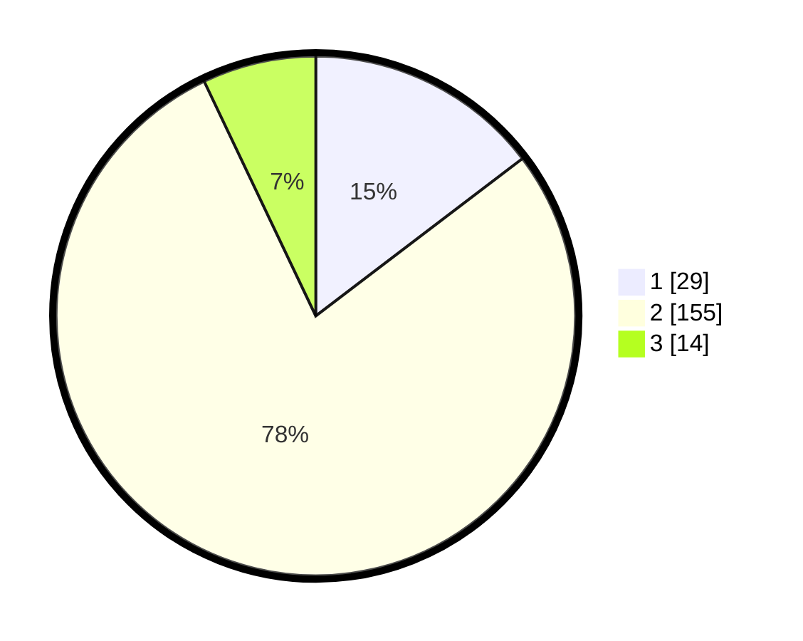

# Hasil

## Grafik

## Tabel

| No. | Nama Paslon    | Suara | Suara (raw) | Persentase |
|:--- |:-------------- | -----:| -----------:| ----------:|
| 1   | ANIES MUHAIMIN | 29    | [29][p-1]   | 14,65      |
| 2   | PRABOWO GIBRAN | 155   | [155][p-2]  | 78,28      |
| 3   | GANJAR MAHFUD  | 14    | [14][p-3]   | 7,07       |

[p-1]: https://github.com/gigit-pemilu/pemilu-2024/blob/main/pilpres/hitung-suara/sub/12-sumatera-utara/sub/18-serdang-bedagai/sub/14-pegajahan/sub/1012-melati-kebun/sub/002-tps/sub/paslon-1.txt
[p-2]: https://github.com/gigit-pemilu/pemilu-2024/blob/main/pilpres/hitung-suara/sub/12-sumatera-utara/sub/18-serdang-bedagai/sub/14-pegajahan/sub/1012-melati-kebun/sub/002-tps/sub/paslon-2.txt
[p-3]: https://github.com/gigit-pemilu/pemilu-2024/blob/main/pilpres/hitung-suara/sub/12-sumatera-utara/sub/18-serdang-bedagai/sub/14-pegajahan/sub/1012-melati-kebun/sub/002-tps/sub/paslon-3.txt

## Foto C Plano

https://sirekap-obj-formc.kpu.go.id/e3e9/pemilu/ppwp/12/18/14/10/12/1218141012002-20240215-015949--e6d8c178-f83c-443b-8ee1-9f5058f1062f.jpg

https://sirekap-obj-formc.kpu.go.id/e3e9/pemilu/ppwp/12/18/14/10/12/1218141012002-20240215-020011--f461000b-a27c-4627-a412-e5a93ac97b23.jpg

https://sirekap-obj-formc.kpu.go.id/e3e9/pemilu/ppwp/12/18/14/10/12/1218141012002-20240215-020041--76c174f7-0c66-4f24-b128-3e9a9b7f9e5a.jpg

## Metadata

| Key        | Value               |
| ---------- | ------------------- |
| Time Stamp | 2024-02-16 12:51:22 |

