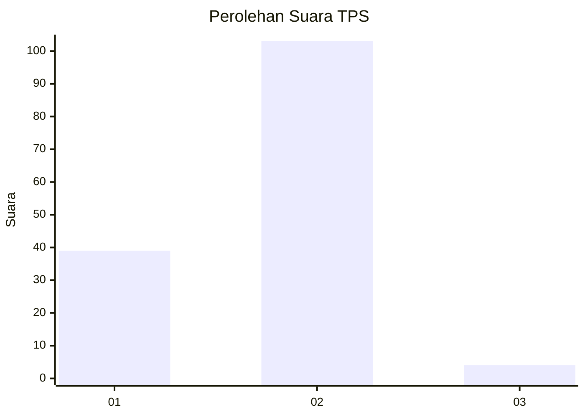
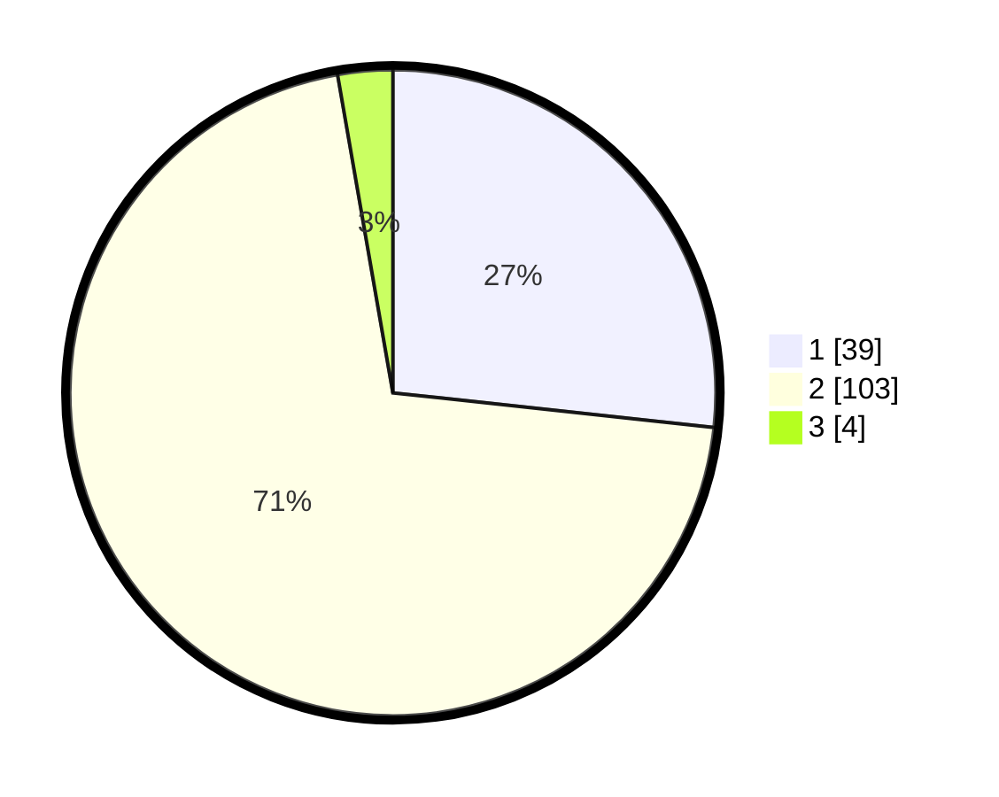

# Hasil

## Grafik

## Tabel

| No. | Nama Paslon    | Suara | Suara (raw) | Persentase |
|:--- |:-------------- | -----:| -----------:| ----------:|
| 1   | ANIES MUHAIMIN | 39    | [39][p-1]   | 26,71      |
| 2   | PRABOWO GIBRAN | 103   | [103][p-2]  | 70,55      |
| 3   | GANJAR MAHFUD  | 4     | [4][p-3]    | 2,74       |

[p-1]: https://github.com/gigit-pemilu/pemilu-2024/blob/main/pilpres/hitung-suara/sub/12-sumatera-utara/sub/18-serdang-bedagai/sub/14-pegajahan/sub/2001-bengabing/sub/002-tps/sub/paslon-1.txt
[p-2]: https://github.com/gigit-pemilu/pemilu-2024/blob/main/pilpres/hitung-suara/sub/12-sumatera-utara/sub/18-serdang-bedagai/sub/14-pegajahan/sub/2001-bengabing/sub/002-tps/sub/paslon-2.txt
[p-3]: https://github.com/gigit-pemilu/pemilu-2024/blob/main/pilpres/hitung-suara/sub/12-sumatera-utara/sub/18-serdang-bedagai/sub/14-pegajahan/sub/2001-bengabing/sub/002-tps/sub/paslon-3.txt

## Foto C Plano

https://sirekap-obj-formc.kpu.go.id/8ae4/pemilu/ppwp/12/18/14/20/01/1218142001002-20240215-031106--c78ce7d6-c784-484e-9283-2ffb4dd9e392.jpg

https://sirekap-obj-formc.kpu.go.id/8ae4/pemilu/ppwp/12/18/14/20/01/1218142001002-20240215-031514--85e2471c-bb0d-4bb9-92cb-d041f2777da0.jpg

https://sirekap-obj-formc.kpu.go.id/8ae4/pemilu/ppwp/12/18/14/20/01/1218142001002-20240215-031715--261c4d9c-c076-4146-b8c8-67a251edf78d.jpg

## Metadata

| Key        | Value               |
| ---------- | ------------------- |
| Time Stamp | 2024-02-16 12:51:22 |

