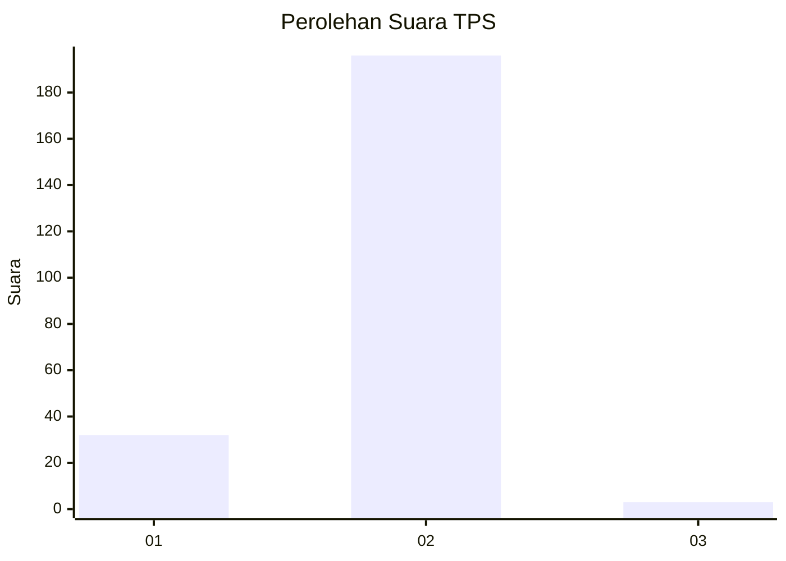
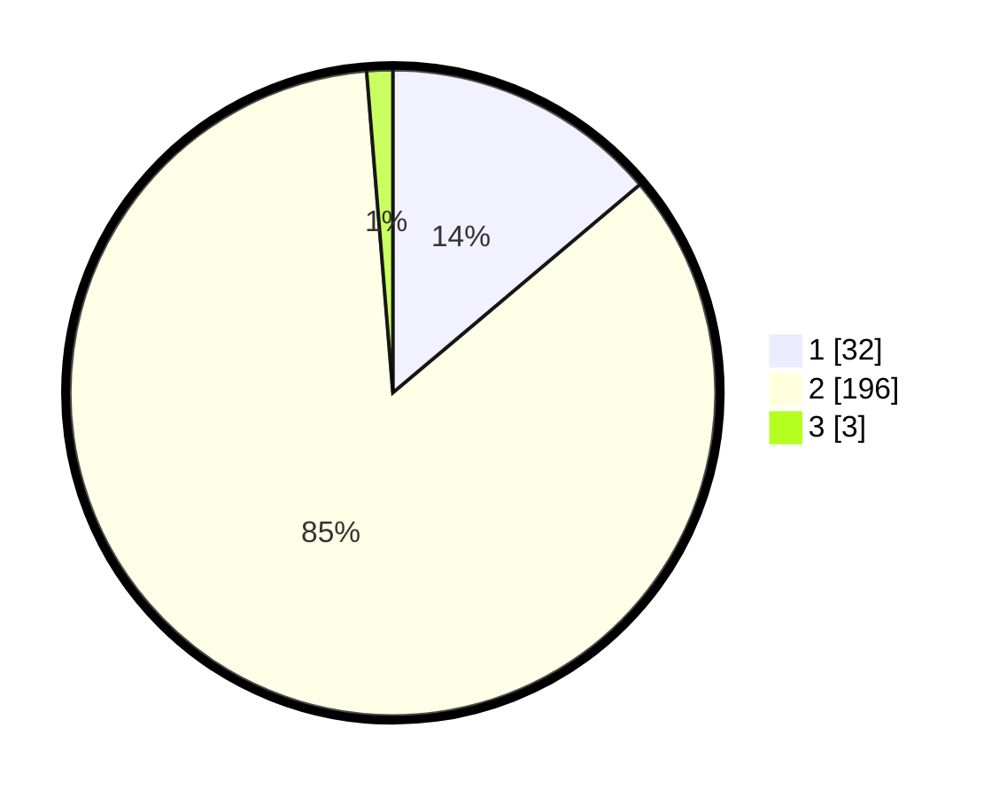

# Hasil

## Grafik

## Tabel

| No. | Nama Paslon    | Suara | Suara (raw) | Persentase |
|:--- |:-------------- | -----:| -----------:| ----------:|
| 1   | ANIES MUHAIMIN | 32    | [32][p-1]   | 13,85      |
| 2   | PRABOWO GIBRAN | 196   | [196][p-2]  | 84,85      |
| 3   | GANJAR MAHFUD  | 3     | [3][p-3]    | 1,30       |

[p-1]: https://github.com/gigit-pemilu/pemilu-2024-12-sumatera-utara/blob/main/pilpres/hitung-suara/sub/12-sumatera-utara/sub/18-serdang-bedagai/sub/14-pegajahan/sub/2001-bengabing/sub/003-tps/sub/paslon-1.txt
[p-2]: https://github.com/gigit-pemilu/pemilu-2024-12-sumatera-utara/blob/main/pilpres/hitung-suara/sub/12-sumatera-utara/sub/18-serdang-bedagai/sub/14-pegajahan/sub/2001-bengabing/sub/003-tps/sub/paslon-2.txt
[p-3]: https://github.com/gigit-pemilu/pemilu-2024-12-sumatera-utara/blob/main/pilpres/hitung-suara/sub/12-sumatera-utara/sub/18-serdang-bedagai/sub/14-pegajahan/sub/2001-bengabing/sub/003-tps/sub/paslon-3.txt

## Foto C Plano

https://sirekap-obj-formc.kpu.go.id/02c1/pemilu/ppwp/12/18/14/20/01/1218142001003-20240215-020234--687f8ab6-48b1-4aa0-8372-0d6cdf135535.jpg

https://sirekap-obj-formc.kpu.go.id/02c1/pemilu/ppwp/12/18/14/20/01/1218142001003-20240215-020327--05400ab1-1478-4497-a8e6-40ce932d3c7c.jpg

https://sirekap-obj-formc.kpu.go.id/02c1/pemilu/ppwp/12/18/14/20/01/1218142001003-20240215-020414--4429cb8d-dbc5-45a1-aaf1-0670d7e59386.jpg

## Metadata

| Key        | Value               |
| ---------- | ------------------- |
| Time Stamp | 2024-02-16 12:51:22 |

