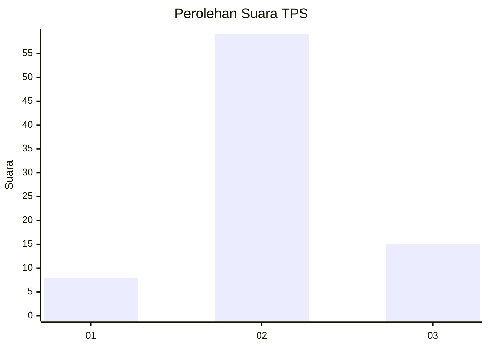
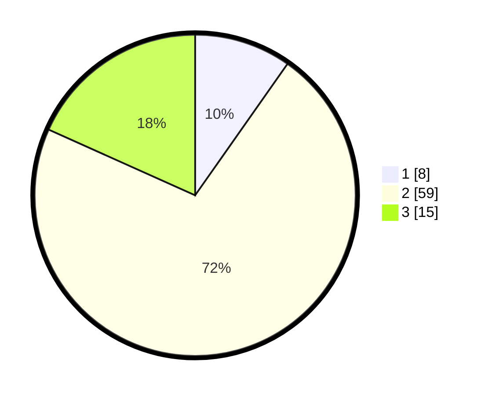

# Hasil

## Grafik

## Tabel

| No. | Nama Paslon    | Suara | Suara (raw) | Persentase |
|:--- |:-------------- | -----:| -----------:| ----------:|
| 1   | ANIES MUHAIMIN | 8     | [8][p-1]    | 9,76       |
| 2   | PRABOWO GIBRAN | 59    | [59][p-2]   | 71,95      |
| 3   | GANJAR MAHFUD  | 15    | [15][p-3]   | 18,29      |

[p-1]: https://github.com/gigit-pemilu/pemilu-2024/blob/main/pilpres/hitung-suara/sub/12-sumatera-utara/sub/18-serdang-bedagai/sub/14-pegajahan/sub/2010-sukasari/sub/019-tps/sub/paslon-1.txt
[p-2]: https://github.com/gigit-pemilu/pemilu-2024/blob/main/pilpres/hitung-suara/sub/12-sumatera-utara/sub/18-serdang-bedagai/sub/14-pegajahan/sub/2010-sukasari/sub/019-tps/sub/paslon-2.txt
[p-3]: https://github.com/gigit-pemilu/pemilu-2024/blob/main/pilpres/hitung-suara/sub/12-sumatera-utara/sub/18-serdang-bedagai/sub/14-pegajahan/sub/2010-sukasari/sub/019-tps/sub/paslon-3.txt

## Foto C Plano

https://sirekap-obj-formc.kpu.go.id/2e1f/pemilu/ppwp/12/18/14/20/10/1218142010019-20240215-062607--8b330da0-b701-4833-822a-f08f060b53a3.jpg

https://sirekap-obj-formc.kpu.go.id/2e1f/pemilu/ppwp/12/18/14/20/10/1218142010019-20240215-062655--df000b0f-92b7-4bba-8502-ad8e95146671.jpg

https://sirekap-obj-formc.kpu.go.id/2e1f/pemilu/ppwp/12/18/14/20/10/1218142010019-20240215-062724--ef44b16a-0b83-4069-a3c4-6d4c2ff8b57d.jpg

## Metadata

| Key        | Value               |
| ---------- | ------------------- |
| Time Stamp | 2024-02-26 10:00:00 |

