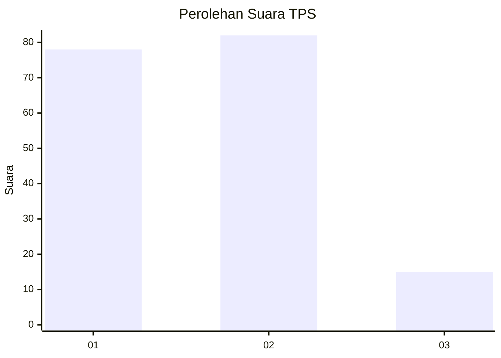
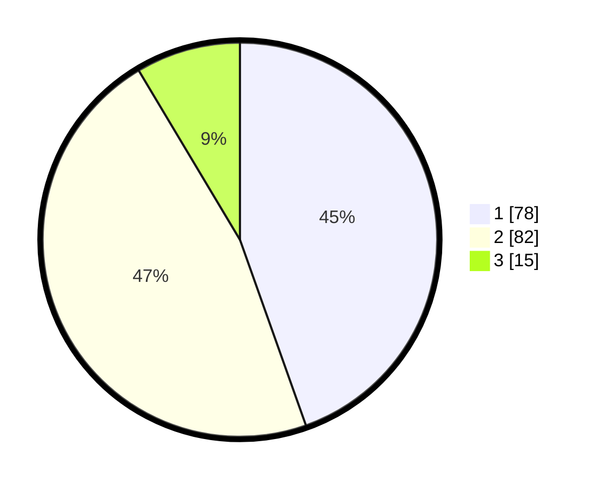

# Hasil

## Grafik

## Tabel

| No. | Nama Paslon    | Suara | Suara (raw) | Persentase |
|:--- |:-------------- | -----:| -----------:| ----------:|
| 1   | ANIES MUHAIMIN | 78    | [78][p-1]   | 44,57      |
| 2   | PRABOWO GIBRAN | 82    | [82][p-2]   | 46,86      |
| 3   | GANJAR MAHFUD  | 15    | [15][p-3]   | 8,57       |

[p-1]: https://github.com/gigit-pemilu/pemilu-2024-12-sumatera-utara/blob/main/pilpres/hitung-suara/sub/12-sumatera-utara/sub/18-serdang-bedagai/sub/15-sei-bamban/sub/2001-pon/sub/003-tps/sub/paslon-1.txt
[p-2]: https://github.com/gigit-pemilu/pemilu-2024-12-sumatera-utara/blob/main/pilpres/hitung-suara/sub/12-sumatera-utara/sub/18-serdang-bedagai/sub/15-sei-bamban/sub/2001-pon/sub/003-tps/sub/paslon-2.txt
[p-3]: https://github.com/gigit-pemilu/pemilu-2024-12-sumatera-utara/blob/main/pilpres/hitung-suara/sub/12-sumatera-utara/sub/18-serdang-bedagai/sub/15-sei-bamban/sub/2001-pon/sub/003-tps/sub/paslon-3.txt

## Foto C Plano

https://sirekap-obj-formc.kpu.go.id/3e3e/pemilu/ppwp/12/18/15/20/01/1218152001003-20240214-155413--f7196d02-aa24-4f13-bba8-f93c534ae5d9.jpg

https://sirekap-obj-formc.kpu.go.id/3e3e/pemilu/ppwp/12/18/15/20/01/1218152001003-20240214-155658--828186b4-2bbb-4772-a0dd-011c4e7f1e07.jpg

https://sirekap-obj-formc.kpu.go.id/3e3e/pemilu/ppwp/12/18/15/20/01/1218152001003-20240214-155812--eb3f764b-594c-4a8f-9081-cf0855a9c752.jpg

## Metadata

| Key        | Value               |
| ---------- | ------------------- |
| Time Stamp | 2024-02-15 23:29:50 |

