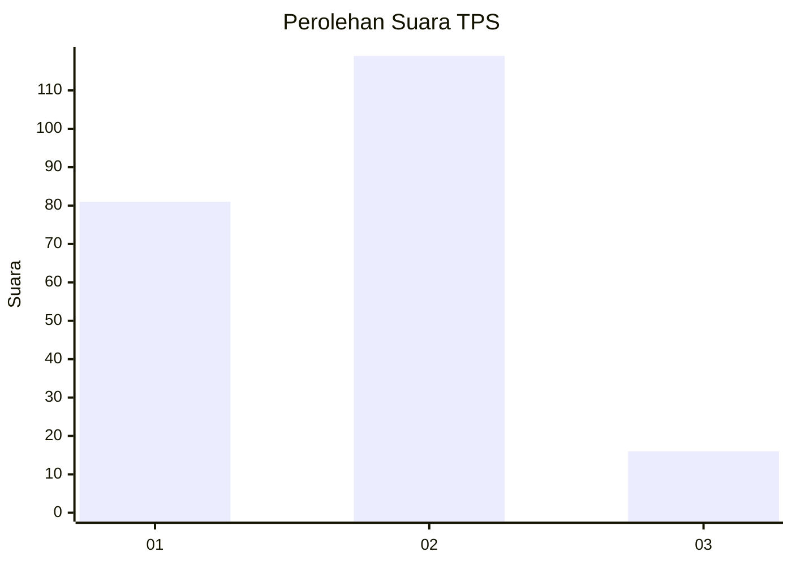
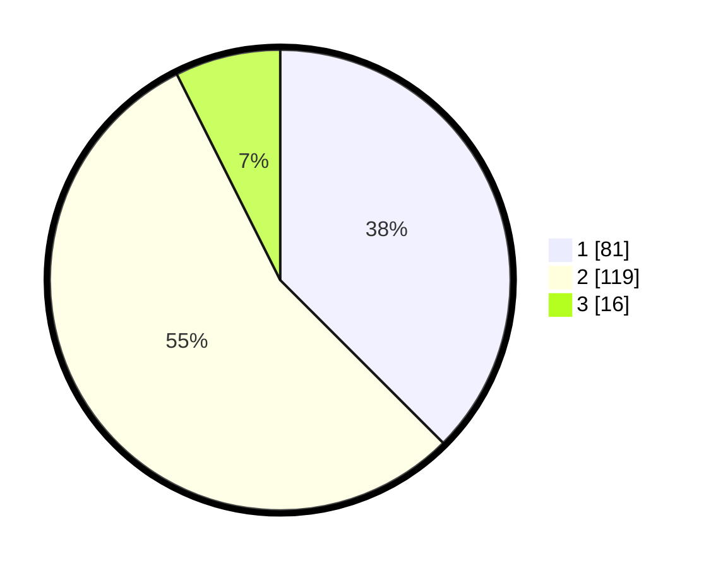

# Hasil

## Grafik

## Tabel

| No. | Nama Paslon    | Suara | Suara (raw) | Persentase |
|:--- |:-------------- | -----:| -----------:| ----------:|
| 1   | ANIES MUHAIMIN | 81    | [81][p-1]   | 37,50      |
| 2   | PRABOWO GIBRAN | 119   | [119][p-2]  | 55,09      |
| 3   | GANJAR MAHFUD  | 16    | [16][p-3]   | 7,41       |

[p-1]: https://github.com/gigit-pemilu/pemilu-2024-12-sumatera-utara/blob/main/pilpres/hitung-suara/sub/12-sumatera-utara/sub/18-serdang-bedagai/sub/15-sei-bamban/sub/2001-pon/sub/005-tps/sub/paslon-1.txt
[p-2]: https://github.com/gigit-pemilu/pemilu-2024-12-sumatera-utara/blob/main/pilpres/hitung-suara/sub/12-sumatera-utara/sub/18-serdang-bedagai/sub/15-sei-bamban/sub/2001-pon/sub/005-tps/sub/paslon-2.txt
[p-3]: https://github.com/gigit-pemilu/pemilu-2024-12-sumatera-utara/blob/main/pilpres/hitung-suara/sub/12-sumatera-utara/sub/18-serdang-bedagai/sub/15-sei-bamban/sub/2001-pon/sub/005-tps/sub/paslon-3.txt

## Foto C Plano

https://sirekap-obj-formc.kpu.go.id/77a7/pemilu/ppwp/12/18/15/20/01/1218152001005-20240214-191530--b8edbd95-3a53-4e4d-b04a-891525344c5f.jpg

https://sirekap-obj-formc.kpu.go.id/77a7/pemilu/ppwp/12/18/15/20/01/1218152001005-20240214-191537--e137036e-8514-418f-8f2e-ad2765a1a4b3.jpg

https://sirekap-obj-formc.kpu.go.id/77a7/pemilu/ppwp/12/18/15/20/01/1218152001005-20240214-191543--1ce77554-e121-49f7-a6b3-e6d86a265464.jpg

## Metadata

| Key        | Value               |
| ---------- | ------------------- |
| Time Stamp | 2024-02-15 23:29:50 |

