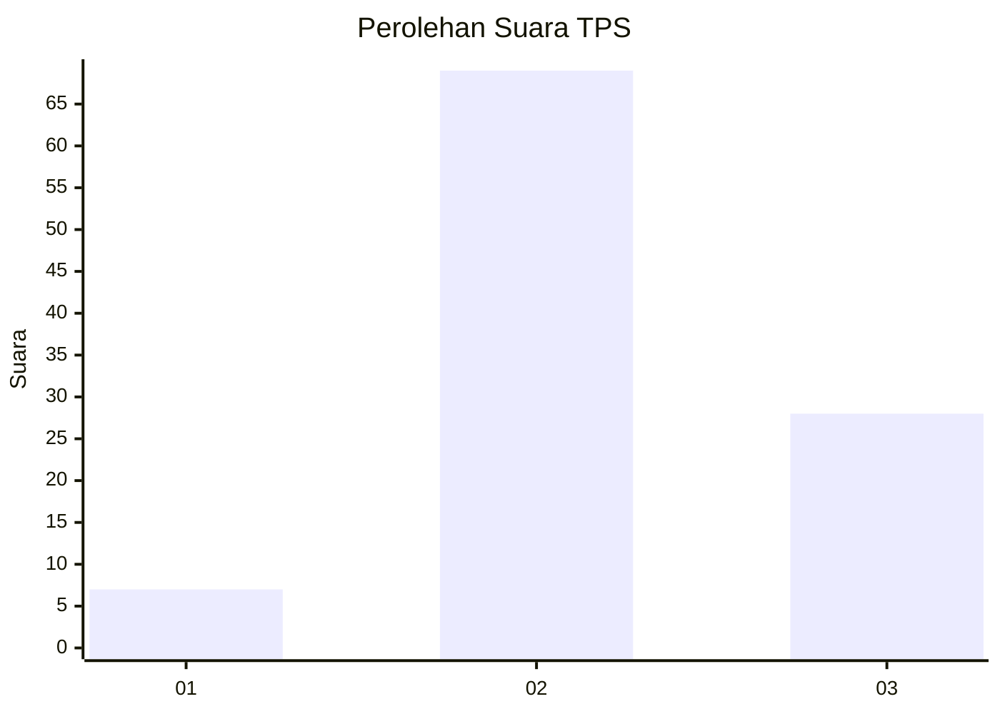
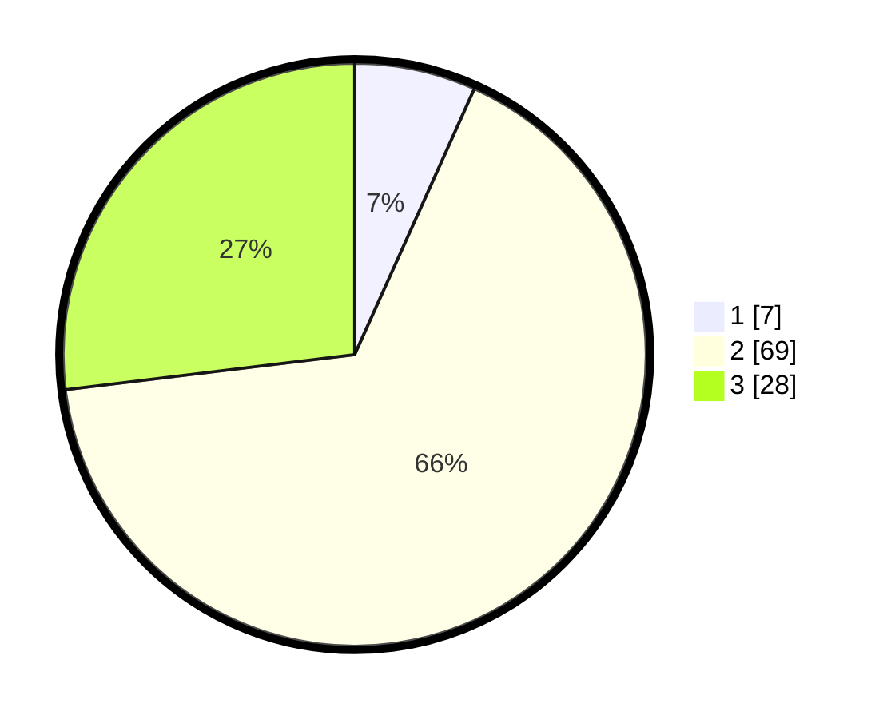

# Hasil

## Grafik

## Tabel

| No. | Nama Paslon    | Suara | Suara (raw) | Persentase |
|:--- |:-------------- | -----:| -----------:| ----------:|
| 1   | ANIES MUHAIMIN | 7     | [7][p-1]    | 6,73       |
| 2   | PRABOWO GIBRAN | 69    | [69][p-2]   | 66,35      |
| 3   | GANJAR MAHFUD  | 28    | [28][p-3]   | 26,92      |

[p-1]: https://github.com/gigit-pemilu/pemilu-2024-12-sumatera-utara/blob/main/pilpres/hitung-suara/sub/12-sumatera-utara/sub/18-serdang-bedagai/sub/15-sei-bamban/sub/2006-suka-damai/sub/014-tps/sub/paslon-1.txt
[p-2]: https://github.com/gigit-pemilu/pemilu-2024-12-sumatera-utara/blob/main/pilpres/hitung-suara/sub/12-sumatera-utara/sub/18-serdang-bedagai/sub/15-sei-bamban/sub/2006-suka-damai/sub/014-tps/sub/paslon-2.txt
[p-3]: https://github.com/gigit-pemilu/pemilu-2024-12-sumatera-utara/blob/main/pilpres/hitung-suara/sub/12-sumatera-utara/sub/18-serdang-bedagai/sub/15-sei-bamban/sub/2006-suka-damai/sub/014-tps/sub/paslon-3.txt

## Foto C Plano

https://sirekap-obj-formc.kpu.go.id/f4ff/pemilu/ppwp/12/18/15/20/06/1218152006014-20240214-160143--260b36f6-3ef3-4c98-ad1b-6b81025856f8.jpg

https://sirekap-obj-formc.kpu.go.id/f4ff/pemilu/ppwp/12/18/15/20/06/1218152006014-20240214-162217--beac8839-1898-4ac4-af2f-4e1deed54d1c.jpg

https://sirekap-obj-formc.kpu.go.id/f4ff/pemilu/ppwp/12/18/15/20/06/1218152006014-20240223-165907--0f39e765-a7fb-4e87-bc49-aa09e0f7f507.jpg

## Metadata

| Key        | Value               |
| ---------- | ------------------- |
| Time Stamp | 2024-02-24 22:31:28 |

