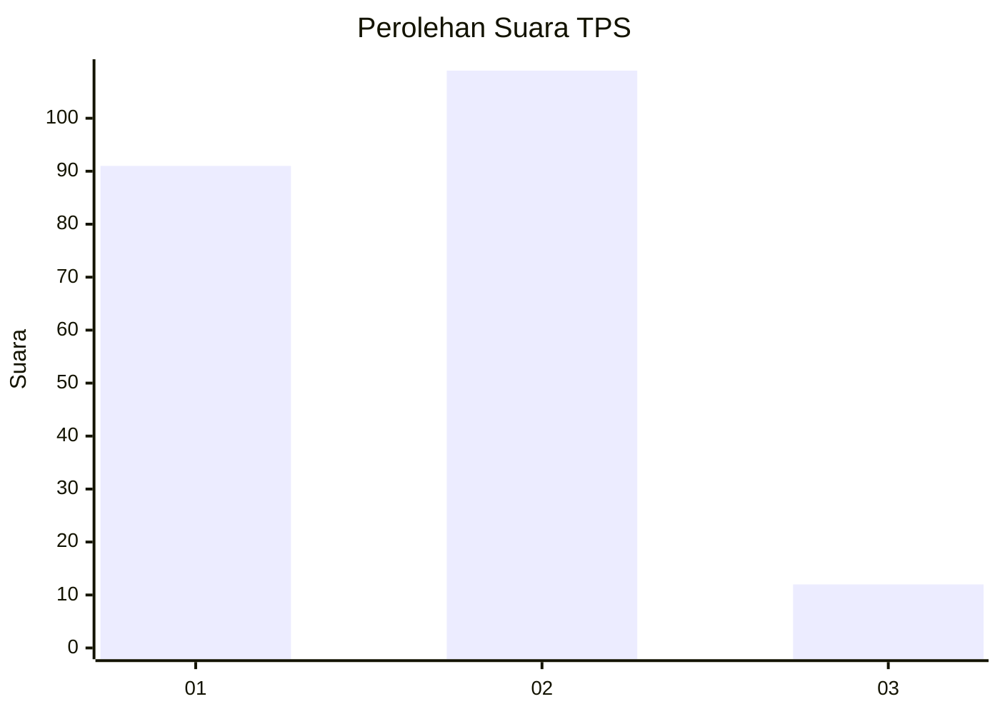
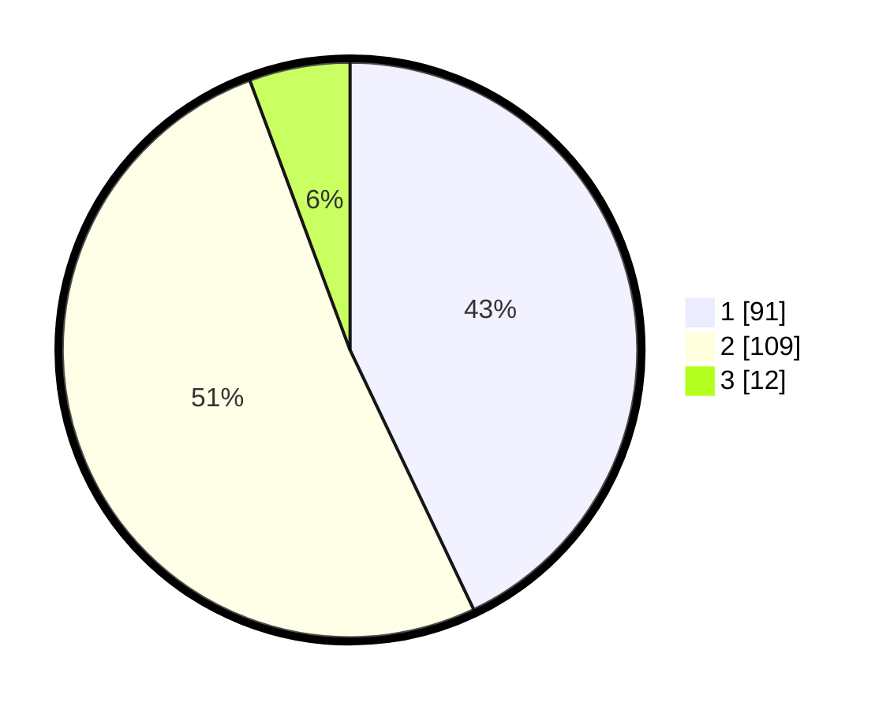

# Hasil

## Grafik

## Tabel

| No. | Nama Paslon    | Suara | Suara (raw) | Persentase |
|:--- |:-------------- | -----:| -----------:| ----------:|
| 1   | ANIES MUHAIMIN | 91    | [91][p-1]   | 42,92      |
| 2   | PRABOWO GIBRAN | 109   | [109][p-2]  | 51,42      |
| 3   | GANJAR MAHFUD  | 12    | [12][p-3]   | 5,66       |

[p-1]: https://github.com/gigit-pemilu/pemilu-2024-12-sumatera-utara/blob/main/pilpres/hitung-suara/sub/12-sumatera-utara/sub/18-serdang-bedagai/sub/16-tebing-syahbandar/sub/2001-penggalian/sub/001-tps/sub/paslon-1.txt
[p-2]: https://github.com/gigit-pemilu/pemilu-2024-12-sumatera-utara/blob/main/pilpres/hitung-suara/sub/12-sumatera-utara/sub/18-serdang-bedagai/sub/16-tebing-syahbandar/sub/2001-penggalian/sub/001-tps/sub/paslon-2.txt
[p-3]: https://github.com/gigit-pemilu/pemilu-2024-12-sumatera-utara/blob/main/pilpres/hitung-suara/sub/12-sumatera-utara/sub/18-serdang-bedagai/sub/16-tebing-syahbandar/sub/2001-penggalian/sub/001-tps/sub/paslon-3.txt

## Foto C Plano

https://sirekap-obj-formc.kpu.go.id/d969/pemilu/ppwp/12/18/16/20/01/1218162001001-20240215-000033--0acfe1d4-b4fd-4385-a356-f414b7c6bf0f.jpg

https://sirekap-obj-formc.kpu.go.id/d969/pemilu/ppwp/12/18/16/20/01/1218162001001-20240215-000028--774ff453-cbe4-409b-9f00-c2610ea7ef07.jpg

https://sirekap-obj-formc.kpu.go.id/d969/pemilu/ppwp/12/18/16/20/01/1218162001001-20240215-003259--60bf4d01-1dcf-49b5-9c6b-101cf1ee58bc.jpg

## Metadata

| Key        | Value               |
| ---------- | ------------------- |
| Time Stamp | 2024-02-24 22:31:28 |

