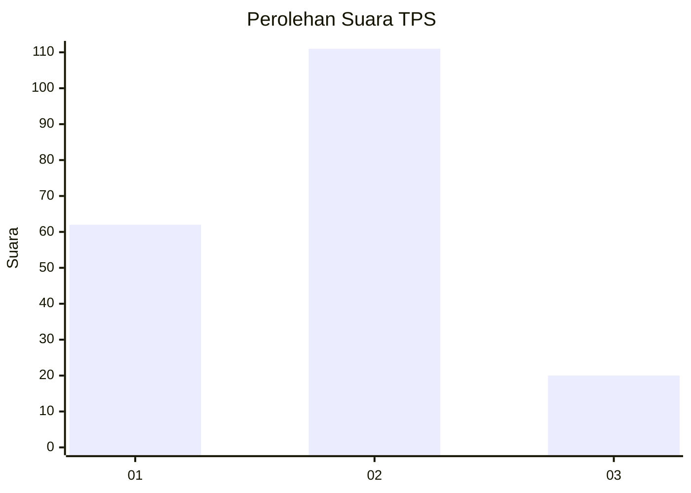
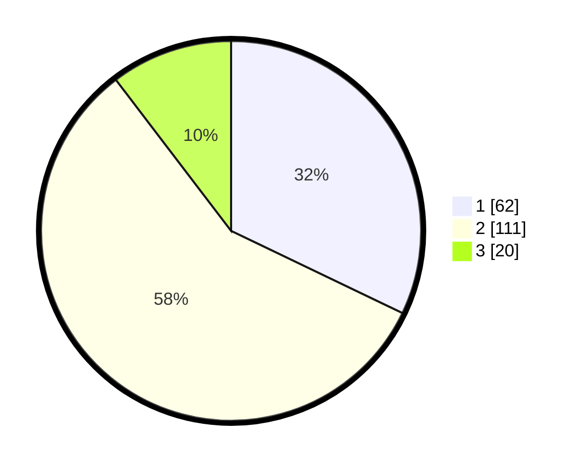

# Hasil

## Grafik

## Tabel

| No. | Nama Paslon    | Suara | Suara (raw) | Persentase |
|:--- |:-------------- | -----:| -----------:| ----------:|
| 1   | ANIES MUHAIMIN | 62    | [62][p-1]   | 32,12      |
| 2   | PRABOWO GIBRAN | 111   | [111][p-2]  | 57,51      |
| 3   | GANJAR MAHFUD  | 20    | [20][p-3]   | 10,36      |

[p-1]: https://github.com/gigit-pemilu/pemilu-2024/blob/main/pilpres/hitung-suara/sub/12-sumatera-utara/sub/18-serdang-bedagai/sub/16-tebing-syahbandar/sub/2001-penggalian/sub/003-tps/sub/paslon-1.txt
[p-2]: https://github.com/gigit-pemilu/pemilu-2024/blob/main/pilpres/hitung-suara/sub/12-sumatera-utara/sub/18-serdang-bedagai/sub/16-tebing-syahbandar/sub/2001-penggalian/sub/003-tps/sub/paslon-2.txt
[p-3]: https://github.com/gigit-pemilu/pemilu-2024/blob/main/pilpres/hitung-suara/sub/12-sumatera-utara/sub/18-serdang-bedagai/sub/16-tebing-syahbandar/sub/2001-penggalian/sub/003-tps/sub/paslon-3.txt

## Foto C Plano

https://sirekap-obj-formc.kpu.go.id/7bd7/pemilu/ppwp/12/18/16/20/01/1218162001003-20240214-162235--21b6fbcc-17b9-4b80-8e60-e2da719f1642.jpg

https://sirekap-obj-formc.kpu.go.id/7bd7/pemilu/ppwp/12/18/16/20/01/1218162001003-20240214-202315--cc3d5487-fe4f-44ef-97ee-892d830bec35.jpg

https://sirekap-obj-formc.kpu.go.id/7bd7/pemilu/ppwp/12/18/16/20/01/1218162001003-20240214-202341--3e370d60-a197-4806-b63f-f1254ff97036.jpg

## Metadata

| Key        | Value               |
| ---------- | ------------------- |
| Time Stamp | 2024-02-19 06:16:00 |

