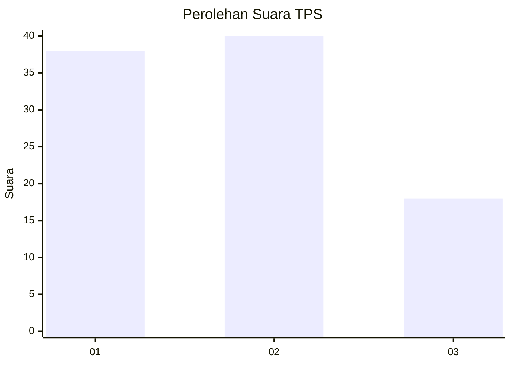
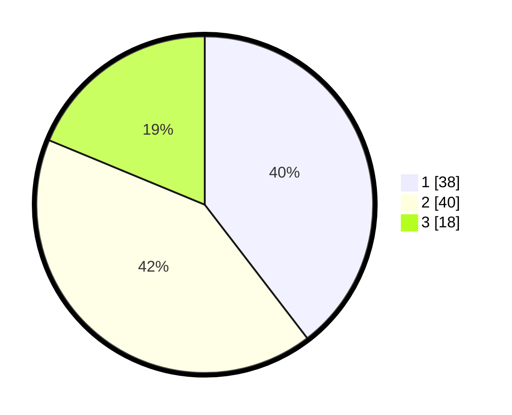

# Hasil

## Grafik

## Tabel

| No. | Nama Paslon    | Suara | Suara (raw) | Persentase |
|:--- |:-------------- | -----:| -----------:| ----------:|
| 1   | ANIES MUHAIMIN | 38    | [38][p-1]   | 39,58      |
| 2   | PRABOWO GIBRAN | 40    | [40][p-2]   | 41,67      |
| 3   | GANJAR MAHFUD  | 18    | [18][p-3]   | 18,75      |

[p-1]: https://github.com/gigit-pemilu/pemilu-2024-12-sumatera-utara/blob/main/pilpres/hitung-suara/sub/12-sumatera-utara/sub/18-serdang-bedagai/sub/16-tebing-syahbandar/sub/2001-penggalian/sub/004-tps/sub/paslon-1.txt
[p-2]: https://github.com/gigit-pemilu/pemilu-2024-12-sumatera-utara/blob/main/pilpres/hitung-suara/sub/12-sumatera-utara/sub/18-serdang-bedagai/sub/16-tebing-syahbandar/sub/2001-penggalian/sub/004-tps/sub/paslon-2.txt
[p-3]: https://github.com/gigit-pemilu/pemilu-2024-12-sumatera-utara/blob/main/pilpres/hitung-suara/sub/12-sumatera-utara/sub/18-serdang-bedagai/sub/16-tebing-syahbandar/sub/2001-penggalian/sub/004-tps/sub/paslon-3.txt

## Foto C Plano

https://sirekap-obj-formc.kpu.go.id/af27/pemilu/ppwp/12/18/16/20/01/1218162001004-20240215-001407--e1c974a8-982b-465f-bc71-3d50e5ed7b23.jpg

https://sirekap-obj-formc.kpu.go.id/af27/pemilu/ppwp/12/18/16/20/01/1218162001004-20240217-214708--26db85bc-91e7-4336-a390-e4245cd0522f.jpg

https://sirekap-obj-formc.kpu.go.id/af27/pemilu/ppwp/12/18/16/20/01/1218162001004-20240217-221153--d1805000-83a7-4e85-8237-0e13d7b55add.jpg

## Metadata

| Key        | Value               |
| ---------- | ------------------- |
| Time Stamp | 2024-02-19 06:16:00 |

