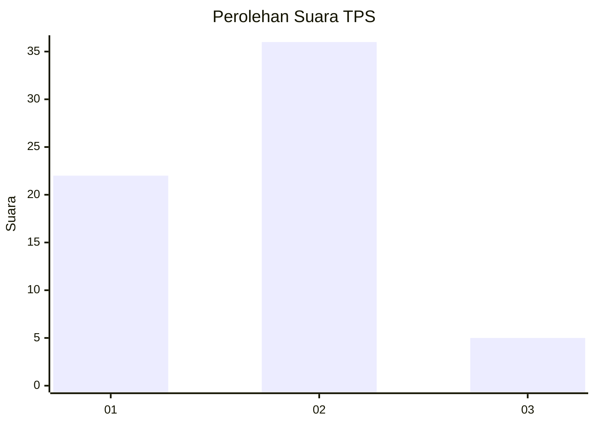
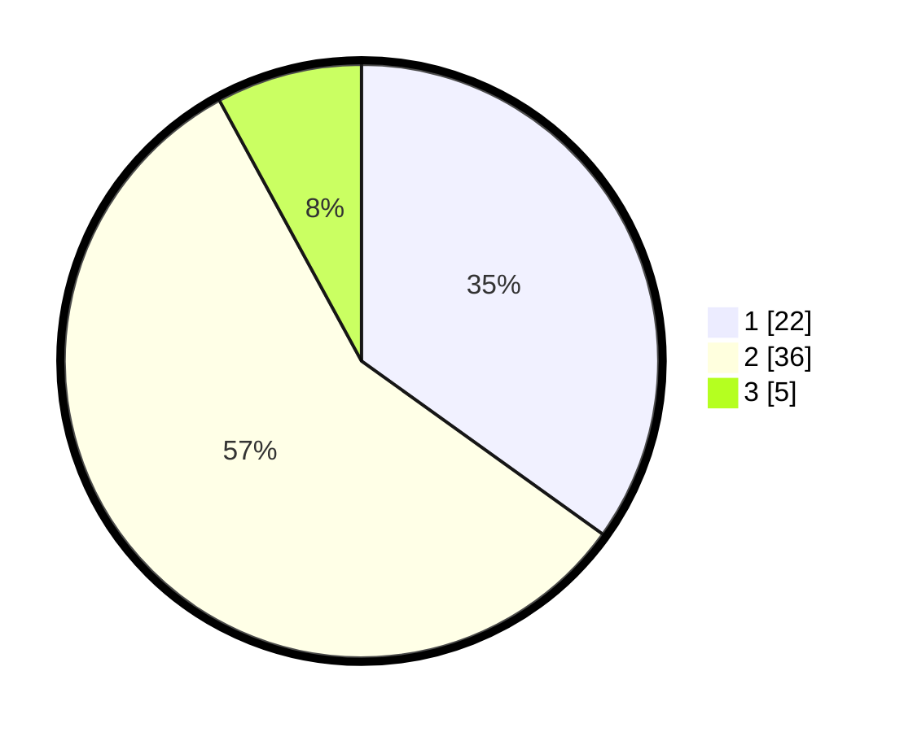

# Hasil

## Grafik

## Tabel

| No. | Nama Paslon    | Suara | Suara (raw) | Persentase |
|:--- |:-------------- | -----:| -----------:| ----------:|
| 1   | ANIES MUHAIMIN | 22    | [22][p-1]   | 34,92      |
| 2   | PRABOWO GIBRAN | 36    | [36][p-2]   | 57,14      |
| 3   | GANJAR MAHFUD  | 5     | [5][p-3]    | 7,94       |

[p-1]: https://github.com/gigit-pemilu/pemilu-2024/blob/main/pilpres/hitung-suara/sub/12-sumatera-utara/sub/18-serdang-bedagai/sub/16-tebing-syahbandar/sub/2002-laut-tador/sub/002-tps/sub/paslon-1.txt
[p-2]: https://github.com/gigit-pemilu/pemilu-2024/blob/main/pilpres/hitung-suara/sub/12-sumatera-utara/sub/18-serdang-bedagai/sub/16-tebing-syahbandar/sub/2002-laut-tador/sub/002-tps/sub/paslon-2.txt
[p-3]: https://github.com/gigit-pemilu/pemilu-2024/blob/main/pilpres/hitung-suara/sub/12-sumatera-utara/sub/18-serdang-bedagai/sub/16-tebing-syahbandar/sub/2002-laut-tador/sub/002-tps/sub/paslon-3.txt

## Foto C Plano

https://sirekap-obj-formc.kpu.go.id/3df6/pemilu/ppwp/12/18/16/20/02/1218162002002-20240214-200941--a020e319-f41b-40ab-acdd-02dc9a188bd8.jpg

https://sirekap-obj-formc.kpu.go.id/3df6/pemilu/ppwp/12/18/16/20/02/1218162002002-20240214-201314--e6f20439-196d-4056-bc65-392353126205.jpg

https://sirekap-obj-formc.kpu.go.id/3df6/pemilu/ppwp/12/18/16/20/02/1218162002002-20240214-201531--a9f37869-899e-4a57-82f9-6f32e992484e.jpg

## Metadata

| Key        | Value               |
| ---------- | ------------------- |
| Time Stamp | 2024-02-19 06:16:00 |

