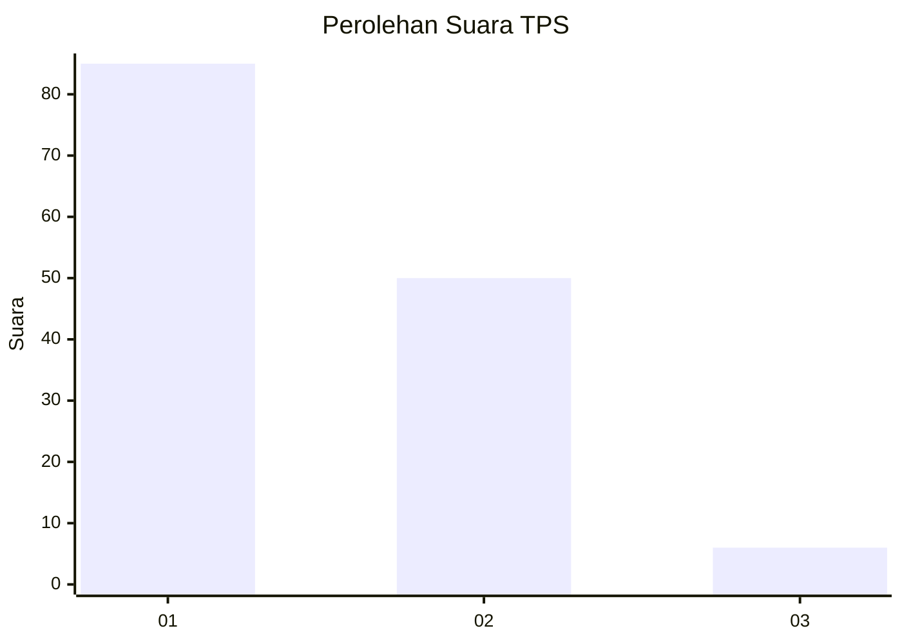
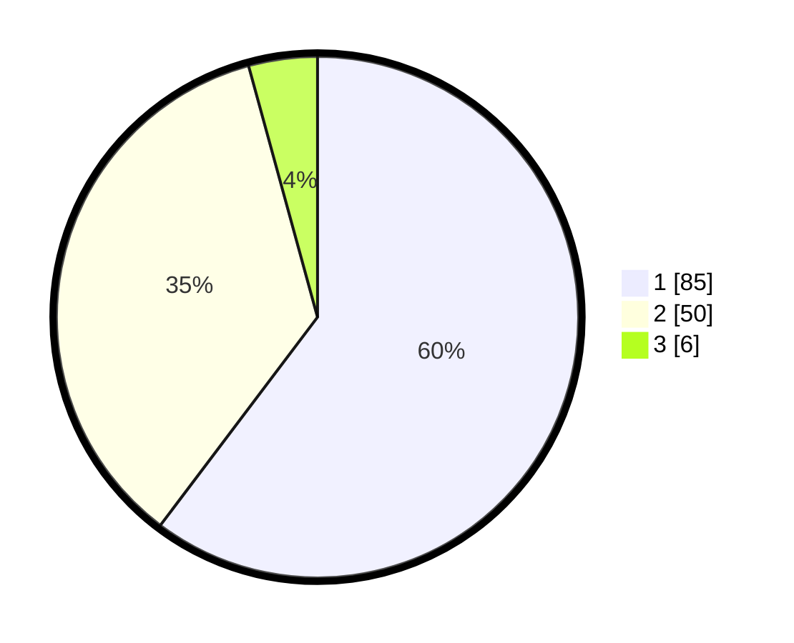

# Hasil

## Grafik

## Tabel

| No. | Nama Paslon    | Suara | Suara (raw) | Persentase |
|:--- |:-------------- | -----:| -----------:| ----------:|
| 1   | ANIES MUHAIMIN | 85    | [85][p-1]   | 60,28      |
| 2   | PRABOWO GIBRAN | 50    | [50][p-2]   | 35,46      |
| 3   | GANJAR MAHFUD  | 6     | [6][p-3]    | 4,26       |

[p-1]: https://github.com/gigit-pemilu/pemilu-2024/blob/main/pilpres/hitung-suara/sub/12-sumatera-utara/sub/19-batu-bara/sub/01-medang-deras/sub/1001-pangkalan-dodek/sub/006-tps/sub/paslon-1.txt
[p-2]: https://github.com/gigit-pemilu/pemilu-2024/blob/main/pilpres/hitung-suara/sub/12-sumatera-utara/sub/19-batu-bara/sub/01-medang-deras/sub/1001-pangkalan-dodek/sub/006-tps/sub/paslon-2.txt
[p-3]: https://github.com/gigit-pemilu/pemilu-2024/blob/main/pilpres/hitung-suara/sub/12-sumatera-utara/sub/19-batu-bara/sub/01-medang-deras/sub/1001-pangkalan-dodek/sub/006-tps/sub/paslon-3.txt

## Foto C Plano

https://sirekap-obj-formc.kpu.go.id/c22c/pemilu/ppwp/12/19/01/10/01/1219011001006-20240214-162245--1c852dd5-c68c-44a8-967e-151f26051800.jpg

https://sirekap-obj-formc.kpu.go.id/c22c/pemilu/ppwp/12/19/01/10/01/1219011001006-20240214-155145--d563fb93-2af6-4c87-bd15-4ab3915b7a2d.jpg

https://sirekap-obj-formc.kpu.go.id/c22c/pemilu/ppwp/12/19/01/10/01/1219011001006-20240214-155303--2e866313-7d76-48f0-9cf9-3fa1d070281b.jpg

## Metadata

| Key        | Value               |
| ---------- | ------------------- |
| Time Stamp | 2024-02-15 12:00:28 |

