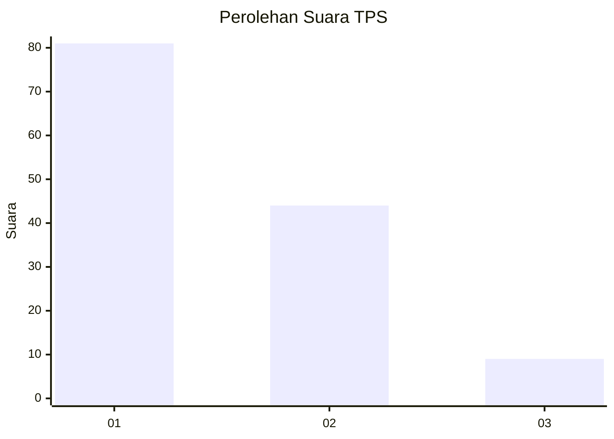
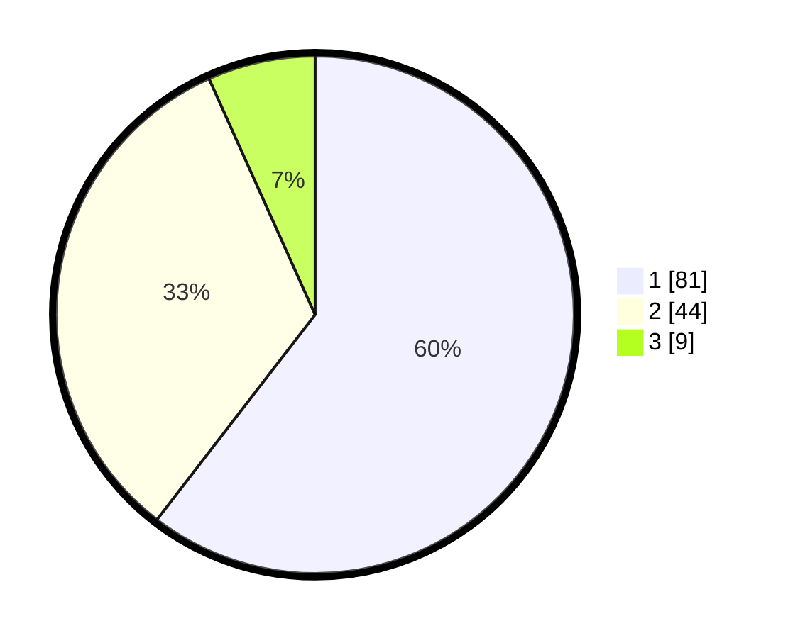

# Hasil

## Grafik

## Tabel

| No. | Nama Paslon    | Suara | Suara (raw) | Persentase |
|:--- |:-------------- | -----:| -----------:| ----------:|
| 1   | ANIES MUHAIMIN | 81    | [81][p-1]   | 60,45      |
| 2   | PRABOWO GIBRAN | 44    | [44][p-2]   | 32,84      |
| 3   | GANJAR MAHFUD  | 9     | [9][p-3]    | 6,72       |

[p-1]: https://github.com/gigit-pemilu/pemilu-2024/blob/main/pilpres/hitung-suara/sub/12-sumatera-utara/sub/19-batu-bara/sub/01-medang-deras/sub/1001-pangkalan-dodek/sub/008-tps/sub/paslon-1.txt
[p-2]: https://github.com/gigit-pemilu/pemilu-2024/blob/main/pilpres/hitung-suara/sub/12-sumatera-utara/sub/19-batu-bara/sub/01-medang-deras/sub/1001-pangkalan-dodek/sub/008-tps/sub/paslon-2.txt
[p-3]: https://github.com/gigit-pemilu/pemilu-2024/blob/main/pilpres/hitung-suara/sub/12-sumatera-utara/sub/19-batu-bara/sub/01-medang-deras/sub/1001-pangkalan-dodek/sub/008-tps/sub/paslon-3.txt

## Foto C Plano

https://sirekap-obj-formc.kpu.go.id/2ac4/pemilu/ppwp/12/19/01/10/01/1219011001008-20240214-162245--7f0080b8-c826-4703-b37f-a2b5a6a85563.jpg

https://sirekap-obj-formc.kpu.go.id/2ac4/pemilu/ppwp/12/19/01/10/01/1219011001008-20240214-162223--8e6b0822-7ca2-4023-85cd-987254742603.jpg

## Metadata

| Key        | Value               |
| ---------- | ------------------- |
| Time Stamp | 2024-02-15 18:00:26 |

